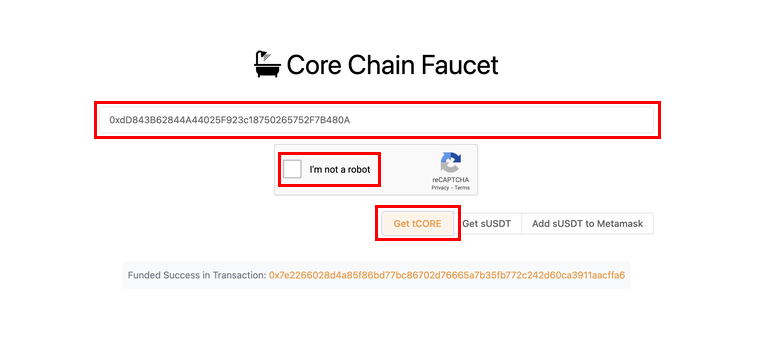

# Core Testnet Faucet

---

To help users get started and enable developers to quickly prototype their dApps, Core has released the public Core Testnet Faucet to distribute Core Testnet tokens, **tCORE** or **tCORE2**.

## Steps to Obtain tCORE/tCORE2 from Core Testnet Faucet

1. Navigate to the faucet website.

   - **For Core Testnet2 (1114) Faucet:** https://scan.test2.btcs.network/faucet
   - **For Core Testnet (1115) Faucet:** https://scan.test.btcs.network/faucet

2. Paste your address in the given textbox. Ensure you provide the Core Testnet address of the wallet you want to fund with tCORE or tCORE2.
3. Complete the CAPTCHA
4. If using faucet for Core Testnet2 (1114), click the `Get tCORE2` button. After requesting tCORE from the faucet, your MetaMask balance will increase.

5. If using the faucet for Core Testnet (1115), click the `Get tCORE` button. After successfully requesting tCORE2 from the faucet, your wallet's balance will increase.

:::caution
Each address can request **only one tCORE or tCORE2 per day** from the faucet within a 24-hour period. If you've run out of tCORE or tCORE2 and the faucet won't send you more because of the daily limit of one tCORE or tCORE2, come back after 24 hours and try again. Alternatively, you can request it in Core's Discord Server.
:::

:::note
tCORE and tCORE2 are only used for testing and do not have any value. Do not use it for real financial transactions.
:::