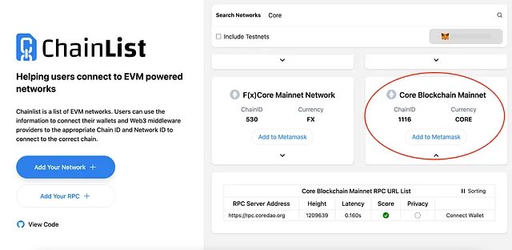
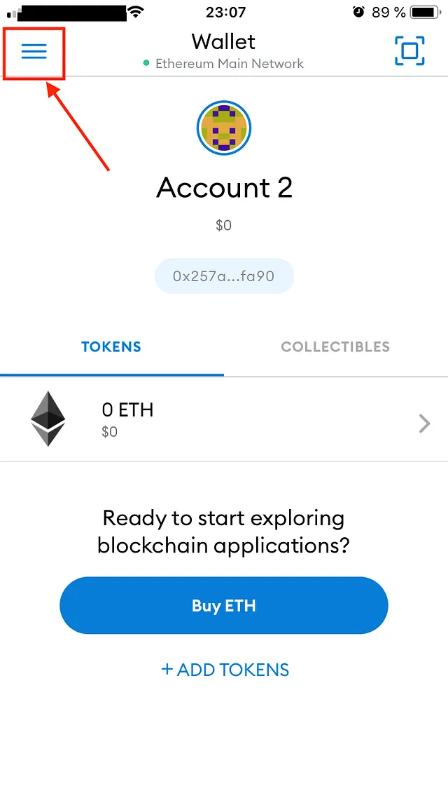
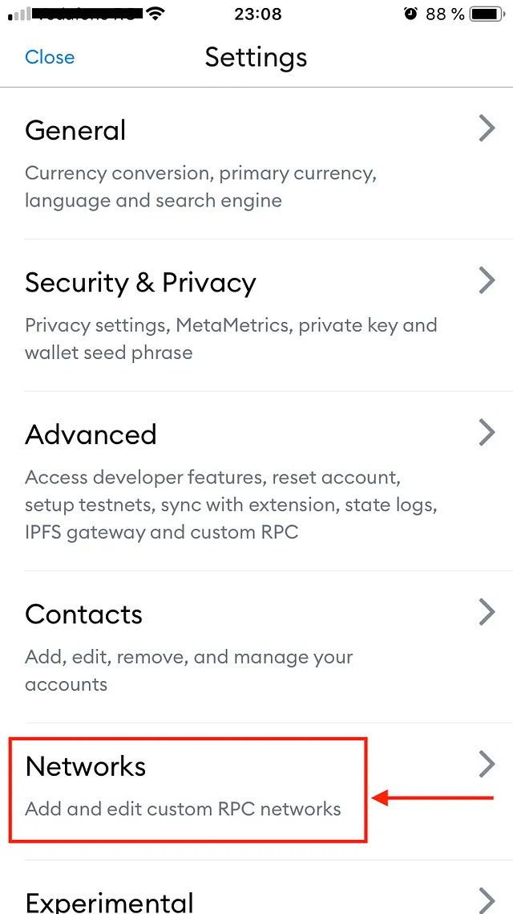
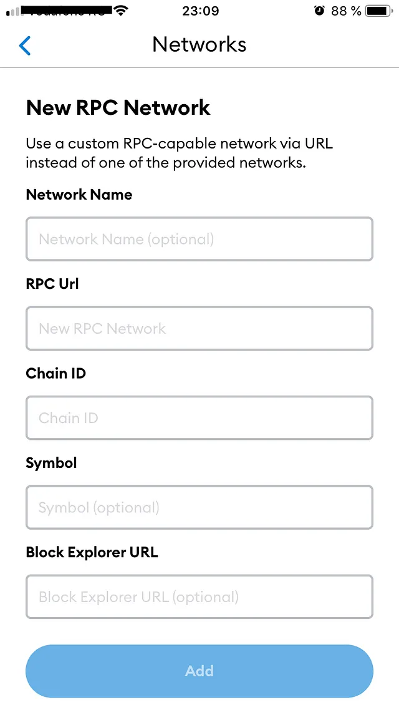

# Connect to Core Mainnet
---

:::note
This is a detailed guideline for connecting to Core Mainnet using the MetaMask wallet.
:::

## Software Prequisites

1. [MetaMask Wallet Browser Extension](https://metamask.io/)

## MetaMask Wallet Setup
We recommend using the [MetaMask web wallet](https://metamask.io/) to connect to Core Mainnet. You'll need to install MetaMask and set up your account before you can use it to connect to Core Mainnet. You can find MetaMask setup instructions here.

## Adding Core Mainnet to MetaMask
There are multiple ways to add Core Mainnet configurations to your MetaMask Wallet, we have listed the most trusted and testest ways below.

### Adding Network Manually
1. Click on the network selector button (the downward facing arrow next to the current network). This will display a list of networks to which you’re already connected.

2. Click ‘Add network’ at the bottom of the network list

3. A new browser tab will then open, displaying various fields to fill out:

Fill in the following network information and click `save` to add the network.

* **Network Name:** Core Blockchain
* **New RPC URL:** https://rpc.ankr.com/core
* **Chain ID:** 1116 (**Note**: 0x45c is the same as 1116. The new version of MetaMask converts chain ID to hexadecimal format).
* **Currency Symbol:** CORE
* **Block Explorer URL:** https://scan.coredao.org

4. After performing the above steps, you will be able to see the Core network the next time you access the network selector.

### Adding the Core network via Chainlist.org
1. Go to chainlist.org and search for ‘_Core_’

2. Double check to make sure to choose the right network. Please check the details in the below snapshots — Chain ID, Currency etc. to ensure you will add the correct one.

3. Click the ‘_Add to MetaMask_’ button.

4. Approve the action in your MetaMask by clicking the _‘Approve’_ button.

The Core network is now added to your MetaMask.

### Adding the Core network via the Core Explorer
1. Go to https://scan.coredao.org/ and scroll all the way down on the page

2. Click the ‘_Add Core Network_’ button

3. Approve in your MetaMask

4. After performing the above steps, you will be able to see Core network the next time you access the network selector.

### Adding the Core network to MetaMask mobile wallet:
1. Tap on the three lines in the top-left corner:

2. Select _‘Settings’_:

3. Select Networks:

4. Tap on ‘_Add Network_’:

5. Fill in the Custom RPC Network details and click _save_ to add the network.

* **Network Name:** Core Blockchain
* **New RPC URL:** https://rpc.ankr.com/core
* **Chain ID:** 1116 (**Note**: 0x45c is the same as 1116. The new version of MetaMask converts chain ID to hexadecimal format).
* **Currency Symbol:** CORE
* **Block Explorer URL:** https://scan.coredao.org

4. After performing the above steps, you will be able to see the Core network the next time you access the network selector.

:::info 
If you happen to have an error, or are struggling with adding the network please ask for help in the ‘support’ channel in the [Core Discord](https://discord.gg/coredao), we are always available to help.
:::
