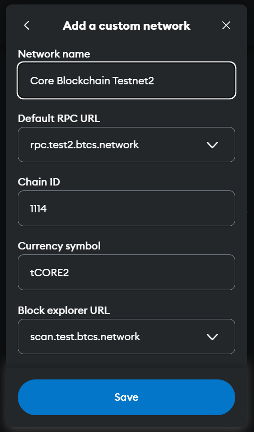
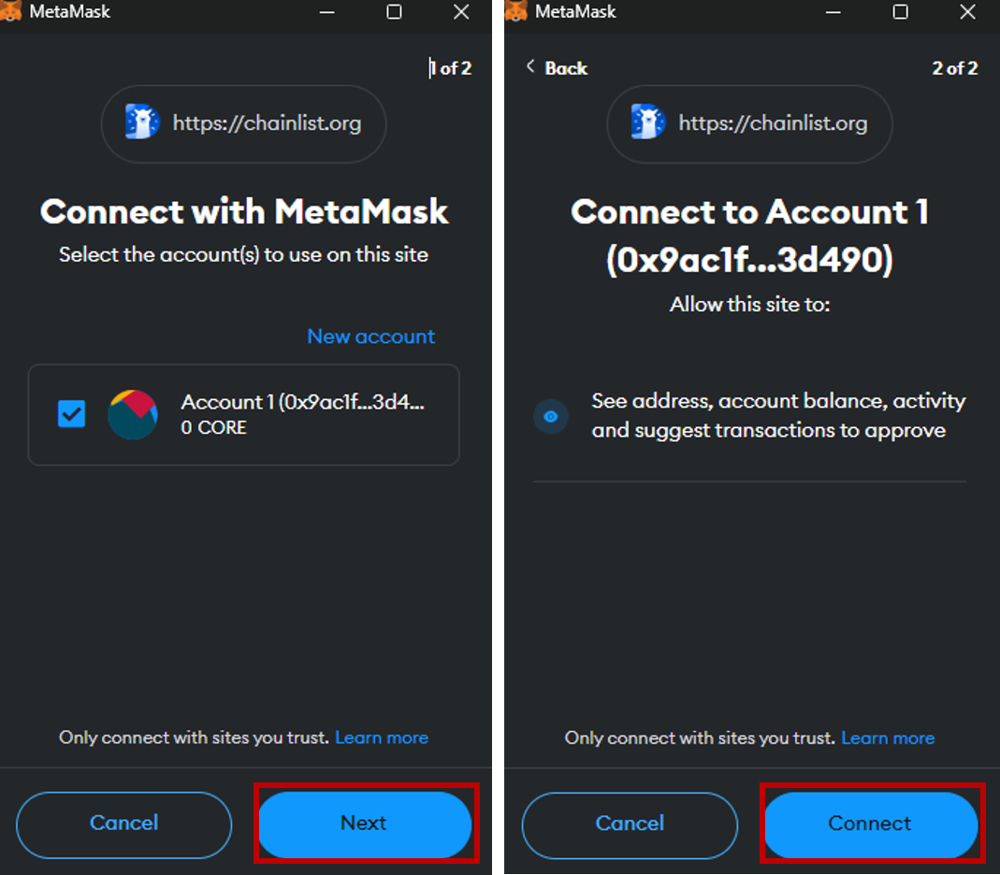
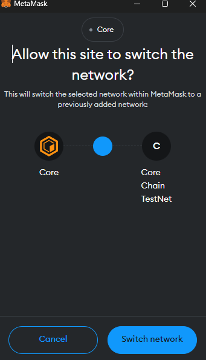

# Connect to Core Testnet
---
:::note
This is a detailed guideline for connecting to Core Testnet (1114) using the MetaMask wallet.
:::

### Software Prequisites

1. [MetaMask Wallet Browser Extension](https://metamask.io/)

### MetaMask Wallet Setup
We recommend using the [MetaMask web wallet](https://metamask.io/) to connect to Core Testnet. You'll need to install MetaMask and set up your account before you can use it to connect to Core Testnet. You can find MetaMask setup instructions here.

### Adding Core Testnet to MetaMask
There are multiple ways to add Core Testnet2 configurations to your MetaMask wallet, we have listed the most trusted and testest ways below.

#### Adding Network Manually
Once you've set up your MetaMask wallet, you can use it to connect to Core Testnet by adding Core Testnet2 network details in MetaMask's network settings. Navigate to `Settings->Networks` in MetaMask and click the `Add Network` button. Input the following information:

* **Network Name:** Core Blockchain TestNet
* **New RPC URL:** https://rpc.test2.btcs.network
* **Chain ID:** 1114
* **Currency Symbol:** tCORE2
* **Block Explorer URL:** https://scan.test2.btcs.network
* **Faucet:** https://scan.test2.btcs.network/faucet
* **Staking Website:** https://stake.test2.btcs.network/

#### Adding the Core network via Chainlist.org
1. Go to https://chainlist.org and search for _Core Blockchain_, make sure to check the _Include Testnets_ option.

2. Double check to make sure to choose the right network. Please check the details in the below snapshots — Chain ID, Currency etc. to ensure you will add the correct one.

3. Click on _Connect Wallet_ and then choose MetaMask. Allow to connect to MetaMask wallet by confirming the MetaMask notifications.

4. Switch to the Core Testnet by clicking the _‘Switch Network’_ button.

The Core Testnet is now added to your MetaMask.

#### Adding Network via Core Testnet Explorer
If you using the Chrome MetaMask extension, you can use a quick shortcut to add Core Testnet to MetaMask. Visit [Core Testnet Explorer](https://scan.test.btcs.network/), scroll down to the bottom, and select the `Add Core Network` button. This will open a pop-up with all necessary network information loaded - you just need to confirm and approve.

:::info 

#### New Testnet
Core's latest testnet Core Testnet2 with `chainID 1114` is now live and the recommended testing environment for Core blockchain. It supports BTC Testnet4 for staking, unlike the previous version (`chainID 1115`). The old testnet, Core Testnet, is not deprecated and will no longer be maintained. 

#### Rebrand Updates
`Satoshi Chain/BTCs` have been rebranded to `Core/CORE`, respectively. If you added the Testnet before the rebranding, you'll need to update Network Name and Currency Symbol in the MetaMask settings manually; otherwise, you won't be able to use the current version of Core Testnet. Go to `Settings->Network`, and select `Core Testnet` to open up the network settings. Update Network Name and Currency Symbol to the values stated in the [above section](#adding-network-manually) and click the Save button. You're good to go!
:::

### Funding Wallet with tCORE2 Tokens

To help users get started and allow developers to quickly prototype their dApps, Core has released the public [Core Testnet Faucet](https://scan.test2.btcs.network/faucet) to distribute Core Testnet tokens, **tCORE2**. Follow the detailed [guide](./core-faucet.md) to fund your metamask account with tCORE2 tokens.

### Sending tCORE2 Tokens

You can use MetaMask wallet to send tCORE2 to other addresses. 
1. Navigate to MetaMask wallet, make sure you are conencted to Core Testnet2 
2. Click on the `Send` button 

3. Enter the amount of tCORE2 tokens you want to send and the address whom you want to send the tCORE2 tokens make sure its a Core Testnet2 Address. Then click _Continue_ and confirm the transaction. 

