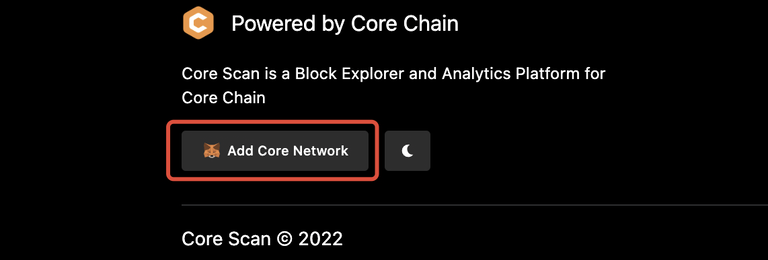
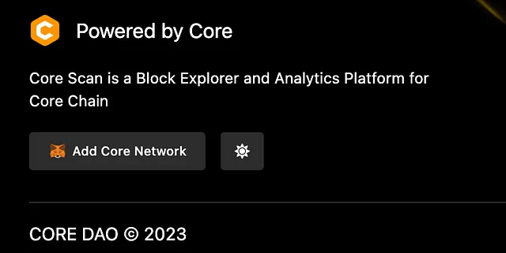

# Connect to Core Testnet

---

import Tabs from '@theme/Tabs';
import TabItem from '@theme/TabItem';

:::note
This is a detailed guideline for connecting to Core Testnet/Mainnet using the MetaMask wallet.
:::

### Software Prequisites

1. [MetaMask Wallet Browser Extension](https://metamask.io/)

### MetaMask Wallet Setup

We recommend using the [MetaMask web wallet](https://metamask.io/) to connect to Core Testnet. You'll need to install MetaMask and set up your account before you can use it to connect to Core Testnet/Mainnet. You can find MetaMask setup instructions here.

### Adding Core to MetaMask

There are multiple ways to add Core Testnet/Mainnet configurations to your MetaMask Wallet, we have listed the most trusted and testest ways below.

#### Adding Network Manually

Once you've set up your MetaMask wallet, you can use it to connect to Core by adding Core chain details in MetaMask's network settings. Navigate to `Settings->Networks` in MetaMask and click the `Add Network` button. Input the following information:

<Tabs defaultValue="testnet2" values={[
{label: 'Testnet2', value: 'testnet2'},
{label: 'Testnet1', value: 'testnet1'},
{label: 'Mainnet', value: 'mainnet'},
]}>

<TabItem value="testnet2">

- **Network Name:** Core Blockchain TestNet
- **New RPC URL:** https://rpc.test2.btcs.network
- **Chain ID:** 1114
- **Currency Symbol:** tCORE2
- **Block Explorer URL:** https://scan.test2.btcs.network
- **Faucet:** https://scan.test2.btcs.network/faucet
- **Staking Website:** https://stake.test2.btcs.network/

</TabItem>
<TabItem value="testnet1">

- **Network Name:** Core Blockchain TestNet
- **New RPC URL:** https://rpc.test.btcs.network
- **Chain ID:** 1115
- **Currency Symbol:** tCORE
- **Block Explorer URL:** https://scan.test.btcs.network
- **Faucet:** https://scan.test.btcs.network/faucet
- **Staking Website:** https://stake.test.btcs.network/

</TabItem>

<TabItem value="mainnet">

- **Network Name:** Core Blockchain
- **New RPC URL:** https://rpc.ankr.com/core
- **Chain ID:** 1116
- **Currency Symbol:** CORE
- **Block Explorer URL:** https://scan.coredao.org
- **Staking Website:** https://stake.coredao.org/

</TabItem>

</Tabs>

### Adding the Core network via Chainlist.org

<Tabs defaultValue="testnet2" values={[
{label: 'Testnet2', value: 'testnet2'},
{label: 'Testnet1', value: 'testnet1'},
{label: 'Mainnet', value: 'mainnet'},
]}>

<TabItem value="testnet2">
1. Go to chainlist.org and search for ‘_core blockchain_’, make sure to check the _Include Testnets_ option.

2. Double check to make sure to choose the right network. Please check the details in the above snapshots — Chain ID, Currency etc. to ensure you will add the correct one.

3. Click on _Connect Wallet_ and then choose MetaMask. Allow to connect to MetaMask wallet by confirming the MetaMask notifications.

4. Add Core testnet2 by clicking the `Approve` button.

The Core Testnet is now added to your MetaMask.

</TabItem>

<TabItem value="testnet1">
1. Go to chainlist.org and search for ‘_core blockchain_’, make sure to check the _Include Testnets_ option.

2. Double check to make sure to choose the right network. Please check the details in the below snapshots — Chain ID, Currency etc. to ensure you will add the correct one.

3. Click on _Connect Wallet_ and then choose MetaMask. Allow to connect to MetaMask wallet by confirming the MetaMask notifications.

4. Add Core testnet by clicking the `Approve` button.

The Core Testnet is now added to your MetaMask.

</TabItem>

<TabItem value="mainnet">

1. Go to chainlist.org and search for ‘_core blockchain_’.

2. Double check to make sure to choose the right network. Please check the details in the below snapshots — Chain ID, Currency etc. to ensure you will add the correct one.

3. Click on _Connect Wallet_ and then choose MetaMask. Allow to connect to MetaMask wallet by confirming the MetaMask notifications.

4. Add Core Mainnet by clicking the `Approve` button.

The Core Mainnet is now added to your MetaMask.

</TabItem>

</Tabs>

### Adding the Core network via the Core Explorer

<Tabs defaultValue="testnet2" values={[
{label: 'Testnet2', value: 'testnet2'},
{label: 'Testnet1', value: 'testnet1'},
{label: 'Mainnet', value: 'mainnet'},
]}>

<TabItem value="testnet2">
1. Go to https://scan.test2.btcs.network/ and scroll all the way down on the page

2. Click the ‘_Add Core Network_’ button

3. Approve in your MetaMask

4. After performing the above steps, you will be able to see Core network the next time you access the network selector.

</TabItem>

<TabItem value="testnet1">
1. Go to https://scan.test.btcs.network/ and scroll all the way down on the page

2. Click the ‘_Add Core Network_’ button

3. Approve in your MetaMask

4. After performing the above steps, you will be able to see Core network the next time you access the network selector.

</TabItem>

<TabItem value="mainnet">

1. Go to https://scan.coredao.org/ and scroll all the way down on the page

2. Click the ‘_Add Core Network_’ button

3. Approve in your MetaMask

4. After performing the above steps, you will be able to see Core network the next time you access the network selector.

</TabItem>
   
</Tabs>

:::info

#### Latest Core Testnet (1114)

Core's new testnet with `chainID 1114` is now live and recommended for use. It supports BTC Testnet4 for staking, unlike the previous version (`chainID 1115`). The old testnet will soon be deprecated and eventually retired, so switch to the new testnet to access the latest features.
:::

<!-- :::note

#### Rebrand Updates

`Satoshi Chain/BTCs` have been rebranded to `Core/CORE`, respectively. If you added the Testnet before the rebranding, you'll need to update Network Name and Currency Symbol in the MetaMask settings manually; otherwise, you won't be able to use the current version of Core Testnet. Go to `Settings->Network`, and select `Core Testnet` to open up the network settings. Update Network Name and Currency Symbol to the values stated in the [above section](#adding-network-manually) and click the Save button. You're good to go!
::: -->