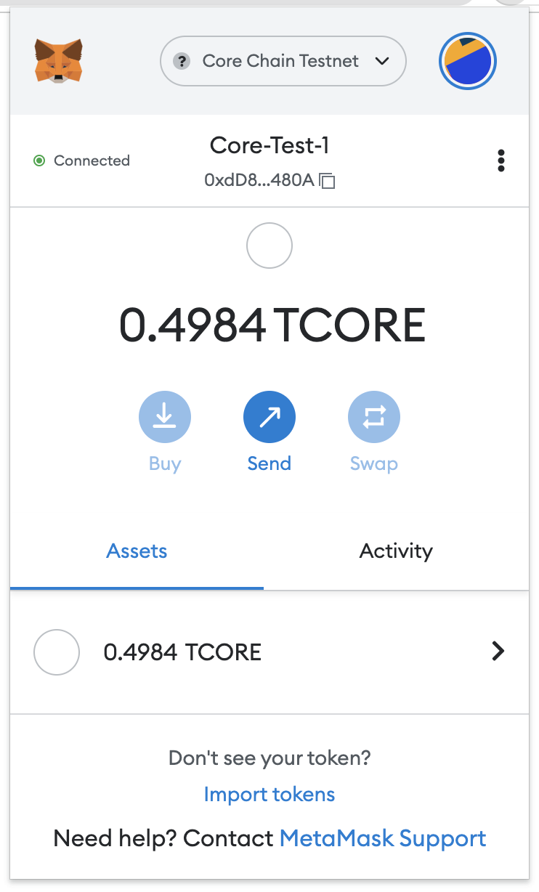

# Building a dApp on Core

---

Decentralized applications (dApps) use a blockchain or on-chain smart contracts to store and reference data, rather than relying on traditional centralized databases. A common, simple dApp structure generally consists of a React.js or Vue.js front-end using Web3.js or Ethers.js to interact with smart contracts deployed to an EVM-compatible blockchain.

## What Are We Building

In this tutorial, we'll develop a simple dApp using React.js and Ethers.js that stores data in a smart contract on the Core blockchain and displays it to users. The dApp's full code is available on GitHub in the [dApp-tutorial](https://github.com/coredao-org/dapp-tutorial/tree/master/01-Simple%20Storage%20Full%20Stack%20Dapp) repository.

## Learning Takeaways

This tutorial will help you gain knowledge on the following learning points:

- MetaMask Wallet connectivity to Core Testnet;
- Smart contract development and deployment on Core Testnet;
- Front-end integration with the smart contract using Ethers.js library;
- Read data from a smart contract;
- Write data to a smart contract;

## Software Prerequisites

- [Git](https://git-scm.com/) v2.44.0
- [Node.js](https://nodejs.org/en) v20.11.1
- [npm](https://docs.npmjs.com/downloading-and-installing-node-js-and-npm) v10.2.4
- [Hardhat](https://hardhat.org/hardhat-runner/docs/getting-started#installation) v10.2.4
- [MetaMask Web Wallet Extension](https://metamask.io/download/)

## Setting up the development environment

1. Create a new directory for the project and navigate into it

```bash
mkdir dapp-tutorial
cd dapp-tutorial
```

2. Install [Hardhat](https://hardhat.org/) and [Waffle](https://getwaffle.io/)

```bash
npm init --yes
npm install --save-dev hardhat
npm install --save-dev chai @nomiclabs/hardhat-waffle
```

3. Initialize Hardhat project by running the following command

```bash
npx hardhat
```
<p align="center">

</p>

:::note
As we will using Waffle for this project and make sure to select **No** for the option "_Do you want to install this sample project's dependencies with npm (@nomicfoundation/hardhat-toolbox)? (Y/n)_"
:::

4. Once this project is initialized, you'll find the following project structure:

```bash
dapp-tutorial.
|   .gitignore
|   hardhat-config.js   (Hardhat configuration file.)
|   package-lock.json
|   package.json
|   README.md
|
+---contracts (For Solidity Smart Contracts)
|       Lock.sol
|
+---ignition (Scripts in previous versions, this folder contains configuration files that specify how smart contracts should be deployed)
|   \---modules
|           Lock.js
|
+---node_modules
|
+---test (For writing and Running Tests)
|       Lock.js
|
```

5. Install and configure MetaMask Chrome Extension to use with Core Testnet. Refer [here](./core-wallet-config.md) for a detailed guide.

6. Create a secret.json file in the root folder and store the private key of your MetaMask wallet in it. Refer [here](https://support.metamask.io/configure/accounts/how-to-export-an-accounts-private-key/) for details on how to get MetaMask account's private key.

```json
{
  "PrivateKey": "you private key, do not leak this file, do keep it absolutely safe"
}
```

:::caution
Do not forget to add this file to the `.gitignore` file in the root folder of your project so that you don't accidentally check your private keys/secret phrases into a public repository. Make sure you keep this file in an absolutely safe place!
:::

7. Copy the following into your `hardhat.config.js` file

```js
/**
 * @type import('hardhat/config').HardhatUserConfig
 */

require("@nomiclabs/hardhat-ethers");
require("@nomiclabs/hardhat-waffle");

const { PrivateKey } = require("./secret.json");

module.exports = {
  defaultNetwork: "testnet",

  networks: {
    hardhat: {},
    testnet: {
      url: "https://rpc.test2.btcs.network",
      accounts: [PrivateKey],
      chainId: 1114,
    },
  },
  solidity: {
    compilers: [
      {
        version: "0.8.24",
        settings: {
          evmVersion: "shanghai",
          optimizer: {
            enabled: true,
            runs: 200,
          },
        },
      },
    ],
  },
  paths: {
    sources: "./contracts",
    cache: "./cache",
    artifacts: "./artifacts",
  },
  mocha: {
    timeout: 20000,
  },
};
```

## Writing Smart Contract

1. Navigate to the `contracts` folder in the root directory of your project.
2. Delete the `Lock.sol` file; create a new file `Storage.sol` and paste the following contents into it.

```javascript
// SPDX-License-Identifier: GPL-3.0


pragma solidity >=0.8.0 <0.8.24;


/**
 * @title Storage
 * @dev Store & retrieve value in a variable
 */
contract Storage {


    uint256 number;


    /**
     * @dev Store value in variable
     * @param num value to store
     */
    function store(uint256 num) public {
        number = num;
    }


    /**
     * @dev Return value
     * @return value of 'number'
     */
    function retrieve() public view returns (uint256){
        return number;
    }
}
```

### Explanation

The `Storage` contract is a simple example that demonstrates how to store and retrieve a value using a Solidity smart contract. It consists of a state variable to hold the value and two functions to update and read this value. The `store` function allows any user to set the value, while the `retrieve` function allows any user to read the current value. This contract can be useful for understanding the basics of state variables and function visibility in Solidity. This Solidity smart contract, named `Storage`, is a simple contract that allows storing and retrieving a single `uint256` value. Here’s a detailed breakdown of its components and functionality:

#### Contract Components

1. **State Variable**:
   - `number`: A `uint256` variable that is used to store the value.

#### Contract Functions

1. **Store Function**:

   - `store(uint256 num) public`: A function that allows users to store a new value in the `number` variable. This function takes a single parameter, `num`, which is the value to be stored. The function updates the `number` variable with the provided value.
   - **Visibility**: The function is marked as `public`, meaning it can be called by any user or contract.
   - **State Change**: This function modifies the state of the contract by updating the `number` variable.

2. **Retrieve Function**:
   - `retrieve() public view returns (uint256)`: A function that returns the current value stored in the `number` variable. This function does not take any parameters and returns a `uint256` value.
   - **Visibility**: The function is marked as `public`, meaning it can be called by any user or contract.
   - **View**: The function is marked as `view`, indicating that it does not modify the state of the contract. It only reads the state.
   - **Return Value**: The function returns the value of the `number` variable.

## Compiling Smart Contract

1. To compile the `Storage` smart contract defined in the `Storage.sol`, from the root directory run the following command

```bash
npx hardhat compile
```

## Deploy and Interact with Smart Contract

1. Before deploying your smart contract on Core, it is best advised to first run a series of tests making sure that the smart contract is working as desired. Refer to the detailed guide [here](https://docs.coredao.org/docs/Dev-Guide/hardhat#contract-testing) for more details.

2. Create a `scripts` folder in the root directory of your project. Inside this folder, create a file `deploy-and-call.js`; paste the following script into it.

```javascript
const hre = require("hardhat");

async function main() {
  const Storage = await hre.ethers.getContractFactory("Storage");
  const storage = await Storage.deploy();

  await storage.deployed();
  console.log("Storage contract deployed to:", storage.address);

  console.log("call retrieve():", await storage.retrieve());

  console.log("call store(), set value to 100");
  const tx = await storage.store(100);
  await tx.wait();

  console.log("call retrieve() again:", await storage.retrieve());
}

// We recommend this pattern to be able to use async/await everywhere
// and properly handle errors.
main().catch((error) => {
  console.error(error);
  process.exitCode = 1;
});
```

3. Make sure your MetaMask wallet has tCORE2 test tokens for the Core Testnet. Refer [here](./core-wallet-config.md) for details on how to get tCORE2 tokens from Core Faucet.

4. Run the following command from the root directory of your project, to deploy your smart contract on the Core blockchain.

```bash
npx hardhat run scripts/deploy-and-call.js
```

If successfully deployed, you will get the following output

```bash
>npx hardhat run scripts/deploy-and-call.js
Storage contract deployed to: 0x48F68BF4A1b1fE6589B9D0a5ad0dF0520582edA2
call retrieve(): BigNumber { value: "0" }
call store(), set value to 100
call retrieve() again: BigNumber { value: "100" }
```

5. Make sure to save the Address of Storage Contract at which is deployed, as obtained above, this will be used for interacting with smart contract from the dApp's frontend.

🎉 Congratulations! You have successfully learned how to create, compile, and deploy a smart contract on the Core Testnet using the Hardhat.

## Interacting with Smart Contract through Frontend

⚡ ️ Let's create a frontend interface for interacting with the smart contract.

### Setting up Frontend

1. Clone the `dApp-tutorial` repository from GitHub using the following command.

```bash
git clone https://github.com/coredao-org/dapp-tutorial.git
```

2. Navigate into the folder `01-Basic Full Stack Dapp on Core` in the cloned `dapp-tutorial` repo.

```bash
cd dapp-tutorial
cd "01-Basic Full Stack Dapp on Core"
```

3. Install all the dependencies, i.e., node modules.

```bash
npm install
```

4. To test if things are working fine, run the application by using the following command. This will serve application with hot reload feature at [http://localhost:5173]

```bash
npm run dev
```

### Key Implementations

The application's key blockchain logic is implemented in [App.tsx](https://github.com/coredao-org/dapp-tutorial/blob/master/01-Simple%20Storage%20Full%20Stack%20Dapp/src/components/App.tsx)

1. [App.tsx (Wallet)](https://github.com/coredao-org/dapp-tutorial/blob/master/01-Simple%20Storage%20Full%20Stack%20Dapp/src/components/App.tsx#L20): logic for connecting the application to MetaMask wallet.
2. [App.tsx (Store)](https://github.com/coredao-org/dapp-tutorial/blob/master/01-Simple%20Storage%20Full%20Stack%20Dapp/src/components/App.tsx#L58): logic to write data to the Storage smart contract.
3. [App.tsx (Retrieve)](https://github.com/coredao-org/dapp-tutorial/blob/master/01-Simple%20Storage%20Full%20Stack%20Dapp/src/components/App.tsx#L87): logic to read data from the Storage smart contract.

### Adding Smart Contract Details

1. Copy the `Storage.sol` file from the `contracts` folder in the root of your project and paste it into the `frontend/src/contracts` folder.
2. Copy the address of the Storage smart contract as obtained in the section [above](#deploy-and-interact-with-smart-contract).
3. Paste this into [Line 10 of App.tsx](https://github.com/coredao-org/dapp-tutorial/blob/master/01-Simple%20Storage%20Full%20Stack%20Dapp/src/components/App.tsx#L10).

```javascript
const contractAddress = "0x48F68BF4A1b1fE6589B9D0a5ad0dF0520582edA2";
```

4. Additionally, we'll need the ABI metadata to interact with the contract from our dApp. From the `artifacts/contracts` folder in the root of your project. Copy the `Storage.json` file and save it to the `/src/contracts` folder.

## Test Locally Using MetaMask

1. Run the command `npm run dev` from the root of the project to start the application. This will serve application with at [http://localhost:5173](http://localhost:5173/)

2. Make sure that your MetaMask wallet is correctly installed and switched to Core Testnet as described in our [Core Testnet user guide](./core-wallet-config.md). You'll also need to connect your MetaMask wallet to the local site.

<p align="center">

</p>

3. Enter a number in the input field and click the **store** button to save it to the contract. A write action on the smart contract invokes the MetaMask wallet. Click the **Confirm** button to sign the transaction and wait for confirmation on the blockchain.

<p align="center">

</p>

4. After the transaction is confirmed on the blockchain, click the **retrieve** button to read the value from the smart contract. You will notice the value has been updated.

<p align="center">

</p>

🎉 Congratulations! You've just interacted with your newly-deployed contract using your dApp's front end! You can build on the codebase by deploying and interacting with different contracts, and by adding new UI components to the website for your users.
