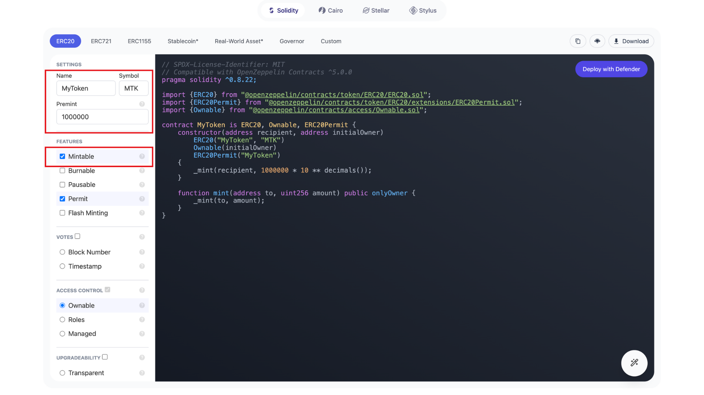
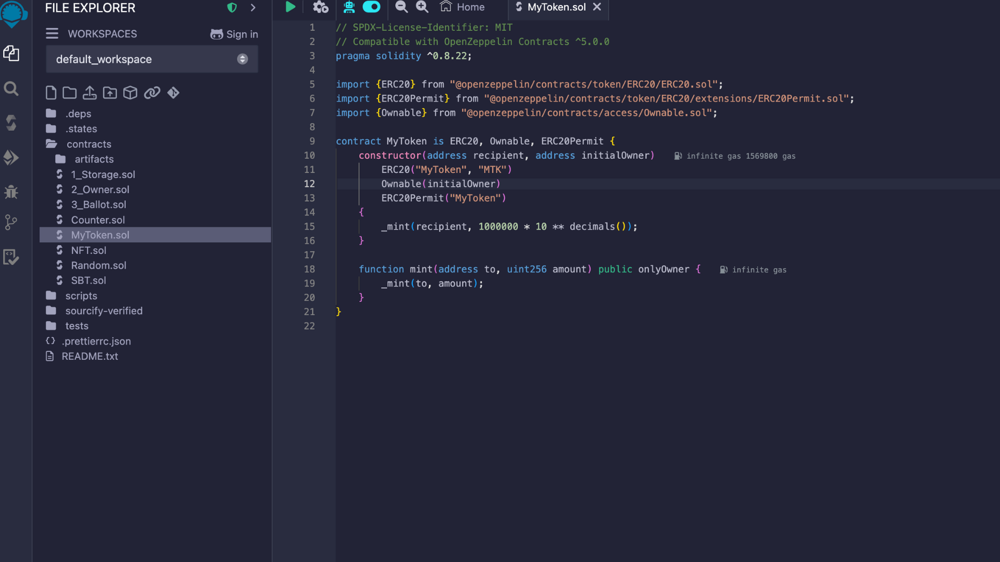
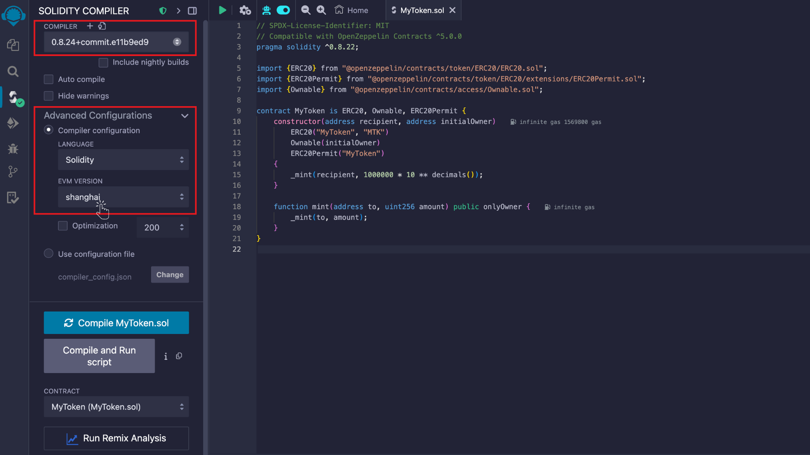
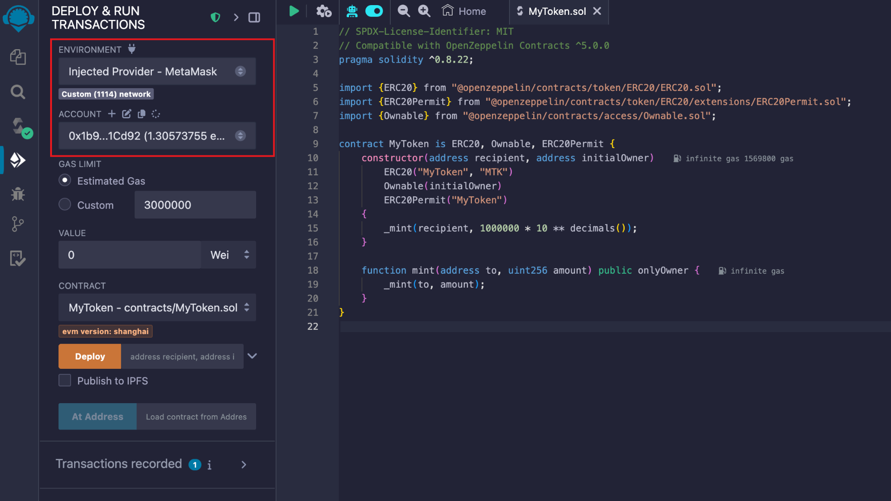
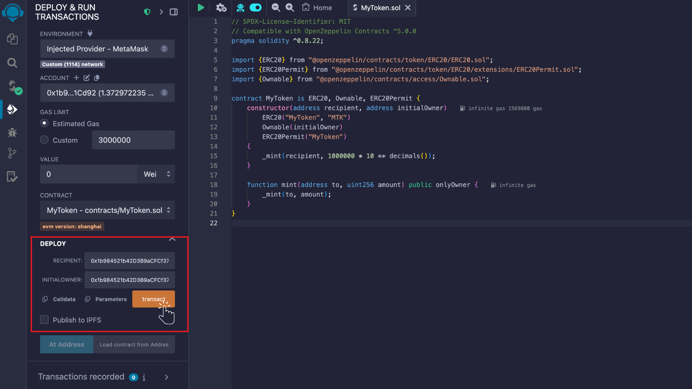
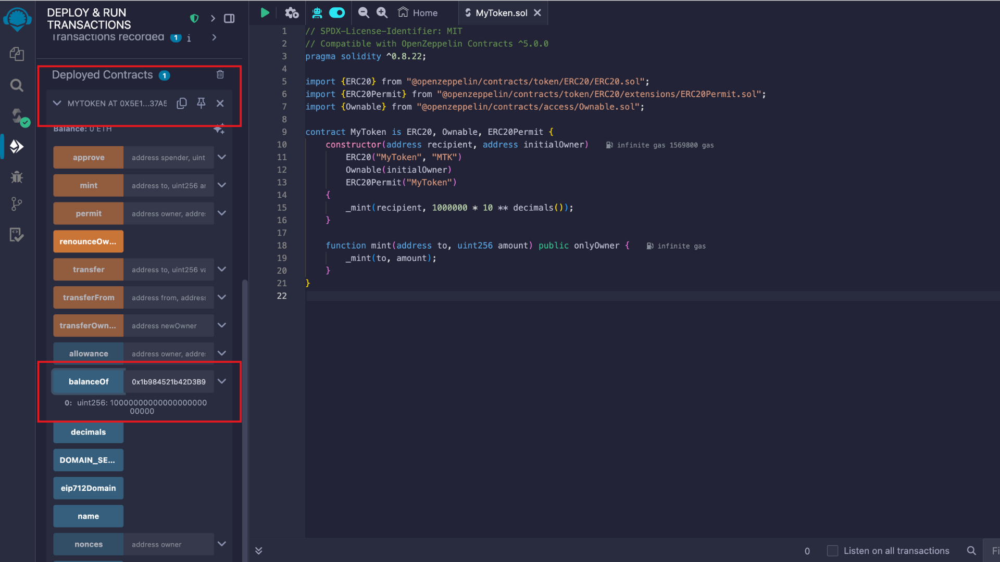

# ERC20 Tokens

---

## What is ERC-20?

ERC-20 is a standard for fungible tokens on the Ethereum blockchain. Unlike ERC-721 tokens, which are non-fungible and unique, ERC-20 tokens are identical to each other and can be traded or exchanged in equal quantities. They are the most common token type for projects involving cryptocurrencies, digital assets, and decentralized applications (dApps).

## Prerequisites

Before starting, you’ll need:

- **MetaMask** or any EVM wallet.
- A basic understanding of **Solidity** (though we will guide you through the whole process).
- Access to **Remix IDE**: [https://remix.ethereum.org](https://remix.ethereum.org)

---

## Step 1: Use OpenZeppelin Wizard to Generate Your ERC-20 Contract

### Why Use OpenZeppelin Wizard?

OpenZeppelin provides secure, audited smart contract templates. The OpenZeppelin Wizard is an excellent tool that simplifies the process of creating ERC-20 tokens, ensuring that your contract follows best practices.

1. **Go to OpenZeppelin's Wizard**: Open the [OpenZeppelin Wizard](https://wizard.openzeppelin.com/) in your browser.
2. **Select ERC-20**: In the list of available contract templates, select **ERC-20**.
3. **Customize Your Contract**:

   - **Token Name**: Enter the name of your token (e.g., `MyToken`).
   - **Token Symbol**: Enter the symbol for your token (e.g., `MTK`).
   - **Initial Supply**: Set an initial supply for your token (e.g., `1000000` tokens). This is the number of tokens that will be created upon deployment.

Optionally, you can include additional features like **minting** and **pausing** if needed for your use case.

4. **Copy the Code**: Once you've configured your contract, click the **Copy** button to get the Solidity code. You can either copy it to your clipboard or directly open it in Remix IDE.

## Step 2: Set Up Remix IDE

Remix IDE is an online platform for Solidity development, making it perfect for beginners and quick testing.

1. **Go to Remix IDE**: Open [Remix IDE](https://remix.ethereum.org) in your browser.
2. **Create a New Solidity File**:

   - In Remix, create a new file by navigating to the **contracts** directory and clicking the **+** button.
   - Paste the ERC-20 contract code you copied from OpenZeppelin’s Wizard into the newly created file.

3. **Install OpenZeppelin Contracts**:
   - If you're using Remix’s built-in **Solidity compiler**, it will automatically fetch OpenZeppelin contracts for you.
   - If you're using Hardhat, you'll need to manually install OpenZeppelin contracts by running `npm install @openzeppelin/contracts`.

## Step 3: Compile the Contract in Remix

1. **Compile Your Contract**:
   - In Remix IDE, go to the **Solidity Compiler** tab (the one with the Solidity logo).
   - Select the compiler version that matches your contract (for example, `0.8.24`).
   - Click **Compile** to compile your contract.

2. **Fix Any Errors**: If there are any errors in the code, Remix will highlight them. Correct any issues and recompile.

## Step 4: Deploy the Contract on a Test Network

1. **Connect Remix to MetaMask**:

   - Go to the **Deploy & Run Transactions** tab in Remix.
   - Under **Environment**, select **Injected Web3**. This will connect Remix to your MetaMask wallet.

Ensure that your MetaMask is connected to a **Core testnet**

2. **Deploy Your Contract**:
   - In the **Deploy** section, select the **ERC-20 contract** (e.g., `MyToken`).
   - Please paste the `recipient address` for the tokens to be minted in Premint, as well as the `owner address` (note that in this case, both addresses are the same).
   - Click on **Deploy**. You’ll be prompted to confirm the transaction in MetaMask.
   - Once the contract is deployed, you’ll see the contract’s address in Remix.

## Step 5: Interact with Your Contract

Now that your contract is deployed, you can interact with it directly from Remix.

1. **Check Balance**:

   - Under **Deployed Contracts**, you'll see your deployed contract.
   - Expand the contract’s interface to interact with functions like `balanceOf`, `mint` (if you included minting functionality).
   - Paste the recipient address and click on `balanceOf` to check the recipient's balance.

1. **Mint Tokens**:

   - Call the `mint` function to create new tokens. Provide the recipient address and the number of tokens to mint.
   - Confirm the transaction in MetaMask.

2. **Transfer Tokens**:
   - You can also use the **transfer** function to send tokens from one address to another.
   - Provide the recipient's address and the amount of tokens you want to send.
   - Confirm the transaction in MetaMask.

## Step 6: Manage Your Tokens

You can add additional functions to your contract, such as:

- **Burning Tokens**: A function to burn (destroy) tokens.

- **Roles**: Roles allow you to assign different permissions to addresses, such as minting or burning tokens, ensuring secure and controlled actions within the contract.

- **Upgradability** : Enables you to upgrade the contract logic after deployment without losing data, ensuring flexibility for future improvements

You can find more information on OpenZeppelin ERC-20 implementation [here](https://docs.openzeppelin.com/contracts/4.x/erc20).

## References:

- [ERC-20 Token Standard (Ethereum.org)](https://ethereum.org/en/developers/docs/standards/tokens/erc-20/)
- [OpenZeppelin ERC-20 Implementation Documentation](https://docs.openzeppelin.com/contracts/4.x/erc20)
