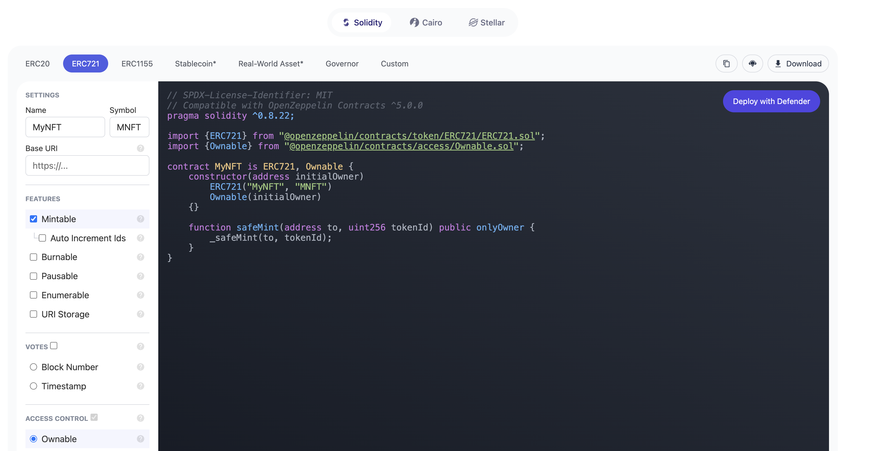
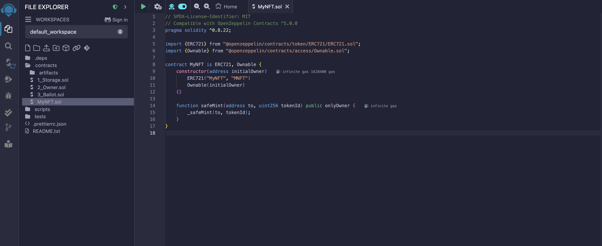
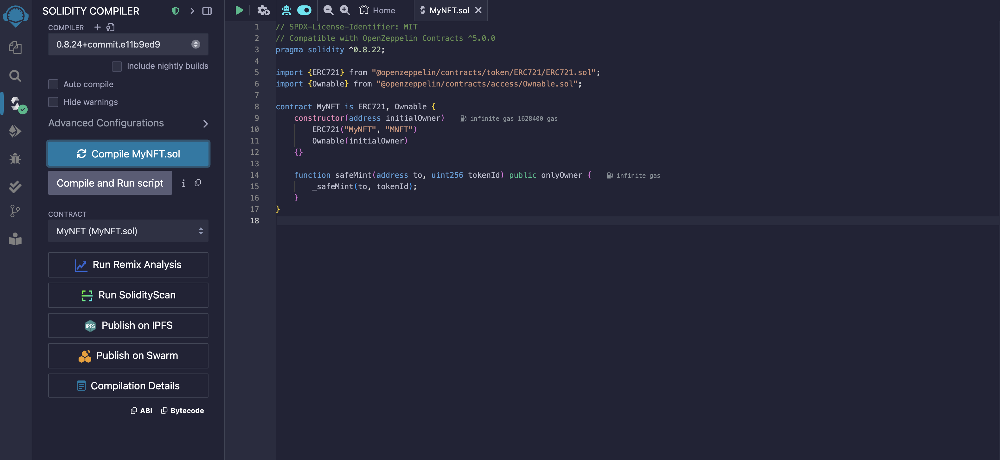
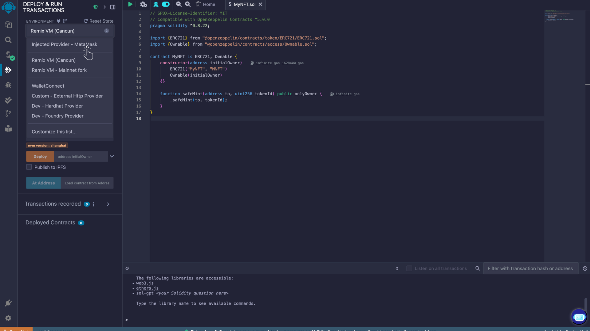
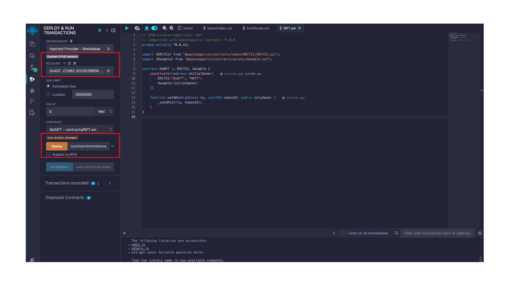
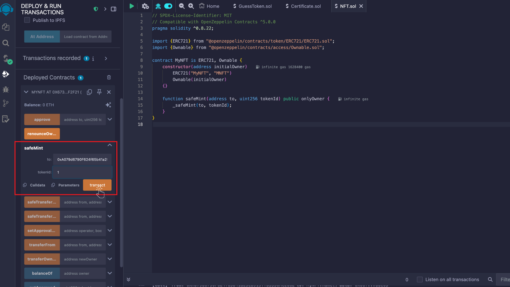

# ERC-721 Tokens

---

## What is ERC-721?

ERC-721 is a standard for non-fungible tokens (NFTs). Unlike ERC-20 tokens, which are fungible, ERC-721 tokens are unique and distinguishable from one another. This makes them perfect for use cases such as digital art, collectibles, in-game items, and more.

## Prerequisites

Before starting, you’ll need:

- **MetaMask** or any EVM wallet.
- A basic understanding of **Solidity** (though we will guide you through the whole process).
- Access to **Remix IDE**: [https://remix.ethereum.org](https://remix.ethereum.org)

## Step 1: Use OpenZeppelin Wizard to Generate Your ERC-721 Contract

### Why Use OpenZeppelin Wizard?

OpenZeppelin provides secure and audited smart contract templates. The **OpenZeppelin Wizard** is an excellent tool that allows you to generate ERC-721 smart contracts with just a few clicks, ensuring you follow best practices.

1. **Go to OpenZeppelin's Wizard**: Open the [OpenZeppelin Wizard](https://wizard.openzeppelin.com/#erc721) in your browser.

2. **Select ERC-721**:

- From the different contract templates listed, select **ERC-721**.

3. **Customize Your Contract**:

- **Token Name**: Enter the name of your token (e.g., `MyNFT`).
- **Token Symbol**: Enter the symbol for your token (e.g., `MNFT`).
- **Mint Function**: Add a minting function to allow new tokens to be created.
- **Metadata URI**: You can set metadata using a URI, which will point to the information about your NFTs (e.g., IPFS or a centralized server).

<p align="center">

</p>

4. **Copy the Code**:

After configuring your contract, click on the **Copy** button to get the Solidity code, or you can directly open it in Remix IDE.

## Step 2: Set Up Remix IDE

Remix is an online IDE for Solidity development that allows you to write, deploy, and manage smart contracts on the Ethereum blockchain. It is perfect for beginners and for quick testing.

1. **Go to Remix IDE**: Open [Remix IDE](https://remix.ethereum.org/) in your browser.

2. **Create a New Solidity File**:

- In Remix, create a new file by navigating to the `contracts` directory and clicking on the **+** button.
- Paste the ERC-721 contract code you copied from OpenZeppelin’s Wizard into the newly created file.

<p align="center">

</p>
3. **Install OpenZeppelin Contracts**:

- Remix provides a way to import OpenZeppelin contracts directly. This is done by adding the following import statement to the top of your contract:

```javascript
import { ERC721 } from "@openzeppelin/contracts/token/ERC721/ERC721.sol";
import { Ownable } from "@openzeppelin/contracts/access/Ownable.sol";
```

If you're using Remix's "Solidity compiler" plugin, it will automatically fetch the OpenZeppelin contracts for you. However, if you're using Hardhat, you'll need to manually install the OpenZeppelin contracts.

## Step 3: Compile the Contract in Remix

**Compile Your Contract:**

- In Remix IDE, go to the Solidity Compiler tab (the one with the Solidity logo).
- Select the compiler version that matches your contract (for example, 0.8.24).
- Click Compile to compile your contract.
- Fix Any Errors: If there are any errors in the code, Remix will highlight them. Correct any issues and recompile.

<p align="center">

</p>

## Step 4: Deploy the Contract on a Test Network

### Connect Remix to MetaMask:

- Go to the Deploy & Run Transactions tab in Remix.
- Under Environment, select Injected Web3. This will connect Remix to your MetaMask wallet.

<p align="center">

</p>

- Make sure your MetaMask is connected to a Core Testnet2.

### Deploy Your Contract:

- Go to the Deploy section.
- Select the **NFT contract** you want to deploy (`MyNFT`).
- Ensure the account is connected to the correct testnet.
- Paste the owner's address in the deployment tab (since the contract is ownable).
- Click on **Deploy**. You’ll be prompted to confirm the transaction in MetaMask.

<p align="center">

</p>

Once the contract is deployed, you’ll see the contract’s address.

## Step 5: Interact with Your Contract

Now that your contract is deployed, you can interact with it directly from Remix.

**Mint a New NFT:**

- Under Deployed Contracts, you’ll see your deployed contract.
- Expand the contract’s interface to interact with the functions like safeMint.
- Call the **safeMint** function to mint new NFTs. You’ll need to provide the `recipient address` and `token Id` as arguments.
- Confirm the transaction in MetaMask.

<p align="center">

</p>

**View Your NFT**

- After minting your NFT, you can view it in a wallet that supports ERC-721 tokens like MetaMask.

## Step 6: Managing Your NFTs

You can add additional functions to your contract, such as:

**Burning Tokens**: A function to burn (destroy) NFTs.
For additional customization, you can refer to OpenZeppelin's ERC-721 documentation and add new features to your contract.

For more information on OpenZeppelin ERC-721 implementation, please read[ ERC-721](https://docs.openzeppelin.com/contracts/4.x/erc721).

#### References

- [https://ethereum.org/en/developers/docs/standards/tokens/erc-721/](https://ethereum.org/en/developers/docs/standards/tokens/erc-721/)
- [https://docs.openzeppelin.com/contracts/4.x/erc721](https://docs.openzeppelin.com/contracts/4.x/erc721)
