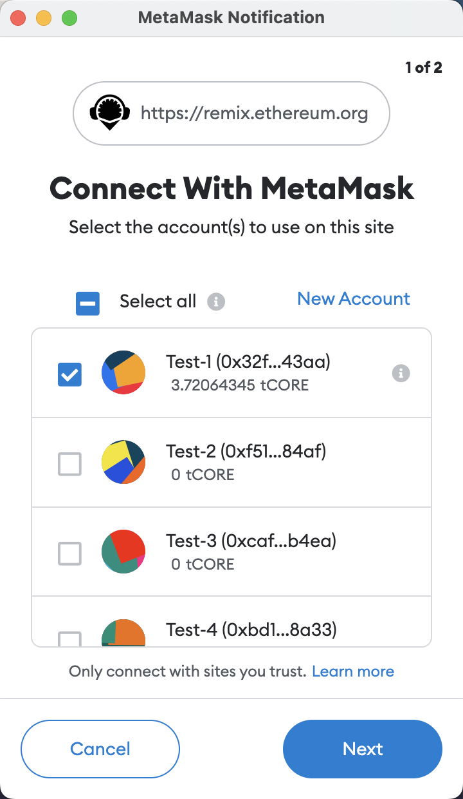
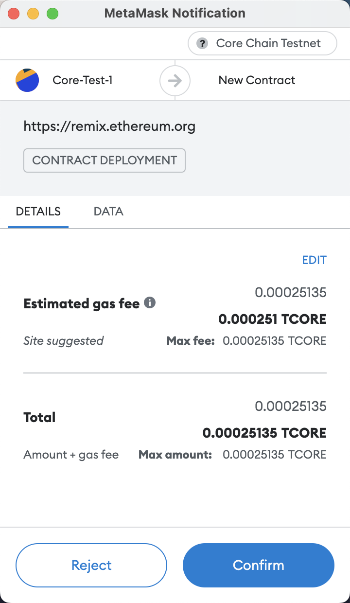

# Using Remix

---

Remix is a powerful online integrated development environment (IDE) for developers to build, test, deploy, and manage smart contracts. In this tutorial, we'll use the [Remix IDE](https://remix.ethereum.org/) to deploy a contract to Core Testnet.

## Connecting Remix to Core Testnet

Navigate to the [Remix IDE](https://remix.ethereum.org/), and you'll see a layout similar to below:

In the picture below, you'll see that you can choose different Solidity compiler versions. We recommend using the newer, more stable versions of Solidity, such as v0.8.7. You can also choose whether to enable auto compilation or hide warnings.

You can choose different environments on Remix, as shown in the picture below. An environment is just the blockchain network you'll be working with. There are built-in Virtual Machines (VMs), as well as providers that enable you to connect to external VMs.

To connect to Core Testnet, choose `Injected Provider - MetaMask`. Make sure your MetaMask wallet is [configured for Core Tesnet](./core-testnet-wallet-config.md) using the testnet chain settings, and verify that your account is funded from the appropriate faucet based ont eh Core testnet your are connectede to. Refer [here](https://scan.test.btcs.network/faucet) for Core Testnet (1115) and [here](https://scan.test2.btcs.network/faucet) for Core Testnet (1114).

You will be asked to connect to MetaMask. Once connected, Remix shows the connected address and the amount of CORE held by the address, as seen below:

## Smart Contract Compilation and Deployment

- **Make sure that your smart contract follows the [Solidity Support Guidelines for Core Blockchain](./smart-contract-guidelines.md)**.

- Remix comes with several default preset contracts loaded to the default workspace, as shown below. For this tutorial, let's use the preloaded `1_Storage.sol` contract. This contract implements a simple database that allows us to store one number via the `store()` function and view it via the `retrieve()` function.

- From the menu on the left, navigate to the `SOLIDITY COMPILER`, navigate to `Advance Configurations` and select `shanghai` from the `EVM Version` dropdown.

- Then select the blue **Compile** button to compile your smart contract.

- Then switch to the `DEPLOY & RUN TRANSACTIONS` from the same lefthand menu and select the **Deploy** button, outlined in red below.

- After selecting the **Deploy** button, MetaMask will open a popup asking you to sign and then send the deployment transaction on Core Testnet, as seen below.

- Once the contract is successfully deployed, you should receive a message on the console.

## Smart Contract Interaction

Once your contract is deployed, you can use Remix to quickly and intuitively interact with it.

Locate the newly deployed contract in the `Deployed Contracts` section located in the lower left. Let's test our contract by entering `100` into the `store` function's input field and selecting the orange **store** button.

MetaMask will again ask us to sign and send the transaction.

After successfully storing `100` in our smart contract, we can use the `retrieve` function to read the value. Click the **retrieve** button to view the value and we should see the number `100` returned, as shown below in the blue box.

You may have noticed that MetaMask did not pop up for the `retrieve` function call; this is because _transactions_ are only necessary for smart contract interactions that require gas, and reading data from a smart contract doesn't require any gas.

## Core Scan

Let's use [Core Scan](https://scan.test2.btcs.network/) to check on our deployed contract.

- **Copy the contract address** from Remix and use it as the input for a search on Core Scan.
- You should find the smart contract along with some relevant information, plus a list of all historical contract interactions that includes our deployment transaction and our `store` transaction.

