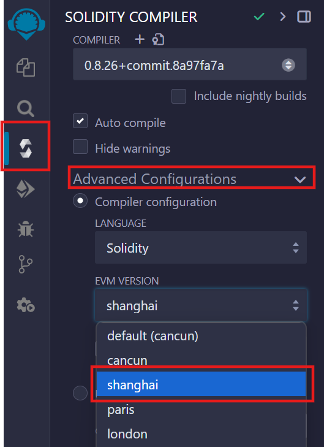

# Guidelines for Smart Contract Development on Core

---

Core blockchain is always improving to provide a better experience for both users and developers. This guide outlines the supported Solidity versions and configuration settings needed for successful smart contract deployment and verification on the Core network.

Core blockchain supports Solidity versions higher than 0.8.24 using the **Shanghai** EVM version. It is important to follow these guidelines to ensure your smart contracts work smoothly on the Core network.

## Recommended Configurations for Deploying Smart Contracts on Core

Currently, Core's EVM matches the Shanghai version and does not support the deployment or verification of smart contracts with Solidity version **0.8.24^** using default EVM settings. follow these guidelines to deploy and verify contracts with Solidity version 0.8.24^.

### EVM Settings

To run smart contracts with Solidity version **0.8.24^**, developers **should** select the **Shanghai** EVM version, not the default EVM, for compiling and deploying contracts.

#### Hardhat

- Please add `evmVersion: "shanghai"` in solidity comppiler configurations.

#### Remix

- Please choose `shanghai` in Compiler configuration.

### Contract Verification

- To simplify the verification process, the default EVM version for Core Scan is set to **Shanghai** for solidity version **0.8.24^**.
- Developers can take the same steps to verify their smart contracts with version 0.8.24^ as of the older versions. Refer [here](./contract-verify.md) for more details on contract verification on Core blockchain.

### Smart Contracts Based on Solidity version < 0.8.24

- **Note**: smart contracts with solidity version **\< 0.8.24** are unaffected and can operate as usual.
