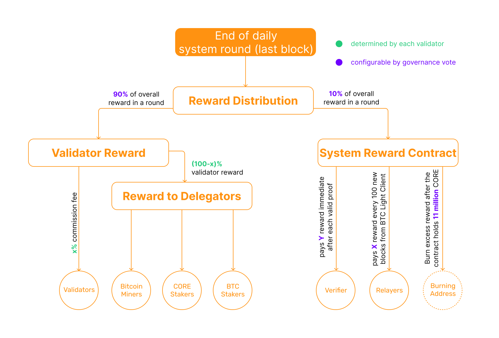

# Rewards in the Core Ecosystem 
---

The Core ecosystem is designed to incentivize participation and secure commitment from its community through a well-structured rewards system. This system underpins the Satoshi Plus consensus mechanism, ensuring network security, stakeholder engagement, and alignment of interests among all participants. The rewards system is fundamental in encouraging the community to partake actively in mining, staking, and governance, thereby enhancing the overall health and growth of the ecosystem.

## Types of Rewards

### 1. Mining Rewards
* **Description:** Mining rewards are provided to Bitcoin miners who contribute their hashing power to secure the Core blockchain. This process extends the traditional mining efforts on the Bitcoin blockchain to include support for Core blockchain, without requiring miners to divert resources from their Bitcoin mining activities.
* **Mechanism:** Miners include specific metadata in the Bitcoin blocks they mine, indicating their support for Core blockchain. In return for their contribution, miners receive CORE tokens as supplemental rewards, on top of their regular Bitcoin mining rewards.

### 2. Staking Rewards
* **Description:** Staking rewards are distributed to Bitcoin and CORE token holders who stake and delegate their tokens with Validators on the Core network. This staking not only helps secure the network through the Delegated Proof of Stake (DPoS) component of the Satoshi Plus consensus but also enables token holders to participate in network governance.
* **Mechanism:**  DPoS allows holders of both CORE tokens and [Bitcoin](../../products/btc-staking/overview.md) to vote and participate in the election of the validator set by delegating their holdings to their preferred validators. For Core token staking, the minimum staking requirement is 1 CORE token, allowing any CORE holders to stake onto the Core network. On the bitcoin-staking side, the present configuration requires a **minimum staking requirement of 0.01 Bitcoin** which is adjustable through a governance vote. Holders of both CORE token and Bitcoin can delegate their respective tokens to validators of their choice through the official [staking website](https://stake.coredao.org/). The rewards earned by stakers are proportional to the amount of Bitcoin/CORE staked and the duration of the staking, incentivizing long-term holding and participation in the consensus process.

### 3. Validator Rewards
* **Description:** Validators earn rewards for their role in processing transactions, creating new blocks, and maintaining the blockchain's integrity. These rewards are critical for compensating Validators for their efforts and operational costs.
* **Mechanism:** Validators receive a combination of transaction fees and new CORE tokens minted through the blockchain's inflation policy. The amount of rewards a Validator receives is proportional to their stake and the delegated hash power from miners. There are two categories of validator rewards:
    1. **Base rewards**, i.e. newly minted CORE tokens;
    2. **Fees collected from transactions in each block**;

Base rewards are calculated and distributed when the last block of a round is mined. Currently, **90%** of the rewards go to the validators and **10%** of the rewards go to the `System Reward Contract`. Of the 90% paid to validators, some percentage is taken as a commission by the validator before they pay out their delegates. Each validator has an equal probability of producing blocks, so in the long run, all stable validators should get a similar portion of the reward.

Validators share rewards with the entities that delegated to them – including CORE stakers, bitcoin stakers, and PoW delegators – but they decide how much to give back by deciding how much they (the validators) choose to keep for themselves. Validators can take as much or as little of the reward as they want, though they’re incentivized to be generous in order to attract more stake and hash power.

After the validators take their fees, the protocol uses this function to determine how the remaining rewards are split between CORE stakers, Bitcoin stakers, and hash power delegators. Reward distribution is calculated based on the following formula: 

### Hash Power Delegators (Miners & Mining Pools)

$$ 
    rH = \frac{\frac{rHp}{tHp} * m} {S} * R
$$

### CORE Stakers

$$ 
    rS = \frac{\frac{rSp}{tSp} * k} {S} * R
$$

### Bitcoin Stakers

$$
    rB = \frac{\frac{rBp}{tBp} * l} {S} * R
$$

Where: 
* $$rH$$: Rewards attributed to delegated hash power (DPoW).
* $$rS$$: Rewards attributed to CORE staking (DPoS).
* $$rB$$: Rewards attributed to BTC staking.
* $$R$$: Total rewards allocated to all delegators.
* $$m$$: Proportion of rewards allocated to hash power.
* $$k$$: Proportion of rewards allocated to CORE staking.
* $$l$$: Proportion of rewards allocated to BTC staking.
* $$S$$: Hybrid score of the validator.

Per unit reward calculations determine the rewards distributed for each staked unit of hash power, CORE, or BTC:

* Per unit hash power reward: $$rHu$$ =  $$ \frac{rH}{rHp} $$
* Per unit CORE reward: rSu = $$ \frac{rS}{rSp} $$
* Per unit BTC reward: $$rBu$$ of **Pn** =  $$\frac{rB}{rBp}$$ x Yield Multiplier for Leveln

Where:
* $$rHu$$ is the validator hash power rewards per unit;
* $$rSu$$ is the CORE token staking rewards per unit;
* $$rBu$$ of **Pn** is the BTC staking rewards per unit for delegator with PN BTC yield level
* **Yield Multipliers:** Each boosted yield level has a specific multiplier (e,f,g,h, ..., etc) that is determined by a user's staking data as well as system dual staking settings. The settings are subject to change and are configurable through governance voting. These calculations ensure proportional rewards are distributed based on individual contributions to a validator’s delegation pool.

#### Impact of Dual Staking on BTC Rewards
With the introduction of Dual Staking, BTC staking rewards are now tiered based on the amount of CORE staked relative to BTC. BTC rewards are no longer evenly distributed across all participants. Instead, they are allocated dynamically based on dual staking thresholds, with higher tiers generally receiving a greater proportion of the rewards. This tiered structure introduces variability in BTC staking returns, aligning incentives across the Core ecosystem while maintaining proportionality in reward distribution.

## Reward Split

These reward-splitting functions are designed to create an active market for rewards while encouraging competition amongst the validator set for both delegated hash power and delegated staked CORE and Bitcoin. For their part, delegators will try to optimize their own rewards by choosing validators with lower amounts of delegated hash power and stake. To maximize their rewards, delegators will look both for validators that are generous in their payouts, but also don’t already have a substantial amount of delegated CORE tokens or delegated PoW. The less a given validator has staked, the greater a contribution from a delegator will be. If a delegator adds one CORE token to a validator that only has one token, they’re 50% of that validator’s total delegation. If they delegate to a validator with 99 CORE tokens, they’re only 1% of that validator’s total delegation. Since payouts are determined in part based on the percentage of total stake each delegator accounts for, they’ll be incentivized to try and find validators with small delegations.

### 4. Relayer and Verifier Rewards
In the Core ecosystem, the base rewards are calculated and distributed when the last block of a round is mined, with **90%** going to the validators and **10%** to the System Rewards Contract. The System Reward Contract accumulates rewards to remunerate relayers and verifiers. As things stand, there is a cap of **10 million** total CORE tokens in the System Reward Contract. Any rewards in excess of this amount are burned.

Relayers are responsible for communicating the Bitcoin blocks and transaction data to the Core network. They earn a portion of the base system rewards and transaction fees for this cross-chain communications work. Relayer rewards are distributed in batches, every 100 Bitcoin blocks. Relayers claim their rewards periodically.

Verifiers in the Core ecosytem are responsible for monitoring the behavior of validators and report them if they engage in double signing or other malicious activity. When successful, rewards are paid out immediately from the System Rewards Contract, in the same transaction.

## Conclusion
The rewards in the Core ecosystem play a crucial role in maintaining the security, vitality, and decentralization of the network. By aligning the incentives of various participants through a comprehensive and adaptable rewards system, Core ensures ongoing engagement and contributes to the sustained growth and stability of the platform. This structured approach to incentivization is foundational to the success of Core as a leading platform in the Bitcoin DeFi landscape.
