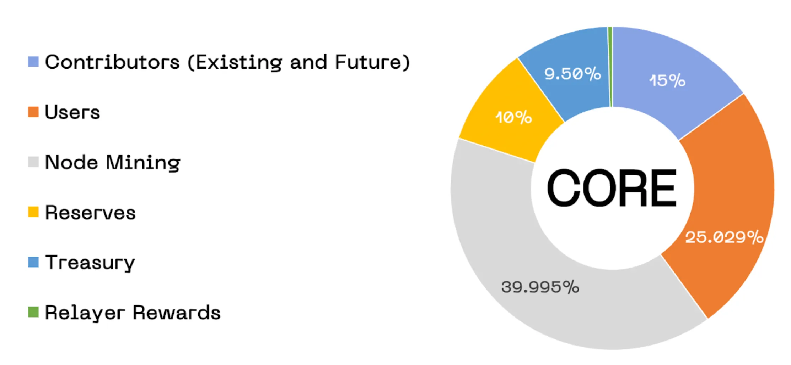

# CORE Tokenomics and Utility
---

## Overview
The tokenomics of CORE, the native utility and governance token of the Core blockchain, is structured to reflect a philosophy deeply rooted in decentralization, sustainability, and long-term alignment of incentives. With a capped supply mirroring Bitcoin's scarcity model and a distribution strategy focusing on decentralization, Core is among the most equitably launched blockchains in history.

## Token Distribution
CORE tokenomics is designed with a focus on long-term sustainability and decentralization. Inspired by the sound monetary policy of Bitcoin and the need for a fair distribution of governance power, CORE tokens serve as the backbone of the Core ecosystem. 

CORE tokens are allocated across several channels to balance the ecosystem. The following diagram illustrates the distribution of CORE tokens.The distribution of the total **2.1 billion** CORE tokens is as follows:

1. **Node Mining (39.995% - 839,900,000 CORE tokens):**  
To bootstrap the network, nodes are rewarded for securing the chain. These rewards are designed to be distributed over approximately **81 years**, aligning with the long-term commitment of participants.

2. **Users (25.029% - 525,600,000 CORE tokens):** A significant allocation is reserved for airdrops to a decentralized user base, emphasizing that the chain is user-centric and inclusive.

3. **Contributors (15% - 315,000,000 CORE tokens):** This allocation is set aside to incentivize both past and future contributors who build and maintain the Core network.

4. **Reserves (10% - 210,000,000 CORE tokens):** A strategic reserve is maintained to capitalize the foundation progressively without centralizing the token supply.

5. **Treasury (9.5% - 199,500,000 CORE tokens):** The Treasury funds are allocated to foster the ecosystem's development and supply the DAO with sufficient resources for growth.

6. **Relayer Rewards (0.476% - 10,000,000 CORE tokens):** Relayers, like nodes, play a vital role in maintaining the network's security and are compensated with rewards and transaction fees.

## Token Utility

CORE tokens serve multiple critical functions within the Core network:

- **Transaction Fees:** Users pay for transactions and smart contract executions using CORE tokens.
- **Staking:** Core allows to stake both Bitcoin and CORE tokens on the Core network, securing it further and enabling stakers to earn rewards.
- **Governance Participation:** Token holders can participate in on-chain governance, shaping the future of the Core network.

## Sound Supply and Emissions

Following a strict hard cap of **2.1 billion** tokens, CORE adopts Bitcoin's absolute scarcity principle, providing resistance to inflation. The block rewards for CORE are designed to be distributed over an **81-year** period to incentivize network participation sustainably.

- **Annual Reward Adjustment:** Each year, block rewards decrease by **3.6%**, extending the emissions schedule and maintaining a deflationary pressure.

## Decentralization and Direction

- The Core strategy focuses on a stable and deliberate path toward decentralization and antifragility. The token launch aims to place CORE tokens in the hands of those committed to building and sustaining the network.

- The direction and pace of the project prioritize robustness over rapid expansion. The token distribution and economic policies reflect Core's design targeting a sturdy foundation that values antifragility and is capable of weathering the volatility of the crypto markets.

- By targeting a diverse group of stakeholders, including builders, users, and believers, CORE tokenomics lays the groundwork for a decentralized governance model that can evolve and adapt as the network matures.

- The distribution is targeted towards builders, users, and long-term supporters, fostering a decentralized, yet fully aligned community.

## Sound Monetary Policy

In addition to the hard cap, Core also has a deflationary mechanism:

- **Transaction Fee Burns:** A portion of transaction fees and block rewards will be burned, as determined by the DAO, so the supply of CORE tokens asymptotically approaches the hard cap without exceeding it.

## Incentive for Bitcoin Network Participants

- **Supplemental Income for Miners:** With the eventual end of Bitcoin block rewards, CORE tokens offer an alternative revenue stream for miners who become validators on the Core network. By delegating their existing hash power, they receive rewards from both Bitcoin transactions and CORE token rewards, upholding the continued security and viability of the Bitcoin mining ecosystem.

- **Reward for HODLing Bitcoin:** Core offer non-custodial Bitcoin staking which is designed specifically for the kind of long-term holders and institutions who have shown a clear preference for keeping their assets on the Bitcoin blockchain. Recognizing that such entities are accustomed to holding their bitcoin without frequent transactions, native bitcoin staking offers them the opportunity to earn rewards during a specified holding period. Users can stake their bitcoin without moving it off the Bitcoin blockchain, thereby maintaining the high security and trust that comes with Bitcoin's robust infrastructure.

## Conclusion

The tokenomics of CORE is crafted to support a robust and decentralized economy within the Core network. With a clear utility, a hard cap on supply, and a long-term reward distribution plan, Core stands out as a platform that balances the principles of sound money with the necessities of a growing and evolving blockchain ecosystem. This financial model is designed to attract dedicated participants who will contribute to the network's strength and resiliency for decades to come.
