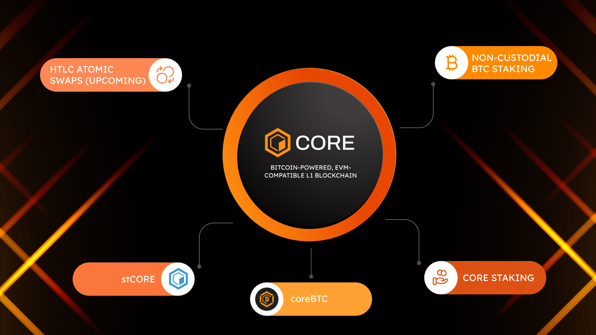

# Core: Unlocking Bitcoin DeFi
---

Core is the first Bitcoin-aligned, EVM-compatible Layer-1 blockchain, designed to be Bitcoin's complementary and hyper-scalable smart contract platform. With over **75%** of Bitcoin mining hash power and more than **8,200** BTC staked and contributing to its security model, Core is unlocking Bitcoin as both the prime protector and central asset of the future of DeFi through the groundbreaking innovation of non-custodial Bitcoin staking.

Core's major innovation is it's novel consensus mechanism, **Satoshi Plus**, that unites Delegated Proof of Work (DPoW), Delegated Proof of Stake (DPoS), and Non-custodial Bitcoin Staking. Through this combination, Core blockchain incorporates Bitcoin miners in the security of Turing-complete smart contracts, unlocks the functionality and utility of those miners beyond the simple maintenance of the Bitcoin ledger, and provides them with purely additive supplemental income in the form of CORE token rewards. This symbiotic relationship works to strengthen Bitcoin without consuming Bitcoin block space or detracting from the miners' primary role as defenders of the Bitcoin network. While DPoW leverages Bitcoin miners, through the DPoS, Core leverages both the CORE and BTC holders that stake their assets onto the Core blockchain and influence the network’s consensus by delegating their staked assets to the validators on the Core network.

## Key Features of Core Blockchain

Some of the key features of Core that distinguishes it from its competitors:

* **Satoshi Plus Consensus Mechanism:** the novel consensus mechanism, which is a hybrid of Delegated Proof of Work (DPoW), Delegated Proof of Stake (DPoS), and Non-Custodial Bitcoin Staking.
* **Core DAO:** the DAO that manages on-chain governance.
* **EVM Execution Layer:** Core adaptes Ethereum Virtual Machine (EVM) for smart contract execution making it EVM-compatible, similar to [BNB Smart Chain's implementation](https://github.com/bnb-chain/bsc) of Geth.
* **coreBTC:** now sunsetted, is the enshrined Core-native bridged BTC. 
* **Non-custodial BTC Staking:** Core offers BTC holders to stake their assets onto the Core blockchain in a trustless and secure manner without having to give up custody of their assets. This innovative feature integrates Bitcoin into Core's DeFi activities, enhancing liquidity and enabling Bitcoin users to earn staking rewards in the form of CORE tokens within the Core ecosystem.
* **stCORE:** Core offers Liquid Staking in the form of stCORE which is designed to enhance the utility of the CORE token and simplify the staking process. This initiative allows token holders to maximize their asset potential with greater flexibility and efficiency.
* **HTLC Atomic Swaps _(Coming Soon)_:** enables trustless, peer-to-peer exchange of tokens between Core and other blockchains, including (and especially) Bitcoin, through Hashed TimeLock Contracts (HTLCs).

## Problems Addressed by Core blockchain

Core blockchain addresses several key problems and issues in the blockchain space through its unique approach and technology. Here's a summary of the issues that Core attempts to overcome:

* **Scalability and Security:** Core utilizes a novel consensus mechanism called "Satoshi Plus" which aims to balance the trade-offs between scalability, security, and decentralization. This mechanism combines Bitcoin's Proof-of-Work (PoW) and Delegated Proof-of-Stake (DPoS) consensus mechanisms into one hybrid system, seeking to leverage the security provided by Bitcoin's mining power while enhancing scalability through DPoS​.

* **Blockchain Trilemma:** The blockchain trilemma asserts that it is challenging to achieve decentralization, security, and scalability simultaneously. Core's solution, the Satoshi Plus consensus, attempts to tackle this trilemma by integrating Bitcoin's computing power for security and the DPoS mechanism for scalability, aiming for a decentralized system that does not compromise on these critical aspects​.

* **Ecosystem Roles and Participation:** Core is designed to have an ecosystem where various participants play significant roles, including validators, relayers, BTC miners, CORE holders, and verifiers. This ecosystem aims to ensure network security, promote decentralization, and encourage community participation in governance and network activities​.

* **Tokenomics and Incentive Structure:** CORE, the native utility token, is used for staking and paying gas fees. With a total supply of **2.1 billion** tokens, Core 
Chain plans to distribute these over **81 years**, aligning with its long-term vision. The project also includes mechanisms for burning a percentage of block rewards and gas fees to manage token supply dynamically​.

* **Passive Income:** Core furnishes an opportunity for BTC holders to earn passive income in the form of CORE tokens earned as rewards in exchange for staking their BTC onto Core and delegating these to valdiators on the Core network, indirectly contributing to Core blockchain’s consensus mechanism and security.

* **Comparison with Other Blockchains:** Core positions itself as an improvement over existing blockchains like Bitcoin, Ethereum, Solana, Polygon, and BNB Chain. By addressing issues such as low transaction throughput, centralization risks, and network stability, Core offers a more scalable, decentralized, and secure alternative​.
