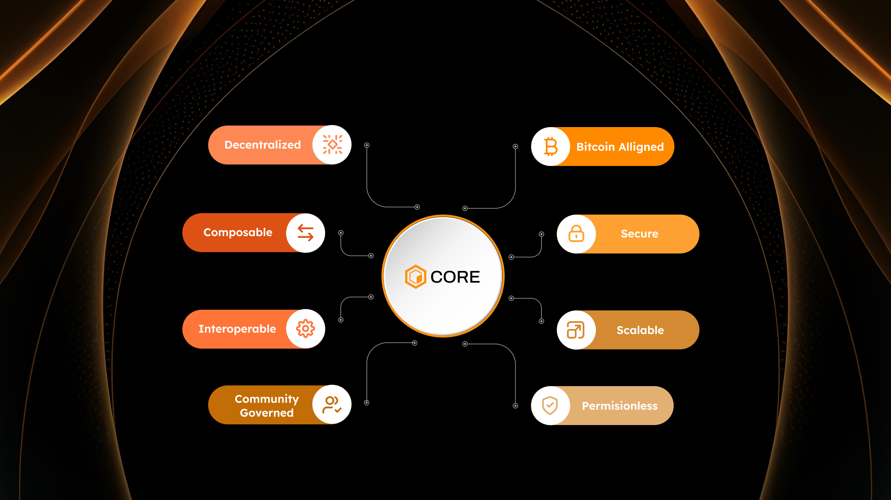

# Why Core
---

Core is Bitcoin’s complementary and symbiotic smart contract platform. It unlocks Bitcoin-native yield, Bitcoin-powered smart contracts, a second block reward for miners, and an end-to-end BTCfi ecosystem. Overall, Core represents a paradigm shift in how we use Bitcoin. It amplifies its role as a Store of Value through the Bitcoin Risk-Free Rate and facilitates its transition to Medium of Exchange by providing Bitcoin-secured, yet hyper-scalable blockchain rails for more efficient transactions and a variety of other use-cases. Core’s approach not only aligns with Bitcoin’s ethos of decentralization, transparency, and permissionlessness, but also safeguards and enhances the base Bitcoin network. 

Core is a blockchain synthesis that unlocks something for everybody. Here are some of the many interested groups and how Core supports them:

* **Bitcoin Holders:** Core puts your Bitcoin to work without requiring you to give up custody. Bitcoin holders can earn the Bitcoin Risk-Free Rate through Core’s Non-Custodial Bitcoin Staking. Without bridging your Bitcoin or even necessarily engaging in Core DeFi, Bitcoin holders can earn more by simply continuing to hold. 

* **Bitcoin Users:** For those interested in using Bitcoin as a Medium of Exchange, Core makes Bitcoin transactions and financial activity practical with its fast, efficient, and Bitcoin-protected blockchain rails. On Core, the Bitcoin asset gains a tailor-made financial ecosystem its users can enjoy permissionlessly. 

* **DeFi Users:** DeFi experts can find many familiar use-cases in Core’s dapp ecosystem, given that Core is fully EVM-compatible and supports a variety of smart contract use-cases. Many opportunities for lending, borrowing, swapping, and other activities are available. This young and growing ecosystem is a great opportunity for DeFi veterans to mount their BTCfi journey. 

* **Web3 Enthusiasts:** Beyond DeFi, Core’s Turing completeness opens the door to a variety of blockchain-enabled use-cases. NFTs, gaming, and other features are an open canvas for believers in an open and user-owned internet. 

* **Builders:** Core is fully permissionless and EVM-compatible, meaning any developer with Solidity experience can create a dapp and launch it with familiarity. Core is also home to a robust ecosystem of dev tools and infrastructure providers, making building a seamless experience. Core also has a vibrant ecosystem of users ready for the emergence of next-gen Bitcoin-powered dapps. 

* **Bitcoin Miners:** Core’s Delegated Proof of Work unlocks a second block reward for Bitcoin miners who are always searching for critical rewards. Furthermore, Core extends the protection of Bitcoin miners beyond the mere Bitcoin asset, and onto an ecosystem that can fully tap into the potential of that asset.

* **Bitcoin Supporters:** Even without personally engaging with the Core blockchain, Bitcoin supporters can appreciate how Core aligns itself with Bitcoin for the betterment of both the Bitcoin network and asset. With better rewarded, and therefore more highly incentivized miners, the Bitcoin network grows stronger, while the Bitcoin asset gains a sophisticated smart contract environment. 

* **Freedom Believers:** Core is a fully permissionless blockchain, enabling anyone across the world to participate. This ethos promotes financial opportunity for communities that can most benefit from the emergence and popularity of Bitcoin and blockchain technology. 
