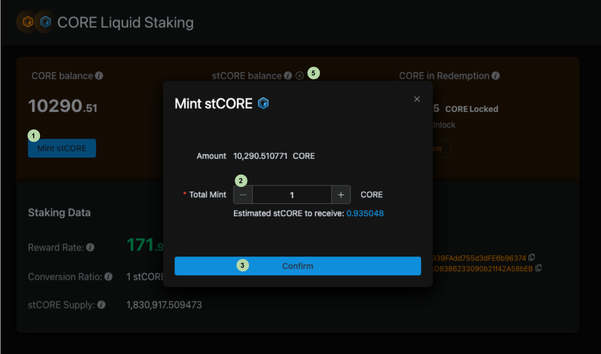

# Liquid Staking with stCORE

---

## Introduction

Liquid Staking with stCORE enhances CORE token utility while streamlining the staking process. This guide provides a detailed walkthrough for minting and redeeming stCORE, enabling token holders to maximize capital efficiency while participating in network security.

## Getting Started: Prerequisites

1. **Check CORE Token Availability:** Verify that your Core wallet contains the necessary amount of CORE tokens for staking.
2. **Access the Staking Platform:** [Visit Core Liquid Staking Platform](https://stake.coredao.org/liquid-staking/stcore)
3. **Wallet Connection:** Connect your wallet to the platform.

## Key Definitions

- **CORE Balance:** The amount of CORE tokens in your wallet.
- **stCORE Balance:** The amount of stCORE tokens in your wallet.
- **CORE in Redemption:** A **7-day** unlocking period for withdrawing CORE after redemption initiation.
- **Reward Rate:** The annualized return projection for holding stCORE.
- **Conversion Ratio:** A dynamic value reflecting the stCORE/CORE or CORE/stCORE ratio, influenced by the Earn contract's staking activities.
- **stCORE Supply:** Total minted stCORE tokens.

## Minting stCORE

1. **Initiate Minting:** Click on '_Mint stCORE_'.
2. **Specify Amount:** Enter the desired CORE amount to convert into stCORE.
3. **Confirmation:** Click '_Confirm_' to proceed.
4. **Wallet Transaction:** Approve the minting transaction in your wallet.
5. **Add stCORE to Wallet:** Click on the **_+_** sign to add stCORE.

## Redeeming CORE from stCORE

1. **Start Redemption:** Click '_Redeem CORE_'.
2. **Enter Amount:** Specify the stCORE amount for redemption.
3. **Confirmation:** Click '_Confirm_'.
4. **Wallet Approval:** Confirm the redemption transaction in your wallet.
5. **Unlocking Period:** A **7-day** wait period begins. Track progress under the “_In Redemption_” section.
6. **Withdrawal:** Post-unlocking, click '_Withdraw_' to transfer CORE to your wallet.

