# Dual Staking on Core

This user guide is designed to walk you through the Dual Staking process on Core. Core’s Non-Custodial Bitcoin Staking allows users to earn yield in CORE by staking their Bitcoins and delegating them to validators on Core. Dual Staking unlocks higher yield tiers by staking Bitcoin and CORE to enhance yield generation from Non-Custodial Bitcoin staking further. Let's dive into how it works and how you can start staking today.

## Prerequisites

To be able to stake, you must have the following prerequisites:

1. **Supported Bitcoin Wallet Browser Extension:** To participate in the BTC staking process, you must install browser extensions of any supported Bitcoin wallets, like [Xverse](https://chromewebstore.google.com/detail/xverse-wallet/idnnbdplmphpflfnlkomgpfbpcgelopg?hl=en-GB&authuser=1), [Unisat](https://chromewebstore.google.com/detail/unisat-wallet/ppbibelpcjmhbdihakflkdcoccbgbkpo), and/or [OKX Wallet](https://chromewebstore.google.com/detail/okx-wallet/mcohilncbfahbmgdjkbpemcciiolgcge) (visit stake.coredao.org for the latest supported wallets). You must use a desktop version, as mobile and hardware wallets are not currently supported. You can also stake directly using the Element wallet mobile application as well. 
2. **Core Wallet Address for Rewards:** Prepare your Core wallet address to stake CORE and receive [CORE token rewards for staking Bitcoin](https://docs.coredao.org/docs/Learn/products/btc-staking/stake-btc-guide#prerequisites) and CORE. If you do not have a Core wallet address, you can quickly create one by connecting to MetaMask. For more information on configuring MetaMask to work with the Core network, follow the detailed guide [here](https://docs.coredao.org/docs/Dev-Guide/core-mainnet-wallet-config).

## Key Considerations For Dual Staking

The following are some key points that users should be careful about when staking their Bitcoin on Core.

1. **Minimum of 0.01 Bitcoin \+ Gas Fee:** To successfully stake your Bitcoin on Core, you need a minimum of 0.01 Bitcoin. In addition to the staking amount, users should consider the necessary gas fees in Bitcoin for executing transactions on the Bitcoin network. If you plan to stake for less than a month, having at least 0.05 Bitcoin is advisable. This extra amount helps cover potential network congestion, which can lead to higher gas prices than the rewards earned from staking.

2. **Minimum of 1 CORE \+ Gas Fee:** To stake, you must have at least 1 CORE. In addition to the staking amount, users should also account for the gas fees in CORE tokens for transaction processing.  
3. **Understanding the Differences in Bitcoin Staking Addresses:**  
   * The staking address in your Bitcoin wallet's transaction prompt may differ from your original Bitcoin address. This is because the Bitcoin staking address is derived from your Bitcoin wallet's master private key, ensuring control and security over your assets. Your Bitcoin remains safe in the Bitcoin staking address, unaffected by staking.   
4. **Delays in Locked Assets to Appear in your Bitcoin Wallet:**   
   * You may face some delays before your locked Bitcoin is displayed in your Bitcoin wallets. This delay primarily results from delays in transaction confirmation on the Bitcoin network, which can take several hours due to block time, the number of block confirmations required, and network congestion.   
   * While we are actively working with wallet partners to support the timely display of your assets in your wallets, you can check your locked assets on the **MyStaking** page on Core’s staking website.   
   * You can also view your staked funds by searching the staking address on a Bitcoin explorer, [Mempool.space](https://mempool.space/).   
5. **Considerations for Locking Periods**  
   * Once you lock your Bitcoin for staking, it's inaccessible until the staking period concludes. Considering your investment objectives and risk tolerance, you are advised to select your locking period thoughtfully. Starting with shorter locking periods can help you become familiar with the process before committing to longer durations.

## Step-By-Step Walkthrough of Dual Staking

Core’s Non-Custodial Bitcoin staking introduces a secure and decentralized method for Bitcoin holders to earn yield through Bitcoin staking. Users can stake their Bitcoin natively on the Bitcoin network through a time-bound mechanism and actively participate in the Core blockchain's Consensus mechanism while staking. 

Dual staking is an enhancement to Core’s Non-custodial BTC staking, allowing users to unlock higher yield tiers by staking Bitcoin and CORE simultaneously. Higher CORE:BTC staking ratios unlock higher yield tiers for Bitcoins staking. To take advantage of Dual Staking and earn higher reward rates for BTC staking, follow the steps detailed below. 

### Connecting Bitcoin and Core Wallets

1. Visit [https://stake.coredao.org](https://stake.coredao.org/) and click **Stake Now** on the top right of the header.  
2. Once on the **Staking** tab, click the **Connect** option next to “BTC Staking Amount” to connect your Bitcoin wallet. This should be the wallet with the Bitcoin assets you want to stake. Click on the supported wallet of your choice to connect your Bitcoin wallet.  

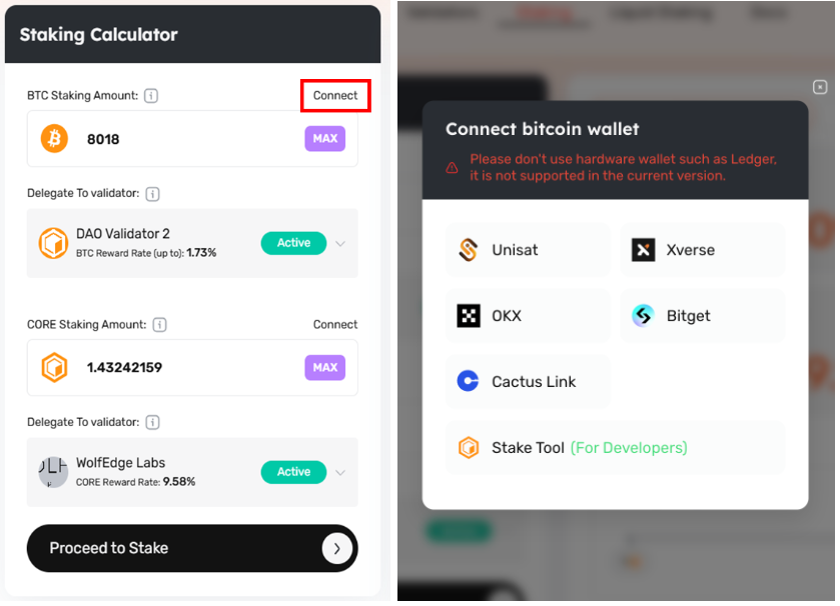

3.  Likewise, click the **Connect** option next to **CORE Staking Amount** and select the Core wallet to stake CORE and receive staking rewards.

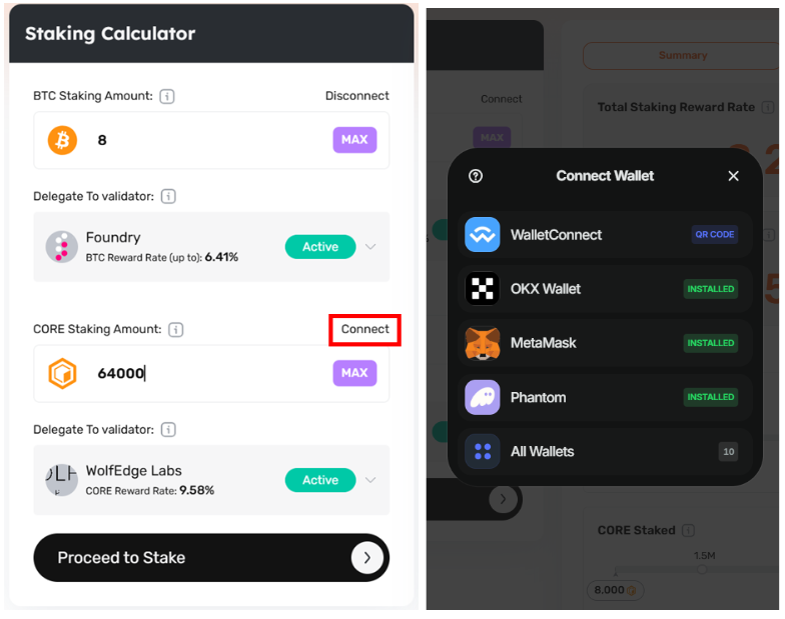

## Specifying the BTC Amount to Stake

4. Enter the amount of Bitcoin you want to stake. The minimum amount is 0.01 BTC.

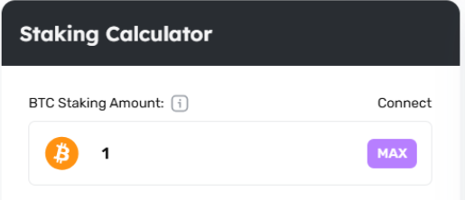

### Selecting a Core Validator for Bitcoin Delegation

5. Under **Delegate to Validator**, from the drop-down menu, select an ***active validator*** to whom you want to delegate your Bitcoin.

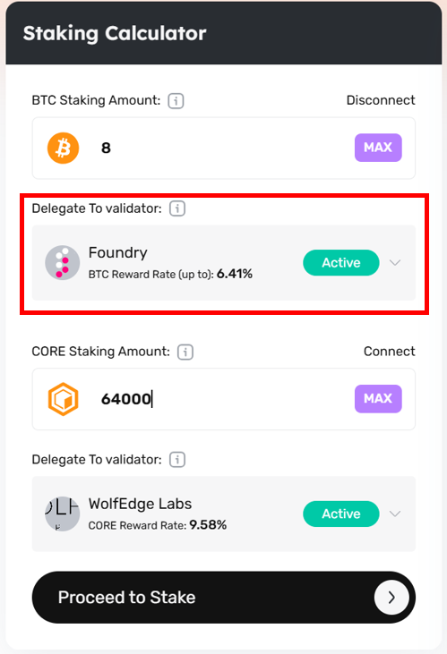

### Specifying the CORE Amount to Stake

6. Enter the amount of CORE you want to stake. The minimum amount is 1 CORE.

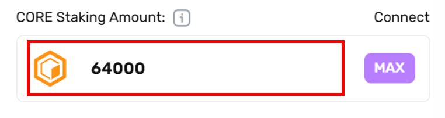

### Selecting a Core Validator for CORE Delegation

7. After specifying the amount of CORE to stake, choose the validator to whom you will delegate your CORE. Make sure to select an active validator from the drop-down.

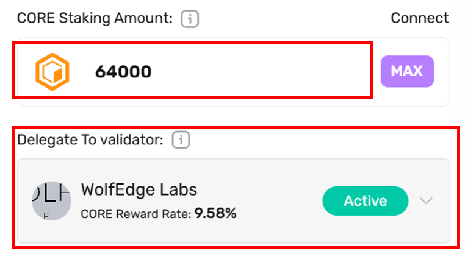

### Adjusting CORE:BTC Ratios for Higher Yields

8. On the right side of the Staking Calculator, there is a **Summary** tab that calculates the Total Staking Reward Rate and Projected Annual Rewards. These are estimated annual return numbers for staked Bitcoin and CORE. The reward rate may fluctuate daily based on the total and weighted amounts of delegations that validators receive. When set to the **Current** button, it displays only the real-time estimated staking reward rate. When set to the **Overall** button, it represents the average of two components: the rates from all validators based on previous staking records and the real-time estimated staking reward rate.

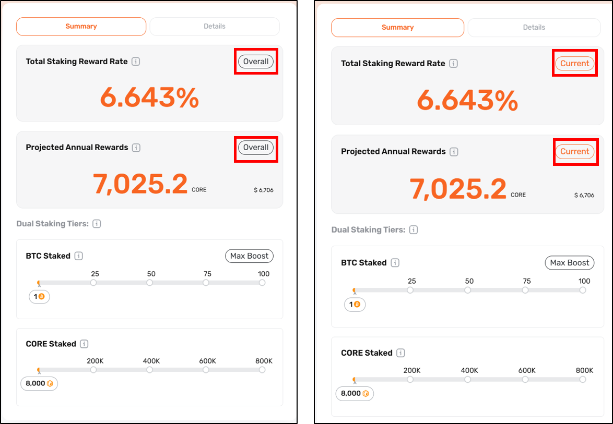

9. You can also use the sliders in the below section to see the effect of CORE:BTC staking ratio on your Total Staking Reward Rate.

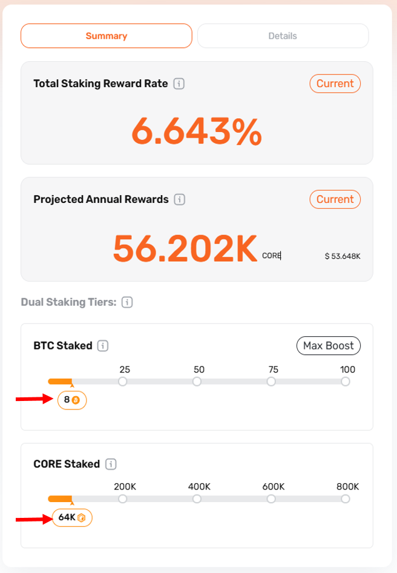

10. To get the maximum reward boost on your staked amount, under the Dual Staking Tiers section, adjust the **BTC Staked** slider to the amount of BTC you want to stake and click the **Max Boost** button. This will automatically set the corresponding  CORE amount in the “CORE Staked” slider to unlock maximum boost. You can also manually adjust the CORE staked and then click the “Max Boost” button again to update the recommended BTC amount in the “BTC Staked” bar.

11\. Next to the **Summary** tab, you can find **Details** page, which shows staking details, including:

* **New Staked BTC:** The amount of BTC you plan to stake and the current reward rate.  
* **New Staked CORE:** The amount of CORE you plan to stake and the current reward rate.  
* **Active Staked BTC:** The amount of BTC currently staked and average earning reward rate across validators.  
* **Active Staked CORE:** The amount of CORE currently staked and average earning reward rate across validators.

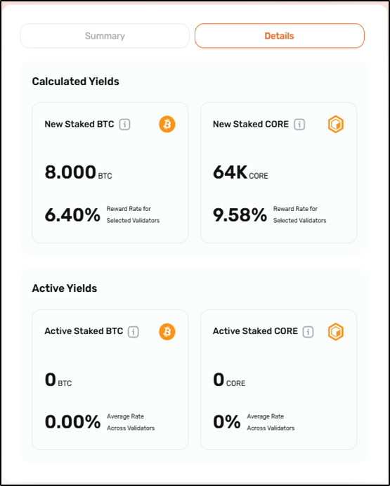

### Finalizing Dual Staking Transactions

11.  Once you have specified the amount of BTC/CORE to stake and the validators for delegation respectively, you can click on the **Proceed to Stake** button.

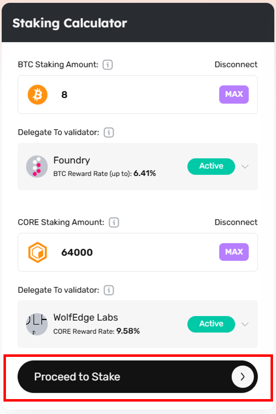

12. On the Stake CORE page, confirm the amount of CORE to stake along with BTC, and click the **Confirm** button.

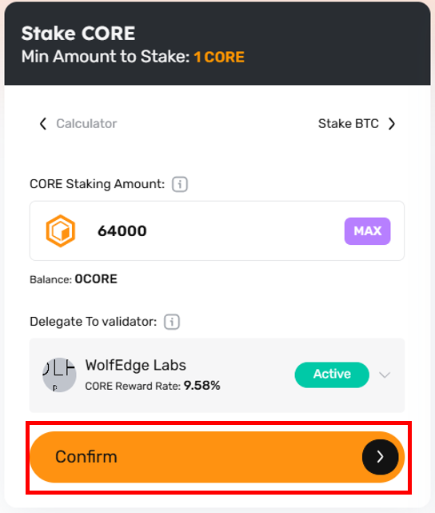

 

13. By clicking **Confirm**, you will get a notification from your connected Core wallet to complete the transaction.   
14. Once you confirm the transition, you will receive a **Transaction Submitted** notification on the top right of your screen. You could click **My Staking** to see your staking records or **View on CoreScan** to review this transaction.  

15.  On the “Stake BTC” page, confirm the amount of Bitcoin to stake. Before finalizing the Bitcoin staking process, it's important to understand and specify several key parameters:  
* Specifying the amount of Bitcoin you’d like to delegate  
  * The minimum amount to delegate is 0.01 Bitcoin  
  * In our example, we will be delegating 0.05 Bitcoin, which satisfies this requirement  
* Setting the lock time determines when your staked Bitcoin will be unlocked and available again for redemption or re-delegation.  
  * Select inside the lock time box to input values, or click on the calendar icon to select the date and click ‘OK’ to proceed.  
  * The default lock time is set to a month in advance. The minimum lock time is 10 days.  
* Specify the network priority speed for your transaction

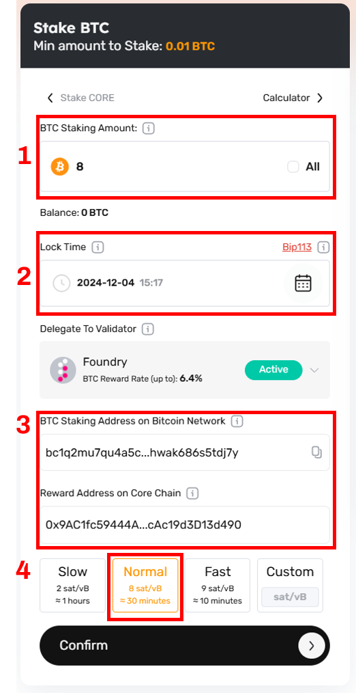

16. Finally, click ‘Confirm’ to complete the transaction.

**Confirm OP\_Return Output** 

17. Before Signing the transaction in your wallet, verify the transaction outputs to ensure they include an `OP_Return` output. The `OP_Return` output is where your `redeem_script` is saved and is essentially used to redeem your staked Bitcoin. There may be two or three outputs, but at least one should always be **OP_Return**. Abort the transaction if it doesn't include the OP\_Return output.

18. Once you confirm the transition, you will receive a **Transaction Submitted** notification on the top right of your screen. You could click on **My Staking** to see your staking records or **View on BTC Explorer** to review this transaction.

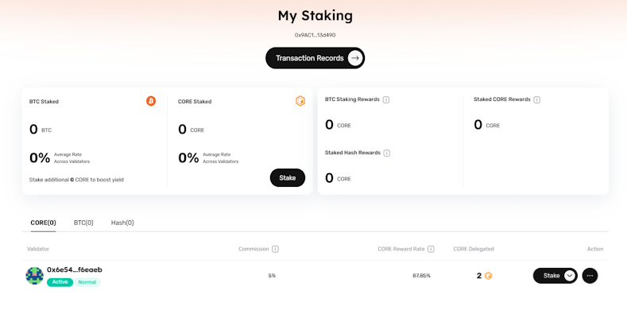

**Verify Transaction Submission and Staking Records**

19.  In the top right corner of the staking website, hover over your connected wallet and click **My Staking**.

20.  The “My Staking” page displays records of all your staking activities (CORE, BTC, hash). Click on the respective CORE, BTC, and Hash tabs to view details on your staking and delegations.

Congratulations\! You have successfully staked your Bitcoin and CORE on the Core blockchain and will now actively earn CORE tokens as rewards. By staking Bitcoin and voting for validators, you actively contribute to the governance and security of the Core network, supporting its decentralization and stability. In addition, through Dual Staking, you help strengthen the connection between the Bitcoin and Core blockchain, aligning incentives and creating value across both ecosystems.