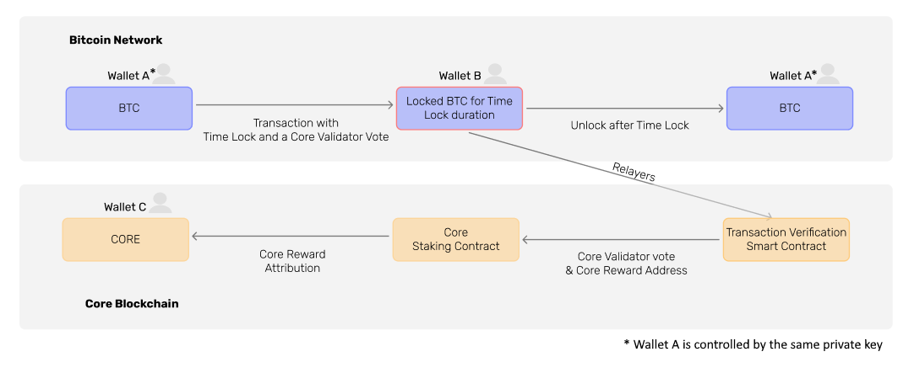

# Non-Custodial BTC Staking - Unlocking Bitcoin DeFi
---

Over [1 trillion dollars'](https://www.coingecko.com/en/coins/bitcoin) worth of BTC has remained idle, yielding no returns for over 10 years. Bitcoin network inherently is not Turing-complete, due to this, to have utility outside the Bitcoin network, the bitcoins have to be wrapped, bridged, or sent to a third-party custody. None of them is secure: they all need trust on a third-party. This is why most of the bitcoins are idle. Securely utilizing them to protect the decentralized economy seems a mission impossible. Previous attempts by other projects to leverage this liquidity have met with limited success. However, with technical advancements on Bitcoin's side and through the innovative and robust ecosystem, Core Chain presents a promising opportunity to unlock the dormant potential of Bitcoin liquidity.

One of the most outstanding features of Core Chain that distinguishes it from other competitors is that of **`Non-Custodial BTC Staking`**. Core Chain welcomes BTC holders to stake their BTC on the Bitcoin network. With the introduction of non-custodial bitcoin staking, Core Chain's recent protocol updates incorporate Bitcoin holders as the third part of the Satoshi Plus consensus mechanism.

## Empowering Bitcoin Holders and Strengthening Core
#### _The Dual Benefits of Non-Custodial BTC Staking_

1. **Benefits for BTC Holders from Non-Custodial BTC Staking**
    - **Maintaining Assets on Bitcoin:** By Non-Custodial BTC Staking, Bitcoin holders have the unique opportunity to keep their assets securely on the Bitcoin network. This is significant because it allows them to retain their investment in what is widely regarded as the most decentralized and secure blockchain, often referred to as digital gold. In essence, they can continue to hold their Bitcoin, enjoying the security and reputation it offers, without needing to transfer their assets elsewhere.
    - **Earning Core Tokens as Rewards:** Participating in Non-Custodial BTC Staking offers an additional incentive: earning Core tokens. This is a way for Bitcoin holders to not only retain their Bitcoin assets but also to receive additional rewards in the form of Core tokens.
    - **Social Responsibility in Decentralization:** By staking their BTC, holders contribute to the decentralization of the Core blockchain. This is a form of social responsibility, as their participation helps in maintaining a diverse and distributed network, which is fundamental to the ethos of blockchain technology.
2. **Core's Rationale Behind Offering Non-Custodial BTC Staking**
    - **Enhancing Decentralization and Security:** Core blockchain is offeringNon-Custodial BTC Staking as a strategic move to enhance its decentralization and security. By incorporating Bitcoin, which has a robust and well-established network, into its consensus mechanism, Core can leverage the decentralization and security features of Bitcoin.

## Advantages of Non-Custodial BTC Staking

1. It is designed specifically for the kind of long-term holders and institutions who have shown a clear preference for keeping their assets on the Bitcoin blockchain. Recognizing that such entities are accustomed to holding their bitcoin without frequent transactions, native bitcoin staking offers them the opportunity to earn rewards during a specified holding period.
2. No new trust assumptions are added. Users can stake their bitcoins without moving it off the Bitcoin blockchain, thereby maintaining the high security and trust that comes with Bitcoin's robust infrastructure.
3. It provides an opportunity for the bitcoin holders to earn passive CORE token rewards in exchange for contributing to Core Chain's consensus.
4. Self custody and 100% secure. Users only need to send themselves the staking transaction on the Bitcoin network and the BTC assets DO NOT need to leave the Bitcoin network at all.
5. The function is implemented using native cryptographic features of the Bitcoin network, and it is fully battle tested and safer than all other non Bitcoin native solutions.
6. Users can build the transaction in any way and with any tool they prefer, it is highly not possible to encounter supply chain attacks from untrusted/unverified third party libraries.

## Why Opt Core Chain's Non-Custodial BTC Staking

There are a few aspects of Core Chain's implementation of staking that set it apart.

1. There is no need to transfer your assets. Unlike other DeFi protocols that require transferring bitcoin to a different blockchain or wrapping it, Core Chain's staking allows users to stake directly within the Bitcoin ecosystem.
2. Core Chain's bitcoin staking maintains the basic blockchain ethos by allowing bitcoin holders to contribute to the expansion of Core Chain's overall security budget.
3. There are options to stake through the command line or a web interface, and there's a simple claim process for rewards.  
4. The product is designed for ease of use, catering to both tech-savvy users and those preferring a more straightforward approach.
5. The reward system helps align cross-chain incentives. The reward pool comes from a shared consensus reward system that integrates the contributions of both Bitcoin miners and CORE token stakers, thereby optimizing the reward distribution for all participants. Additionally, the rewards are sustainable over the long-term, and will be distributed over a period of 81 years.

## How Non-Custodial BTC Staking Works

With the non-custodial bitcoin staking, Core Chain's protocol incorporate bitcoin holders as the third part of Satoshi Plus consensus. Core Chain's methodology for integrating bitcoin staking centers on [CLTV timelock](https://en.bitcoin.it/wiki/Timelock#CheckLockTimeVerify). CLTV timelock are Bitcoin-native cryptographic feature that specify a condition under which the transaction output cannot be spent until a certain point in time has passed. This time can be defined in terms of a specific date and time or by block height. Rather than holders giving up custody of their bitcoins to external staking, stakers on Core Chain merely need to place their bitcoins in CLTV timelocks as part of a transaction, and the transaction can be designed to return the output after the time period has elapsed. Within that transaction, stakers must include a script containing the same information that Bitcoin miners include in their delegated blocks: 

1. The address of the Core Validator the staker wants to delegate their bitcoin to.
2. The address that the staker would like their CORE token rewards to be sent to.

Bitcoin stakers earn a yield on their otherwise passive bitcoin in the form of CORE token rewards, for however long they set the time-lock (and thus for however long they delegate their bitcoin to vote for Validators on Core Chain). The end result is that billions of dollars in underutilized Bitcoin value will become productive, remunerating stakers while also expanding the scope of Bitcoin's utility. 

### Guidelines for Staking/Redeeming BTC

When staking or redeeming your BTC, please follow these guidelines to ensure smooth transactions:
1. **Avoid Low Gas Fees:** 
    * We recommend avoiding gas fees lower than the current market rate. 
    * Using a gas fee that is too low, especially during periods of network congestion, may result in your Bitcoin transaction taking an extended amount of time (potentially days) to be confirmed.
2. **Handling Low Gas Fee Situations:** 
    * If your Bitcoin transaction is delayed due to a low gas fee, consider using a transaction accelerator to speed up the process. 
    * There are several third-party services available; for example, the free viaBTC transaction accelerator (which can be accessed [here](https://www.viabtc.com/tools/txaccelerator)). 
    * Please research and choose a service that best fits your needs.

By following these recommendations, you can ensure a more efficient staking and redemption process for your BTC.

### Requirements for Eligibility

Core Chain welcomes BTC holders to stake their BTC on the Bitcoin network. By voting for a Core validator during your BTC staking transaction, you play a pivotal role in Core's decentralization, earning CORE tokens as recurring rewards.

* There are _minimal requirements_ on both **amount** and **duration** to make the staking eligible on Core Chain.
    * A user should at least stake **0.01 BTC** (less transaction fees) for at least **10 days**. 

### Transaction Work Flow

Core Chain's implementation of BTC native staking is completely non-custodial, i.e., users can keep their BTC assets on the Bitcoin network without bridging them out before staking. Users are required to perform only the following steps:

* Send a BTC transaction to their own address, and lock up the output whose amount is intended to stake on Core blockchain by using the Bitcoin native timelock feature. Besides, the transaction should also contain an `op_return` output in which users can designate the Core validator address to stake to and a `reward address` to receive CORE rewards. For details to compose such a staking transaction, please refer to the [transaction design](design.md).

* (_Optional_) After the transaction is confirmed on the Bitcoin network, users can retrieve the transaction data and submit to the Core blockchain. This step is optional, if users compose the transaction in a standard format as suggested by Core Chain (defined in the [transaction design](design.md)). The Core infrastructure will detect the staking transaction and submit it to Core blockchain for users.

* When the timelock expires, users can spend the UTXO using the corresponding redeem script. It is easy for them to build the redeem script from the original staking transaction.
