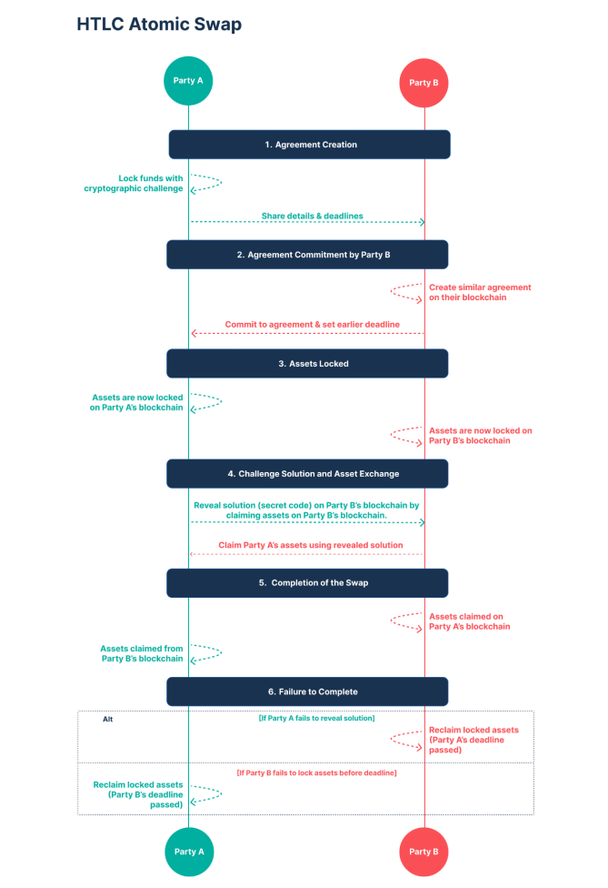

# How HTLC Atomic Swaps Work

The operation of HTLC atomic swaps involves a series of cryptographic and time-based conditions that ensure the secure exchange of cryptocurrencies. Here’s a breakdown of the process:

1. **Contract Initiation:** Party A initiates the swap by creating an HTLC on their blockchain, say, Core Chain, locking their funds and setting a cryptographic hash and a timelock.
2. **Engagement from Party B:** Party B, on another blockchain, like Bitcoin, engages by creating a corresponding HTLC with the same cryptographic hash but with a shorter timelock to ensure they commit before Party A’s deadline.
3. **Disclosure of the Preimage:** Party A reveals the preimage (the secret to the hash) on the second blockchain (Bitcoin) to claim Party B’s funds. This action simultaneously unlocks the funds due to the cryptographic nature of HTLCs.
4. **Completion of the Swap:** With the preimage now public, Party B uses it to unlock and claim the funds held in the HTLC on the first blockchain (Core Chain). This completes the atomic swap.
5 **Fallback Mechanism:** If either party fails to fulfill their part of the contract before the timelock expires, the funds are safely returned to the original owner, minimizing the risk of loss.

## Conclusion
HTLC atomic swaps are a cornerstone technology for Core Chain, enabling trustless, secure, and efficient cross-chain exchanges that are crucial for the integration and utility of Bitcoin within the Core Chain ecosystem. By facilitating these types of transactions, Core Chain not only enhances the liquidity and usability of Bitcoin but also supports the broader vision of a decentralized, interoperable blockchain landscape. This technology exemplifies the innovative approaches being adopted in Core Chain to bridge the gap between Bitcoin and smart contract platforms, paving the way for a more expansive and integrated DeFi ecosystem.