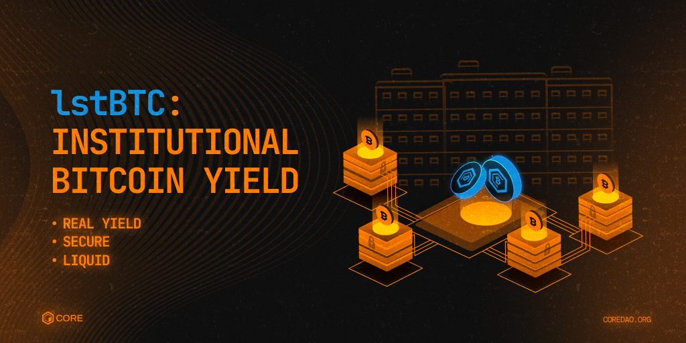

# lstBTC: Institutional Bitcoin Yield
---

## The Big Idea
Bitcoin is the world’s largest digital asset, yet it remains financially idle—held in vaults or posted as collateral without generating yield. Institutions have traditionally faced a dilemma:  
- **HODL BTC** as a store of value, leaving it unproductive.  
- **Lend BTC**, taking on counterparty risks, illiquidity, and operational complexity.  

**lstBTC changes that.**  

For the first time, institutions can earn BTC-denominated yield **without relinquishing custody, lending risk, or disrupting workflows**. Powered by **Core’s Dual Staking**, risk-managed by **Maple Finance**, and secured by **custodians like BitGo, Hex Trust, and Copper**, lstBTC transforms Bitcoin into a **yield-bearing asset with full liquidity and security**.  

## **What is lstBTC?**  
lstBTC is a **liquid, yield-bearing Bitcoin token** issued on the Core blockchain, designed for institutional investors seeking **BTC-native yield** without compromising security.  

Unlike traditional BTC yield solutions, lstBTC **does not require**:  
* Lending BTC (eliminating counterparty risk).  
* Wrapping BTC onto another chain (avoiding bridging risks).  
* Giving up custodial control (Bitcoin remains in institutional custody).  

Instead, lstBTC:  
* Generates **3-6%+ BTC yield** via Core’s **Dual Staking**.  
* Ensures BTC remains custodied by **BitGo, Copper, and Hex Trust**.  
* Is risk-managed by **Maple Finance** to **protect yield sustainability and BTC principal**.  

## **How lstBTC Works**  
For institutional users, lstBTC is **simple and seamless**:  
1. **Deposit BTC** with a trusted custodian (BitGo, Copper, or Hex Trust).  
2. **Receive lstBTC 1:1**, which accrues BTC-denominated yield daily.  
3. **Use lstBTC as BTC**—trade, transfer, or pledge it as collateral.  
4. **Redeem lstBTC for BTC + Yield** at any time through the original custodian.  

* **No custody changes**: BTC remains where institutions already store it.  
* **No capital inefficiency**: BTC earns returns instead of sitting idle.  
* **No workflow disruptions**: lstBTC integrates seamlessly into financial operations.  

## **How lstBTC Generates Yield**  
lstBTC’s yield is powered by **Core’s Dual Staking mechanism**, a capital-efficient BTC yield strategy:  
- **BTC is collateralized** via a low **10% Loan-to-Value (LTV) ratio loan** to purchase CORE.  
- **Maple Finance** manages risk by using options strategies to hedge against CORE price fluctuations.  
- **CORE and BTC are Dual-Staked** on Core’s blockchain, earning block rewards and fees.  
- **Yield is converted into BTC**, ensuring **all returns are BTC-denominated**.  

**Risk Management**:  
* BTC principal is **protected from extreme market moves**.  
* **Negligible liquidation risk** due to conservative LTV ratios.  
* **Dynamically managed yield** to balance rewards and security.  

## **Who is lstBTC For?**  
🔹 **Institutional BTC Holders** – Funds, treasuries, and wealth managers looking for **BTC yield**.  
🔹 **Custodians & ETP Issuers** – Institutions managing BTC on behalf of clients.  
🔹 **Traders & Market Makers** – lstBTC serves as **yield-bearing collateral** for structured strategies.  
🔹 **Bitcoin Lenders & Borrowers** – Offsets borrowing costs, reducing financing expenses.  
🔹 **Crypto Exchanges** – Enhances **capital efficiency** for trading and lending.  

**Key Use Case**:  
- Institutions **pay custody fees** to store BTC. With lstBTC, these costs **flip into revenue streams**, unlocking **$3B-$6B in potential industry-wide BTC yield**.  
- **Real Example**: Maple Finance will **accept lstBTC as collateral**, improving BTC capital efficiency.  

## What Makes lstBTC Different?
Unlike **BTC lending** or **wrapped BTC**, lstBTC is the **first institutional-grade, liquid BTC staking solution**. 
* Fully Liquid
* Institutional-Grade
* Non-Custodial
* BTC-Native Yield (No Counterparty Risk) 

| Feature        | lstBTC (Core) ✅ | BTC Lending ❌ | Wrapped BTC ❌ |
|--------------|----------------|---------------|---------------|
| **BTC Yield** | **3-6%+ APR** | Risky lending | Bridging risks |
| **Liquidity** | **Fully liquid** | Locked in loans | Somewhat liquid |
| **Custody Risk** | **Same custody setup** | Requires counterparty | Centralized minting risk |
| **Collateral Utility** | **Accepted on exchanges** | Limited use | Moderate use |
| **Security** | **Non-custodial staking** | Default & insolvency risk | Smart contract risks |

## Launch Partners & Institutional Credibility
lstBTC is backed by **industry-leading custodians, risk managers, and exchanges**:  
🔹 **Custodians (Security & Compliance)** – **BitGo, Copper, Hex Trust** ensure seamless lstBTC minting and redemption.  
🔹 **Investment Manager (Risk & Yield Optimization)** – **Maple Finance** safeguards principal and manages yields.  
🔹 **Exchanges (Liquidity & Adoption)** – **Deribit, OKX, Bybit** integrate lstBTC for trading and collateral use.  

**lstBTC unlocks a new era of Bitcoin utility—turning passive BTC into a productive institutional asset.** 