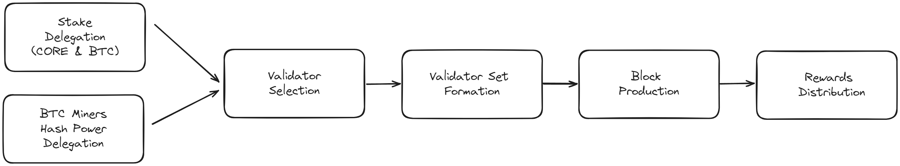

# Validator Election Process on the Core Chain Network
---

## Overview

Validators are a crucial part of the Core network. In addition to the fact that they handle transaction validation and block production, the validator election process is where all the components, i.e., DPoW, DPoS, and Non-Custodial Bitcoin Staking, of Satoshi Plus consensus come together. The Validator election process is a central feature of the Satoshi Plus consensus mechanism employed by Core Chain. This process ensures the integrity, security, and efficiency of the blockchain by electing Validators responsible for validating transactions and creating new blocks. 

## Importance of Validator Election

* **Security and Integrity**: Validators maintain the blockchain's integrity, making a robust election process crucial for ensuring that only the most reliable nodes manage the blockchain ledger.

* **Decentralization**: The election process allows miners and stakers to participate in Validator selection, promoting decentralization and preventing the concentration of control.

* **Incentive Alignment**: Stakeholders are incentivized to support effective Validators, aligning interests across the network. Validators and their supporters (miners and stakers) receive rewards, ensuring accountability and continued participation.

* **Efficiency and Scalability**: Competent Validators enhance the network's transaction handling capacity, crucial for performance and scalability.

## Workflow of the Validator Election Process

The Validator election process in Satoshi Plus involves key steps, supported by specific equations to quantify stake and hash power contributions:

1. **Stake Delegation**:
   - CORE and BTC token holders stake and delegate their tokens to Validator candidates. This delegation is a form of voting, where the weight of each vote corresponds to the number of staked tokens.

2. **Hash Power Delegation**:
   - Bitcoin miners delegate a portion of their hash power by specifying their preferred Validators in the Bitcoin blocks they mine. This process integrates Bitcoin's mining power into Core Chain's security mechanism.

3. **Validator Selection**:
   - Validators are selected based on the total support they receive, calculated by combining staked tokens (BTC and CORE) and delegated Bitcoin hash power. 

4. **Validator Set Formation**:
A set of Validators is formed from those with the highest scores. This set is dynamically updated to reflect ongoing changes in stake delegations and hash power allocations. There are two steps involved in validator election. 

1. Hybrid scores are calculated for all validators in the network with the following equation. The hybrid score for each validator is calculated based on the following formula:

$$
 S = \frac{rHp}{tHp} * m + \frac{rSp + rBp * n}{tSp + tBp * n} * (1 - m) 
$$

Where:

* $rHp$ is the Bitcoin hash power delegated to a validator, measured as the total number of Bitcoin blocks with that validator’s information written into their coinbase transactions;
* $tHp$ is the total hash power on Core Chain
* $rSp$ is the amount of CORE tokens delegated by CORE token holders to that validator
* $tSp$ is the total amount of CORE tokens stake on Core Chain
* $rBp$ is the amount of BTC tokens delegated by BTC holders to that validator
* $tBp$ is the total amount of BTC staked on Core Chain
* $m$ is a dynamic factor that controls the overall weights of hash power $(0 < m <1)$
* $n$ is a dynamic factor that controls the voting power of each BTC vs. each CORE token.

2. At the end of each round validators are ranked in order of their hybrid score, and the **21** validators with the highest hybrid scores are selected for the validator set in the next round.

Leaving aside the mathematical details, this is essentially a weighted, bicameral voting procedure. Bitcoin miners can vote for validators through their PoW (by writing validator information into the coinbase transaction on blocks they’ve already mined), CORE token holders can vote for a validator with their PoS (by delegating their tokens to it), and non-custodial bitcoin stakers can vote for a validator through the same mechanism. This delegated PoW and delegated PoS are weighted to determine the hybrid score.

This is the “core” of the Core blockchain, the mechanism by which the network leverages the security and decentralization of the Bitcoin network and the scalability and composability of PoS chains like Ethereum. Letting Bitcoin miners and bitcoin stakers vote on validators allows Core Chain to avail itself of Bitcoin’s legendary robustness; and because Core Chain is EVM compatible, it’s possible to build smart contracts, dApps, and other applications on Core Chain that couldn’t be done without changes to the underlying Bitcoin protocol.

5. **Block Production**:
   - After election, all validators are sorted roughly in order of their hybrid score, and they take turns producing blocks in a **round-robin manner** before the process starts over again from the beginning. By _initially limiting the number of validators to **21**_, Satoshi Plus offers a higher transaction rate and increased scalability, but the number of validators is expected to increase over time as the network grows. What’s more, this mechanism provides additional security through improved efficiency and a tolerance for a large number of Byzantine players. Core Chain is secure as long as no more than $1 \over 3$ of the validators are malicious.

6. **Reward Distribution**:
   - Rewards are distributed based on contributions to network security, using the following formula:
 
      $$ 
         rH = \frac{rHp}{tHp} * \frac{m}{S} * R
      $$

      $$
         rS = \frac{rSp}{tSp + tBp * n} * \frac{(1-m)}{S} * R
      $$

      $$
         rB = \frac{(rBp * n)}{(tSp + tBp * n)} * \frac{(1-m)}{S * R}
      $$

      Where: 
      * $rH$ is the rewards received by the validator because of the hash power delegated to it (DPoW)
      * $rS$ is the rewards received by the validator because of the CORE delegated to it (DPoS)
      * $rB$ is validator rewards attributed to BTC staking
      * $R$ is the overall rewards attributed to all delegators

      For completeness, here are three other ratios of interest:

      $$
         rHu = \frac{rH}{rHp}
      $$

      $$
         rSu = \frac{rS}{rSp}
      $$

      $$
         rBu = \frac{rB}{rBp}
      $$

      Where:
      * $rHu$ is the validator hash power rewards per unit;
      * $rSu$ is the CORE token staking rewards per unit;
      * $rBu$ is the BTC staking rewards per unit;

   These reward-splitting functions are designed to create an active market for rewards while encouraging competition amongst the validator set for both delegated hash power and delegated stake (BTC and CORE). 

### Flow Diagram of the Validator Election Process

The following diagram visually represents the Validator election process in Satoshi Plus:

This flowchart illustrates the cyclical nature of the validator election and their ongoing responsibilities within the Satoshi Plus consensus mechanism. It emphasizes how stake and hash power delegation directly influence validator selection, block production, and reward distribution, driving a secure, decentralized, and efficiently managed network.