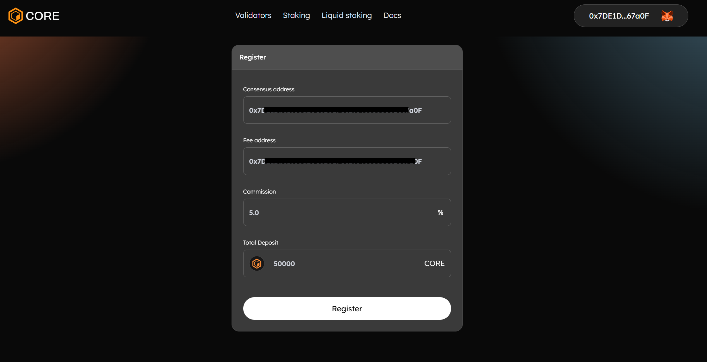
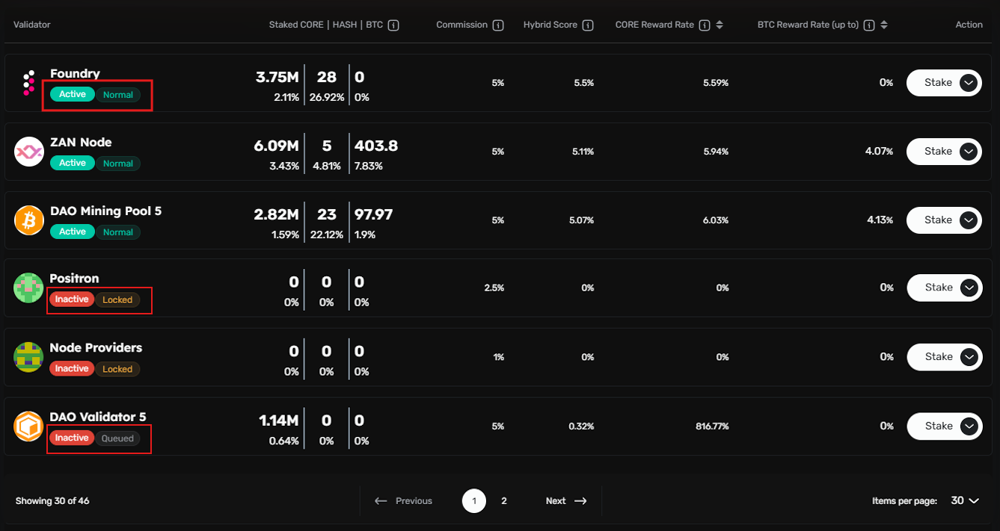
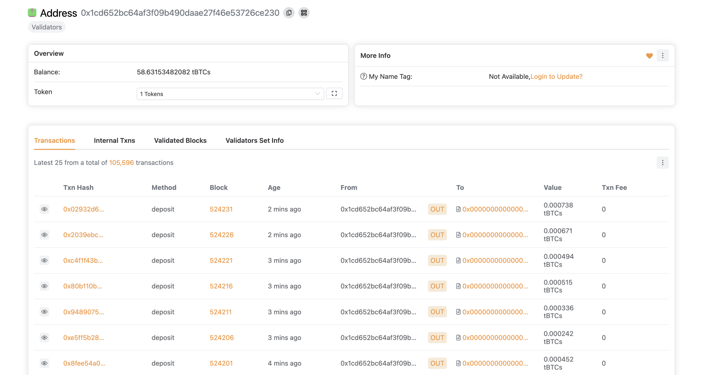
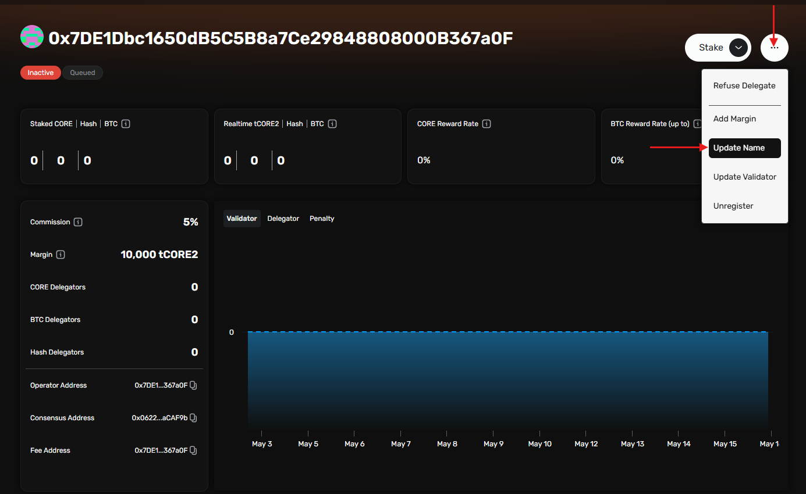
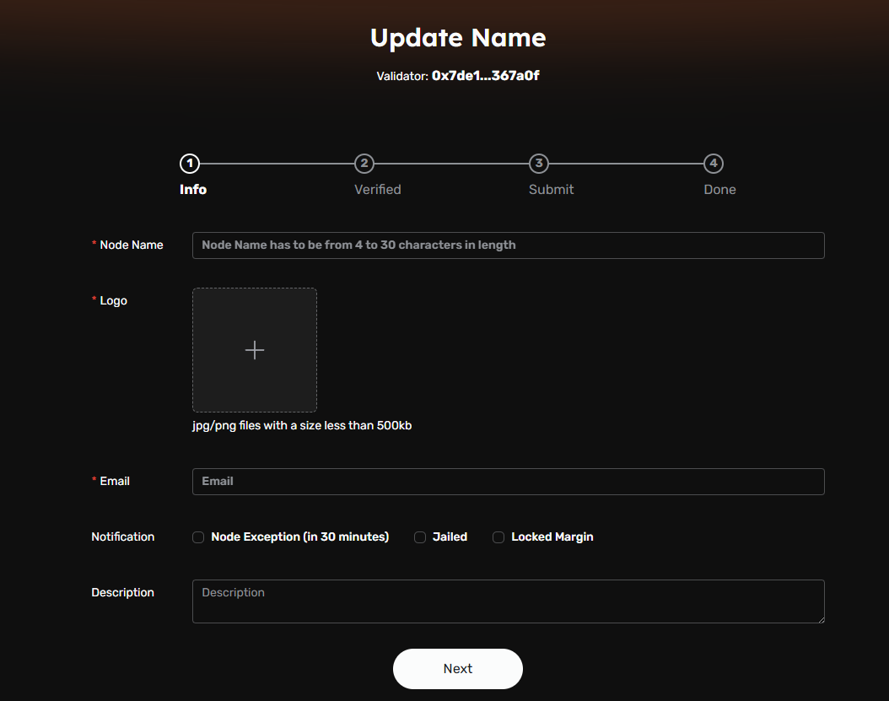
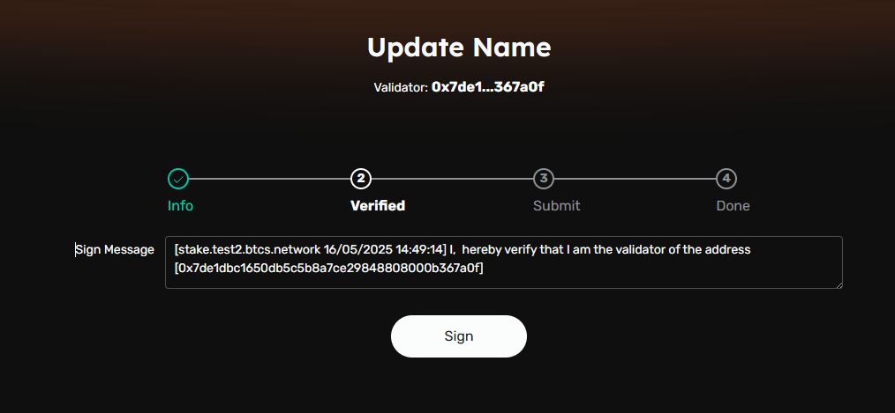

import Tabs from '@theme/Tabs';
import TabItem from '@theme/TabItem';

# Validator Registration
---

:::caution 
Before running a Validator Node on Core, we strongly recommend reading the [Technical Whitepaper](https://whitepaper.coredao.org/).
:::

## Set Up a Full Node in Validator Mode
Before you can register as a validator, you need to set up and run a full node in validator mode following the guide [here](./setting-up-validator.md).

Make sure your validator node is up and running. 

## Register Your Validator

Once your node is running and synced, you can proceed with the registration process.

1. **Navigate to Staking Website:** The easiest way to register a new validator is using Core's official staking websites:

    * [Core Mainnet Staking website](https://stake.coredao.org/become-validator)
    * [Core Testnet Staking website](https://stake.test.btcs.network/become-validator)
    * [Core Testnet2 Staking website](https://stake.test2.btcs.network/become-validator)

3. **Connect Your Wallet:** On the staking website, click **Connect Wallet** in the top right corner and connect your wallet (such as MetaMask, Ledger, etc.) that holds the necessary CORE tokens.

4. **Fill Out the Validator Registration Form**

Once your wallet is connected, the **Register** button will appear. Clicking this button will open a form where you’ll need to provide several pieces of information:

Provide information for each of the form's fields:

* **Consensus Address**: the validator address you set when you initialized your validator node.
* **Fee Address**: the address used to collect commission fees.
* **Commission**: revenue is split between the validator and its delegators, with the commission determining what percentage of delegator revenue is taken by the validator as compensation.
* **Total deposit**: the refundable CORE deposit locked up while performing validator services. The minimum deposit for testnet and mainnet is **10,000 CORE**.

5. **Submit Registration:** Once you’ve filled out all the required information, click **Register** to submit your validator for registration.

## Confirm Registration

After submitting your registration form, you can check whether the registration was successful.

### Checking the Logs
Open your node’s log file and search for the error message `unauthorized validator`. If this message appears, it means that your node is registered but has not yet been elected to the validator set.

## Validator Election

Each day, the top **27** validators with the highest hybrid scores are elected to the active validator set, thereby becoming responsible for producing blocks and validating transactions on the Core network for the entirety of the round. When the last block of a round is mined, the round’s accumulated rewards are distributed and the next round's validator set is selected. For more details about how the validator election works, refer to the [validator election](./validator-election.md) section.

You can check the validator status on the stake website, active elected validators will be marked as `Active/Normal`. The validator set is updated at **00:00 am UTC** every day.

### Validator Status Updates

Validator status is updated daily at 00:00 UTC. You can check the status of your validator on the staking website. There are various possible statuses:

* **`Active/Normal`:** Validator is elected for the current round and qualified for the next election.

* **`Active/Refuse`:** Validator is elected for the current round but refused to accept delegations. Not qualified for the next election.

* **`Active/Jailed`:** Elected validator in the current round, but jailed due to a felony. Not qualified for the next election.

* **`Inactive/Queued`:** Validator is registered but not elected. Qualified for the next election. 

* **`Inactive/Refuse`:** Validator is registered but has refused delegation. Not qualified for the next election.

* **`Inactive/Jailed`:** Validator is registered but is jailed and not qualified for the next election.

* **`Inactive/Locked`:** Validator is registered but has not met the minimum deposit requirements. Not qualified for the next election.

* **`Inactive/Invalid`:** Validator is unregistered.

## Monitor Your Validator's Performance

You can monitor the status of your validator and its block production record on [Core Scan](https://scan.coredao.org/). This tool allows you to track whether your node is successfully producing blocks and performing well.

## Setting Validator Name

You may assign a human-readable name to your validator node using the Core Staking UI. This name serves as a label for delegators and network participants to identify your validator in the interface.

### Steps to Set or Update Your Validator Name

1. **Access the Staking Website:** navigate to the [validator dashboard](https://stake.coredao.org/validators). 
2. **Locate Your Validator:** Identify your validator entry within the list. By default, validators are listed by their associated `Fee Address`.
3. **Open Validator Details:** Click on your validator to open the Validator Details page.
4. **Access the Update Menu:** On the Validator Details page, click the menu button (three vertical dots) next to the Stake button and select "Update Name" from the dropdown.

4. **Enter Validator Details:** Provide the name and other details in the input form. This name will be publicly visible to delegators and users of the network interface.

5. **Sign Validator Ownership Message:** Click Sign to verify ownership of your validator address by signing the displayed message.

6. **Submit the Update:** After verifying the entered information, submit the transaction to finalize the update. Once the transaction is confirmed on-chain, the updated name will be reflected in the validator list.

## Maintaining Your Validator Node
To remain an active and successful validator, you’ll need to keep your node online, perform maintenance, and respond to any issues that arise.

#### Stay Synced

Ensure that your node is always in sync with the Core network to prevent issues with block production and validation.

#### Handle Rewards

At the end of each round, accumulated rewards are distributed to validators. You should track these rewards and monitor any potential issues with your validator's performance.
