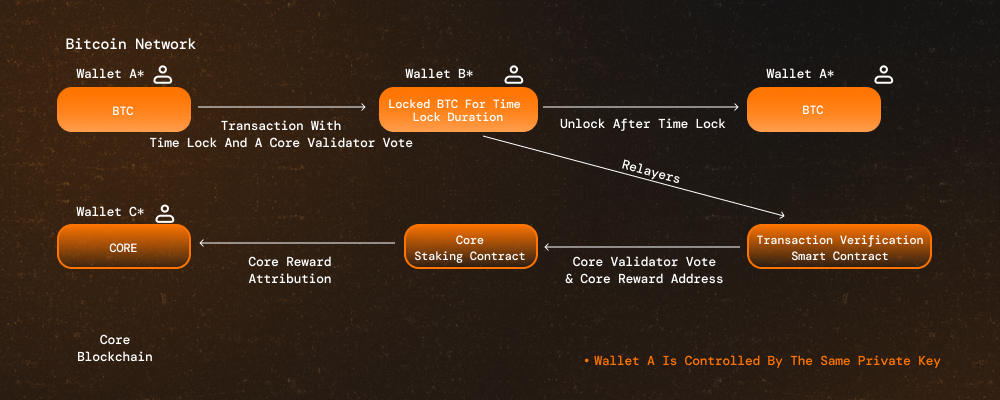

# How Self-Custodial Bitcoin Staking Works {#how-self-custodial-bitcoin-staking-works}

Self-Custodial Bitcoin Staking is one of the three fundamental components of Core’s Satoshi Plus consensus. This feature integrates Bitcoin holders into Core’s consensus, enhancing network security while enabling Bitcoin to become a yield-generating asset. 

Unlike traditional staking mechanisms that require users to transfer custody of their assets, Core's approach leverages [`CheckLockTimeVerify (CLTV)`](https://en.bitcoin.it/wiki/Timelock#CheckLockTimeVerify) timelocks, a Bitcoin-native cryptographic function. This ensures Bitcoin remains securely in users’ wallets while still being staked to support the Core network.

## How CLTV Timelock Works

CLTV timelock is a Bitcoin-native cryptographic feature that specifies a condition under which the transaction output cannot be spent until a specific point in time has passed. This time can be defined as a specific date and time or by block height. CLTV acts as a time-locked vault, restricting access to staked Bitcoin until a predetermined time elapses. When a user initiates a CLTV transaction:

* The Bitcoin remains locked for a specified duration.
* Once the timelock expires, the Bitcoin is automatically returned to the user.
* Users earn staking rewards in CORE tokens for the locked duration.

Unlike custodial staking models that involve third parties, Core’s staking model allows users to retain full control over their Bitcoin while participating in the security of the network and earn rewards for it.

### How Bitcoin Staking Works on Core  

#### 1. Creating a CLTV Staking Transaction  

To participate in Bitcoin staking, holders must create a valid timelock transaction using Bitcoin's CLTV (`CheckLockTimeVerify`) function. For the Core network to recognize this transaction as a valid delegation to a validator, the timelock transaction must include specific metadata in the script. This metadata must contain:
- **Validator Delegation Address:** The Core validator the staker is delegating their Bitcoin to.  
- **Reward Address:** The address where the staker wants to receive CORE rewards.  

#### 2. Role of Core Relayers

**Relayers** in the Core ecosystem continuously **monitor the Bitcoin network** for valid Bitcoin timelock transactions. When a CLTV transaction is detected, the relayers:  

- Verify the transaction details.  
- Forward the information to Core’s **Consensus Engine** for processing.  
- Core’s **Consensus Engine** is then responsible for awarding the stakers delegated Bitcoin accordingly. 

### Security & Risk Considerations  

- **No Custodial Risk:** Core’s mechanism does **not** move BTC off-chain or transfer it to third-party smart contracts.  
- **Bitcoin Remains in the User’s Wallet:** Users **always** retain full control over their staked BTC.  
- **No Protocol-Level Risk:** Staking only involves locking BTC via a Bitcoin-native function.  

### Requirements for Bitcoin Staking

#### General Requirements  

To ensure a BTC staking transaction is **valid and detected** by Core’s relayers, users must:  

1. **Use CLTV Timelock:** The BTC must be locked using a **Bitcoin-native timelock transaction** specifying the delegation details,as the transaction output.  
2. **Include an `OP_RETURN` Output:** The transaction must contain:  
   - **Core Validator Address** (to delegate their staked Bitcoin).  
   - **CORE Reward Address** (to receive staking rewards).  

#### Minimum Staking Requirements

| Method | Minimum BTC Staked | Minimum Lockup Duration |  
|--------|-------------------|-----------------------|  
| **Official UI** | 0.01 BTC | 5 Days |  
| **Staking Script** | No Minimum | No Lockup Requirement |  

### Transaction Workflow

Core's Bitcoin Timelocking operates across two separate blockchains—Bitcoin and Core. The table below outlines the specific operations that occur on each chain when Bitcoin holders participate and earn rewards. Importantly, this mechanism maintains Bitcoin's security model without introducing additional risks or trust assumptions. While the Core blockchain monitors and verifies timelock transactions and distributes rewards, all Bitcoin operations—including timelocking, redemption, and custody—remain entirely on the Bitcoin network under the holder's control.

| **Step**                 | **Bitcoin Network**                                                                                       | **Core Network**                                                  |  
|--------------------------|---------------------------------------------------------------------------------------------------------|------------------------------------------------------------------|  
| **1. Initiate Staking**  | User crafts a **CLTV timelock** transaction, locking BTC for a chosen duration, and specifying delegation details in `OP_RETURN`. | Relayers monitor Bitcoin transactions for valid staking activity. |  
| **2. Broadcast Transaction** | User sends the **CLTV transaction** on the Bitcoin network.                                      | Relayers track and validate the transaction.                      |  
| **3. Locking Period Begins** | BTC is locked in the user's wallet on the Bitcoin network. Once confirmed (which can take hours due to block time, confirmations, and congestion), the locked assets appear in staking records. | Relayers register the locked BTC and update Core’s staking records. |  
| **4. Relayer Detection** | Relayers detect the staking transaction on Bitcoin.                                              | They verify and forward it to Core’s Consensus Engine.            |  
| **5. Staking Rewards Accrual** | BTC remains locked, but rewards accumulate on Core.                                       | CORE token rewards accrue during staking; users must claim them manually. |  
| **6. Unlocking Bitcoin**  | After the timelock expires, the user **must** send a Redeem script to regain access to their locked BTC. | Relayers update the staking records to reflect BTC unlocking.      |  

**Important:** Users can also **redelegate** BTC directly without first redeeming it.  
_**(*Optional*)**_ After the transaction is confirmed on the Bitcoin network, users can retrieve the transaction data and submit it to the Core blockchain. This step is optional if users compose the transaction in a standard format, as suggested by Core. Relayers from the Core infrastructure will detect the staking transaction and submit it to the Core blockchain for users. 

#### Step-by-Step Staking Process

1. **Locking Bitcoin**  
   - The user creates a **CLTV timelock transaction** on the Bitcoin network.  
   - While there’s no minimum lock duration when staking via the CLI tool, a minimum of 24 hours is recommended to be eligible for staking rewards. The Core UI typically suggests a lock period of 5+ days to ensure optimal participation and reward potential.
     
2. **Delegating to a Core Validator**  
   - The timelocking transaction must include:  
     - **Core Validator Address** (for delegation of BTC).  
     - **CORE Reward Address** (for receiving CORE rewards).  

3. **Bitcoin Lock Period Begins**  
   - The BTC is locked for the selected duration.  
   - It remains **securely on the Bitcoin network** in the holder's custody.  

4. **Validator Selection & Rewards Accrual**  
   - Core uses the staked BTC to calculate the validator’s hybrid score.  
   - Higher delegated BTC increases validator election chances.  
   - Stakers earn **CORE token rewards** based on their timelocked amount and validator reliability.  

5. **Bitcoin Availability After Timelock Expiration**  
   - Once the timelock expires, BTC **remains in the user’s address but stays locked**.  
   - The user must send a **Redeem script** explicitly after the timelock period ends to regain access and be able to spend their BTC.
   - Alternatively, users can **redelegate directly** without redemption.  

### Timeline
Here's an overview of the timeline for Bitcoin timelocking and when rewards take effect:

1. **Timelock Confirmation:** Once a Bitcoin timelock transaction is broadcast, it requires confirmation on the Bitcoin blockchain (typically 6 blocks or approximately 60 minutes) before Core's relayers will recognize it.
2. **Core Network Recognition:** After the timelock transaction is confirmed on Bitcoin, Core's relayers detect the delegation information and include it in the validator election calculations for the next round.
3. **Rewards Activation:** Validator election occurs once per round (~24 hours, based on UTC+0 time). Timelocked Bitcoin will influence validator election and generate rewards starting from the first round after transaction confirmation.
4. **Data Availability:** Once the timelocked Bitcoin is actively participating in consensus, all related staking data becomes accessible via the Core Staking API.

#### **Example: Bitcoin Staking Transaction with 2-day Duration**
- Assume a timelock order is placed at 6:00 AM UTC+0 today.
- The transaction will go through 6 Bitcoin blocks on the same day.
- The staking will become effective at 00:00 AM UTC+0 on the second day.
- After the staking goes effective, the staking data is then accessible.

#### **Example: Bitcoin Staking Transaction with 3-day Duration**
- Assume a staking order is placed at 11:30 PM UTC+0.
- The transaction will go through 6 Bitcoin blocks on the next day.
- The staking will become effective at 12:00 AM UTC+0 on the third day.

### Guidelines for Staking/Redeeming Bitcoin

Follow these guidelines to ensure efficient Bitcoin timelocking and redemption:

1. **Include Sufficient Fees**  
* Transactions with low fees may experience delayed confirmation times.
* Use a competitive fee rate (measured in sats/vB) to ensure timely processing.
* During periods of network congestion, insufficient fees may result in your transaction remaining in the mempool for an extended period (potentially days).

 2. **Handling Delayed Transactions**  
* If your Bitcoin transaction is stuck due to low fees, consider using a transaction accelerator service.
* Several mining pools offer acceleration services, such as viaBTC.
* Alternatively, if your wallet supports Replace-By-Fee (RBF), you can increase the fee on your pending transaction.

## Conclusion  

Bitcoin Timelocking transforms Bitcoin from a passive store of value into a productive asset that generates yield while maintaining self-custody. By leveraging Bitcoin's native CLTV mechanism, holders can participate in Core's consensus, contribute to validator selection, and earn CORE rewards—all while their Bitcoin remains securely on the Bitcoin blockchain. This integration exemplifies how Core extends Bitcoin's utility without compromising its fundamental security properties.

For a detailed guide on staking transaction design, refer [here](design.md).  
