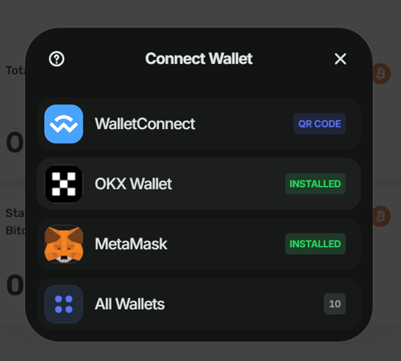
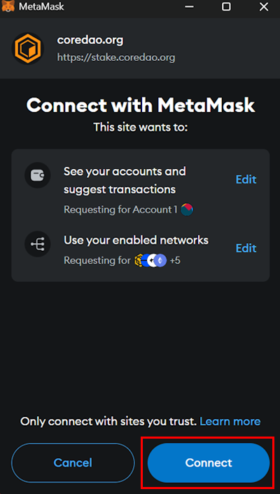
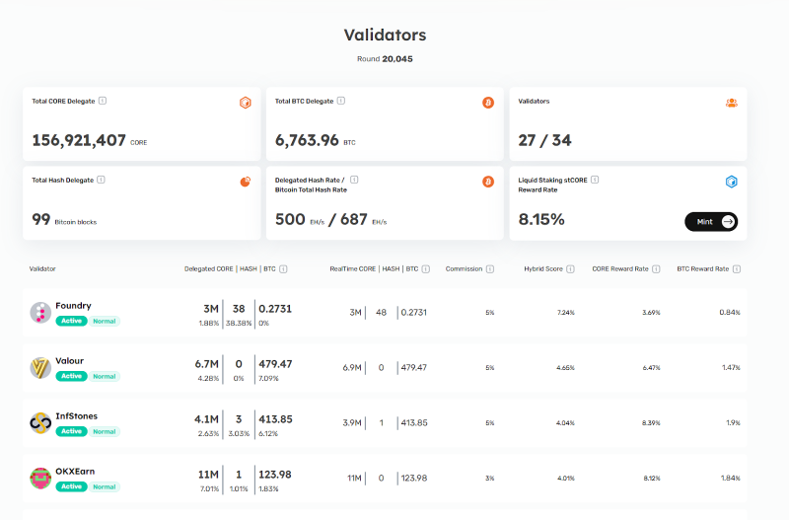
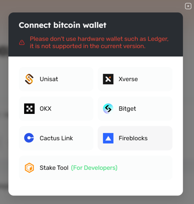
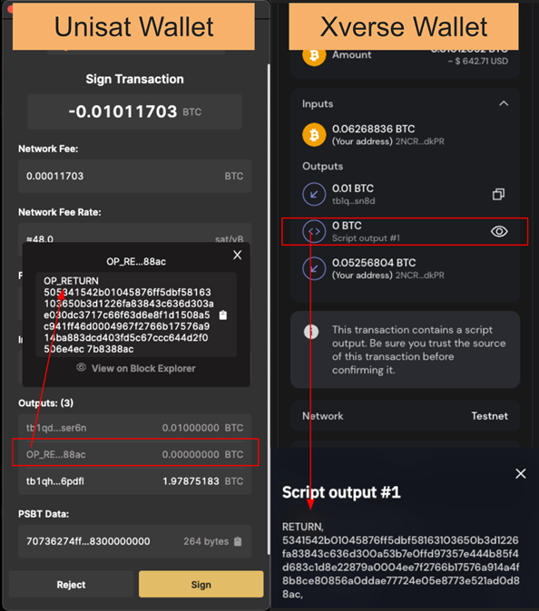
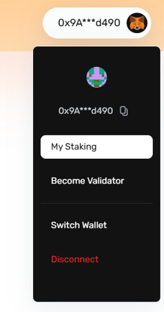

# Self-Custodial Bitcoin Staking

This user guide is designed to walk you through staking your Bitcoin on the Core blockchain to earn CORE token rewards. 

## Prerequisites

To be able to stake, you must have the following prerequisites:

1. **Supported Bitcoin Wallet Browser Extension:** To participate in the BTC staking process, you must install browser extensions of any supported Bitcoin wallets, like [Xverse](https://chromewebstore.google.com/detail/xverse-wallet/idnnbdplmphpflfnlkomgpfbpcgelopg?hl=en-GB&authuser=1), [Unisat](https://chromewebstore.google.com/detail/unisat-wallet/ppbibelpcjmhbdihakflkdcoccbgbkpo), and/or [OKX Wallet](https://chromewebstore.google.com/detail/okx-wallet/mcohilncbfahbmgdjkbpemcciiolgcge) (visit stake.coredao.org for the latest supported wallets). You must use a desktop version, as mobile and hardware wallets are not currently supported. You can also stake directly using the [Element Wallet](https://www.elementwallet.com/) mobile application as well. 
2. **Core Wallet Address for Rewards:** Prepare your Core wallet address to receive CORE token rewards for staking Bitcoin. If you do not have a Core wallet address, you can quickly create one by connecting to MetaMask. For more information on configuring MetaMask to work with the Core network, follow the detailed guide [here](https://docs.coredao.org/docs/Dev-Guide/core-mainnet-wallet-config.md).

## **Key Considerations For BTC Staking**

The following are some key points that users should be careful about when staking their Bitcoin on Core.

1. **Minimum Bitcoin Amount \+ Gas Fee:** The minimum BTC required for staking on Core depends on the chosen method. If using the official website UI, you must stake at least 0.01 BTC (excluding transaction fees). There is no minimum requirement when staking via the script. Additionally, users should account for Bitcoin gas fees required for transactions. If staking for less than a month, it is recommended to have at least 0.05 BTC to cover potential network congestion, which could increase gas costs beyond the staking rewards earned.
2. **Minimum Staking Duration:** Minimum staking duration depends on the method. The official website UI requires a 5-day minimum, while the script has no lockup requirement.
3. **Understanding the Differences in Bitcoin Staking Addresses:**  
   * The staking address in your Bitcoin wallet's transaction prompt may differ from your original Bitcoin address. This is because the Bitcoin staking address is derived from your Bitcoin wallet's master private key, ensuring control and security over your assets. Your Bitcoin remains safe in the Bitcoin staking address, unaffected by staking.   
4. **Delays in Locked Assets to Appear in your Bitcoin Wallet:**   
   * You may face some delays before your locked Bitcoin is displayed in your Bitcoin wallets. This delay primarily results from delays in transaction confirmation on the Bitcoin network, which can take several hours due to block time, the number of block confirmations required, and network congestion.   
   * While we are actively working with wallet partners to support the timely display of your assets in your wallets, you can check your locked assets on the ”MyStaking” page on Core’s staking website.   
   * You can also view your staked funds by searching the staking address on a Bitcoin explorer, [Mempool.space](https://mempool.space/).   
5. **Considerations for Locking Periods**  
   * Once you lock your Bitcoin for staking, it's inaccessible until the staking period concludes. Considering your investment objectives and risk tolerance, you are advised to select your locking period thoughtfully. Starting with shorter locking periods can help you become familiar with the process before committing to longer durations.
6. **Supported Bitcoin Address Types**
   * Core’s BTC staking supports the following Bitcoin address formats:

      | Address Type        | Prefix | Example (hypothetical)                      |
      |---------------------|--------|---------------------------------------------|
      | Legacy (P2PKH)      | 1      | 1KFHE7w8BhaENAswwryaoccDb6qcT6DbYY          |
      | Nested SegWit (P2SH)| 3      | 3Ai1JZ8pdJb2ksieUV8FsxSNVJCpoPi8W6          |
      | Native SegWit (Bech32)| bc1  | bc1qw508d6qejxtdg4y5r3zarvary0c5xw7kygt080  |
      | Taproot (P2TR)      | bc1p   | bc1p5cyxnuxmeuwuvkwfem96lkw4rfd4x0dc9kwljz  |

:::info 
   Ensure your BTC wallet uses one of the supported formats above when participating in Core’s Self-Custodial BTC staking. Always double-check your wallet address before staking.
:::

## Workflow of Self-Custodial BTC Staking

Self-custodial Bitcoin staking introduces a secure and decentralized method for Bitcoin holders to earn staking rewards. By locking your Bitcoin natively on the Bitcoin network through a time-bound mechanism, you can actively participate in the Core blockchain's consensus mechanism while staking. Here are the steps involved in this process.

1. **Initiate Staking:** Start by accessing either the [CLI-based BTC Staking Tool](https://github.com/coredao-org/btc-staking-tool) (for technical users) or the [web-based staking platform](https://stake.coredao.org/) (for general users).   
2. **Stake Bitcoin with Time-Lock:** You stake your Bitcoin by sending a transaction on the Bitcoin network with a time-lock parameter, and your Bitcoin remains locked until the specified period ends. Ensure you follow the requirements for a transaction to be valid and eligible; refer [here](../btc-staking/design#requirements-for-transaction-validity) for more details.   
   1. **Minimum staking duration depends on the method choosen for staking.** The official website UI requires a 5-day minimum, while the script has no lockup requirement. Therefore, make sure to thoughtfully select your lockup periods.   
   2. Include the Core Validator Address to delegate your assets.  
   3. Include the Core wallet address for rewards.  
3. **Vote for Validators:** By including the address of the Core Validators in your transaction, you can delegate your staked Bitcoin to the chosen validator on the Core blockchain.  
4. **Connect a Core wallet for rewards:** In the return field, verify your Core wallet address; you'll receive CORE token rewards at this address.  
5. **Claiming Rewards:** Accrued CORE token rewards will also appear on the [staking site](http://stake.coredao.org/). CORE token rewards will appear when users connect their wallets, and can be claimed daily. Also, to be eligible to earn rewards, it is required to complete a full staking round (00:00:00 - 23:59:29 UTC).   
6. **Redeem Bitcoin:** Once the staking lock time expires, the staked Bitcoin will remain idle in the staking address until redeemed by the user.

## Self-Custodial Bitcoin Staking Walkthrough 

To begin staking your Bitcoin on the Core blockchain and earn staking rewards in CORE tokens, follow the steps detailed below to stake Bitcoin through Core's official [staking website](http://stake.coredao.org/).

### Connect Core Wallet

1. Visit [https://stake.coredao.org](https://stake.coredao.org/) and click on **Validators** on the top header.

2. Click **Connect Wallet** in the top right corner of the header to connect your Core wallet. From the supported list of wallets, choose your desired Core wallet. For this walkthrough, we have used Metamask.

3. Confirm the wallet notification to allow to connect to the staking website.

### Selecting a Core Validator for Bitcoin Delegation

4. Once on the **Validators** page, scroll down to view the list of Core Validators and choose the Validator to whom you wish to delegate your Bitcoins. Please ensure to choose active validators.

5. By clicking on the name of the desired validator, you will be directed to the **Validator Details** page. This page displays details about the staking/delegation records for the selected validator.

6. Click on the **Stake** button, then select **BTC**

7. To connect your Bitcoin wallet, click on the supported wallet of your choice. For this walkthrough, we selected Unisat.  

8. Once your Bitcoin wallet is connected, it's important to understand and specify several key parameters:  

* Specifying the amount of Bitcoin you’d like to delegate  
  * The minimum amount to delegate is 0.01 Bitcoin, if delegating through the official website U. 
  * In our example, we will be delegating 0.05 Bitcoin, which satisfies this requirement  
* Setting the lock time determines when your staked Bitcoin will be unlocked and available again for redemption or re-delegation.  
  * Select inside the lock time box to input values, or click on the calendar icon to select the date and click ‘OK’ to proceed.  
  * The default lock time is set to a month in advance.  
* Specify the network priority speed for your transaction

9. Note that the **Reward Address on Core** is pulled from the connected Core wallet. You should connect the Core wallet with the same address on which you want to receive staking rewards in CORE tokens.  
10. Click **Confirm** to complete the transaction.

:::note
Note: For BTC staking, transferring the staking validator will interrupt staking, resulting in the loss of rewards for that day.
:::

### Confirm OP\_Return Output
11. Before signing the transaction in your wallet, verify the transaction outputs to ensure they include an OP\_Return output. The OP\_Return output is where your redeem\_script is saved and is essentially used to redeem your staked Bitcoin. There may be two or three outputs, but at least one should always be OP\_Return. Abort the transaction if it doesn't include the OP\_Return output.

12. Once you confirm the transition, you will receive a **Transaction Submitted** notification. You can verify your transaction by clicking **View on BTC Explore**.

### Verify BTC Staking Address

13. Before proceeding to confirm your staking transaction. This verification feature allows users to independently verify their BTC staking address, helping prevent blind signing and enhance the security of the staking process. 

14. To proceed with verification, click on the **Verify the BTC Staking Address** button. This will navigate you to the external website.

15. On the Verification Website UI, ensure that the fetched data is correct and then click on the _Submit_ button. 

16. The verification result will appear in the **Verification Result** section.

17. Once verified, navigate back to stake.coredao.org and continue by clicking on **Approve Transaction**.

### Viewing Staking Records

18.  In the top right corner of the staking website, hover over your connected wallet and click **My Staking**.

19.  The **My Staking** page displays records of all your staking (CORE, BTC, and hash). Click on the **BTC Records** tab to show details of your BTC delegations.

**Congratulations!!** You have successfully staked your Bitcoin on the Core blockchain and will now actively earn CORE tokens from your delegated Bitcoin. Through staking Bitcoin and helping to elect validators on Core, you actively contribute to the security of the Core network, supporting its decentralization and stability.
