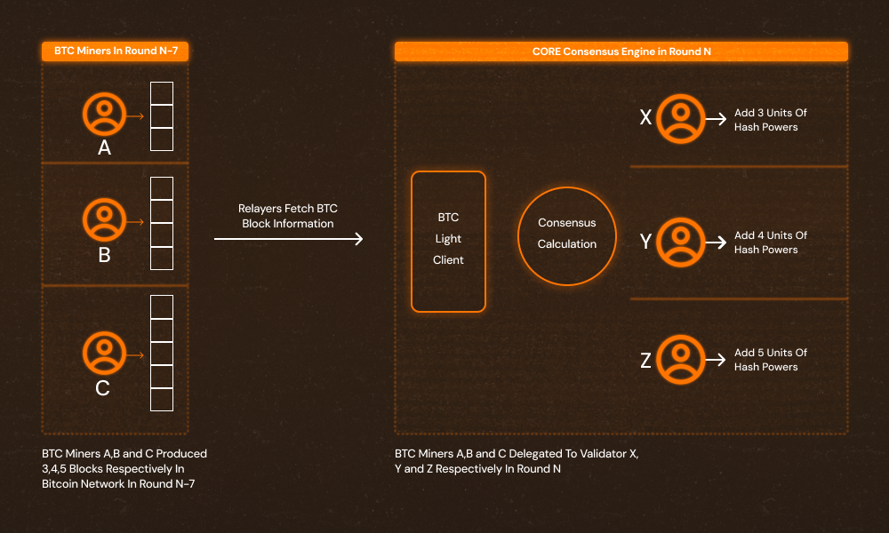

# Delegating Hash Power

---

Using their public and private keys, Bitcoin miners can delegate their hash power to a Core validator or delegate to themselves if they choose to run a validator by verifying and syncing their identity (addresses) on both the Bitcoin and Core blockchains. When relayers submit transactions, they sync the blocks mined by the Bitcoin miner with the Core network. Each round, the Core network calculates the Bitcoin hash power associated with each validator by counting the number of blocks produced by each miner in the Bitcoin network during the same day of the prior week. The architecture of the mapping-chain communication is illustrated in the diagram below. By delegating Bitcoin hash power to Validators, Bitcoin miners can help secure the network and share in system rewards.

## Set Up Process for Miners

Let's take a look at how Bitcoin miners or mining pools can delegate hash power to the Core blockchain by adding an `OP_RETURN` output in the Bitcoin coinbase transaction.

:::info
For more information about Core blockchain and Satoshi Plus consensus, please refer to the [Technical Whitepaper](https://whitepaper.coredao.org/).
:::

### Implementation

Bitcoin miners and mining pools must compose the information below in the following format and put it in the Bitcoin block:

`OP_RETURN + LENGTH + CORE + VERSION + Delegate Information`

Here is a brief description of what belongs in each spot:

- OP_RETURN: `0x6a`
- LENGTH: `0x2d`, which represents the total byte length after the `OP_RETURN` opcode
- CORE: `0x434f5245`
- VERSION: `0x01`
- The `Delegate Information` contains two Core addresses, each 20 bytes. The first address is the Validator address that will receive your PoW delegation. The second address is the Core address at which you want to receive your reward distributions.

To illustrate, let's assume the Validator address is:

- &#x20;`0x0a53b7e0ffd97357e444b85f4d683c1d8e22879a`&#x20;

And the reward address is:

- &#x20;`0xBD13F9435f8B327C222d1D1930C17ea6719e8a33` &#x20;

Combining the constant `OP_RETURN + LENGTH + CORE + VERSION`, we see that the prefix for this (and any other) byte string will be `0x6a2d434f5245010`.

Remember that the full `Delegate Information` comes from the combination of the Validator and reward addresses, so that would be:

- `0x0a53b7e0ffd97357e444b85f4d683c1d8e22879aBD13F9435f8B327C222d1D1930C17ea6719e8a33`

By adding the constant prefix to our example Delegate Information, we get a complete and valid example byte string:

- `0x6a2d434f5245010a53b7e0ffd97357e444b85f4d683c1d8e22879aBD13F9435f8B327C222d1D1930C17ea6719e8a33`

Simply include this byte string as a new output of the Bitcoin coinbase transaction to delegate your hash power and receive rewards.

:::note
Please note that your Validator and reward address will be different than above and must be substituted into the `Delegate Information` portion of the byte string in order to correctly delegate hash power and receive rewards.
:::

### Additional Information

- The Core blockchain uses Bitcoin network block records from seven days ago for hybrid score calculations. Additionally, after a validator is elected, staking rewards are distributed on the second day of the switched round. Therefore, after delegating their hash power, miners/mining pools will have their hash power used in the Validator election calculation N+7 days later and will have claimable rewards N+8 days later.
- In order to improve rewards received from Core blockchain, we encourage miners/mining pools to delegate to more than one Validator and distribute their hash powers evenly. The optimal solution is to delegate **\~5%** of your overall hash rate to each validator.
- Validator information for Core mainnet can be found [here](https://stake.coredao.org/). Validator information for Core Testnet can be found[ here](https://stake.test2.btcs.network/). Use the operator address of the Validator to fill the part in the byte string described above.
- Your reward address must be EVM-compatible. After creating an Ethereum formatted address to use as your reward address, add it after the Validator address in the byte string as described above. Later you will use your reward address to claim rewards from Core blockchain using MetaMask or your preferred web wallet. For more information about adding Core to MetaMask, please refer to our guide on [adding Core to MetaMask](https://medium.com/@core_dao/add-core-to-metamask-7b1dd90041ce).
