# Using Ledger Hardware Wallet for Bitcoin  Staking on Core 
---

This user guide is designed to walk you through staking your Bitcoin on the Core blockchain using the Ledger hardware wallet to earn yield through Core’s Self-Custodial Bitcoin Staking and Dual Staking mechanisms.

:::note
To stake BTC on the Core Mainnet using a Ledger hardware wallet, users must install the CoreDAO app on their devices and ensure that the latest firmware is installed on their Ledger devices.
:::

## Supported Ledger Hardware Wallets

Currently, the following Ledger hardware devices support Bitcoin Staking directly on Core. 
* Ledger Nano S+
* Ledger Stax
* Ledger Flex

Before you begin, ensure your Ledger device is running the latest firmware. At the time of writing, the latest versions were:
* **Ledger Nano S+:** 1.3.2
* **Ledger Stax:** 1.6.2
* **Ledger Flex:** 1.2.2

ℹ️ Please update to the newer versions available to ensure compatibility and security.

## Prerequisites
Make sure you have the following before getting started:
* A supported Ledger device with the latest firmware installed.
* Ledger Live is installed and set up on your computer.
* Core DAO app is installed on the Ledger device.
* If you are using Xverse Wallet, ensure that the Ledger device is added to the Xverse wallet.
* BTC is available for staking on your Ledger device.
* A stable internet connection.

## Setting up Ledger Device
Ensure your Ledger device is updated and ready for use. Follow the steps below to install the CoreDAO app on your device. 

### Installing Core DAO app
* With your device connected, open Ledger Live and navigate to "**My Ledger**".
* Under the "**App Catalog**", search for "**CoreDAO**".
* Install the "**CoreDAO**" app. Use only the CoreDAO app for staking Bitcoin on Core Mainnet.

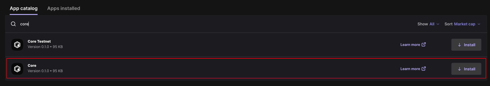

:::note
For staking BTC on Core with a Ledger device, it’s recommended to **only** use the CoreDAO app. Unlike the Bitcoin app, which relies on blind signing, the CoreDAO app supports Clear Signing, allowing users to fully view and verify transaction details before signing and approving them.
:::

## Stake BTC with Ledger on Core Staking Testnet

::: note
To stake BTC on Core Mainnet, a **minimum of 0.01 BTC** is required, plus the applicable transaction fee.
For dual staking with CORE, you’ll also need a minimum of 1 CORE on Core Mainnet in addition to the BTC amount.
:::

* On your Ledger device, open the CoreDAO app before proceeding.

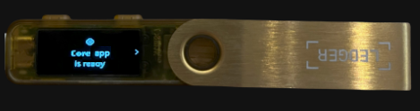

* Navigate to the Core Staking website: https://stake.coredao.org/staking 

### Connecting Wallets

#### Option One: Connect Ledger Wallet Directly to Website
* On the Bitcoin staking UI, click on "**Connect**" next to BTC Staking Amount on the Staking Calculator. 

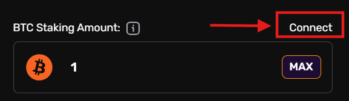

* In the wallet modal, click on "**Ledger**" under "**Hardware Wallet**". Ensure your Ledger is connected, unlocked, and the CoreDAO app is open.

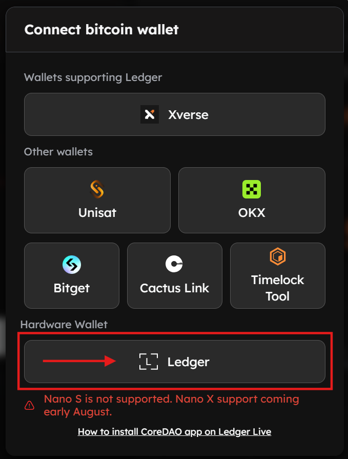

#### Option Two: Connecting Ledger Device Using Xverse Wallet 
Alternatively, you can also use Xverse to dual stake BTC directly from your Ledger device. To achieve this, users **must** first add their Ledger device to their XVerse wallet as a prerequisite.

* On the Core Dual Staking website, click on "**Connect**" next to BTC Staking Amount on the Staking Calculator. 

* From the displayed modal, click on "**Xverse**" under "**Wallets Supporting Ledger**". Make sure your Ledger device is unlocked.

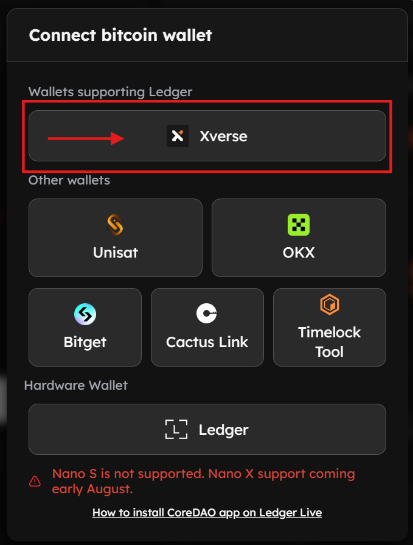

* Unlock your Ledger device and confirm the connection via the Xverse wallet extension.

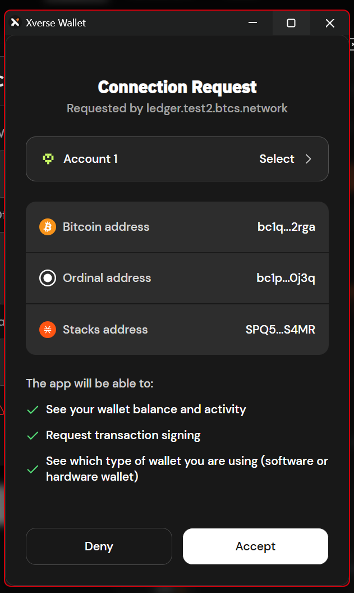

### Connect Core Wallet to Website
* Connect your Core Mainnet wallet to the website. This will be used as the CORE reward address, and if you want to dual stake along with Bitcoin.
* Click on "Connect" next to the CORE Staking Amount on the Staking Calculator. Note that a minimum of 1 CORE is required to be staked with Bitcoin for dual staking.

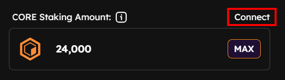

### Specify & Confirm Staking Details
1. Once both wallets are connected, enter the amount of BTC to stake. Select the desired validator to delegate your Bitcoin to. To Dual Stake, enter the amount of CORE to stake along with BTC. Select the desired validator to delegate your CORE. Click the "**Proceed to Stake**" button.

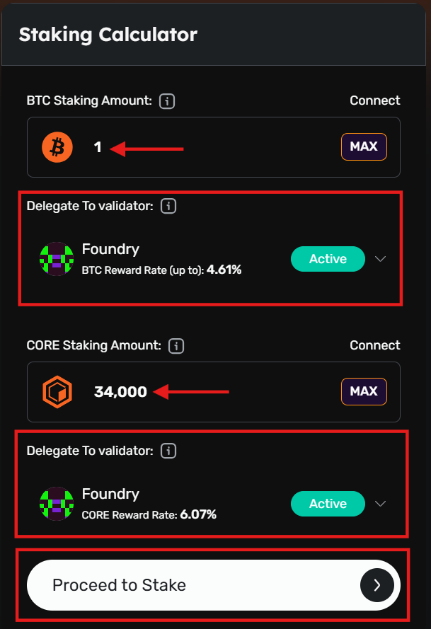

2. **Confirm CORE Staking Details (Optional)**
    * Users can skip this step if they wish to stake only Bitcoin and click directly on "**Stake BTC**" to proceed with staking only BTC by verifying BTC Staking details.
    * Alternatively, if you wish to stake CORE along with Bitcoin, verify that the staked CORE amount and selected Validator are correct. Click "**Confirm**" to proceed with staking CORE. 

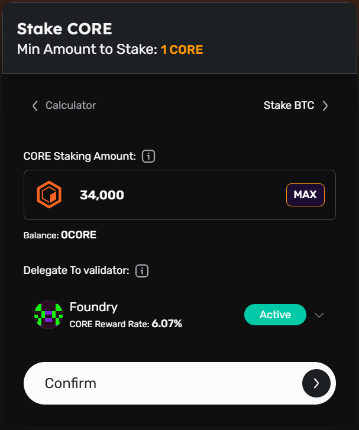

3. **Confirm Bitcoin Staking Details:** Confirm the amount of Bitcoin to stake. Before finalizing the Bitcoin staking process, it's essential to understand and specify several key parameters:
    * Confirm the amount of Bitcoin you’d like to delegate. The minimum amount to delegate is 0.01 Bitcoin.
    * Setting the lock time determines when your staked Bitcoin will be unlocked and available again for redemption or re-delegation. The default lock time is set to a month in advance.
    * Specify the network priority speed for your transaction. 

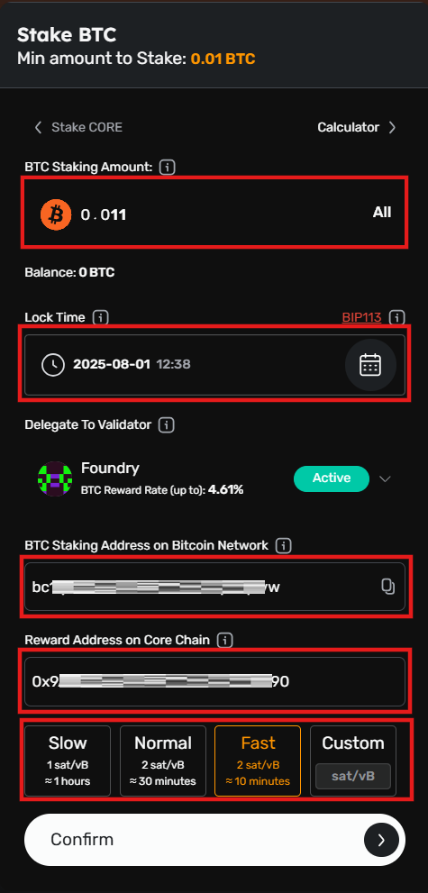

4. **Verify Bitcoin Staking Address (Optional)**
Before proceeding to confirm your staking transaction, you can use the Bitcoin Staking Address verification tool, which helps prevent blind signing and enhances the security of the staking process.

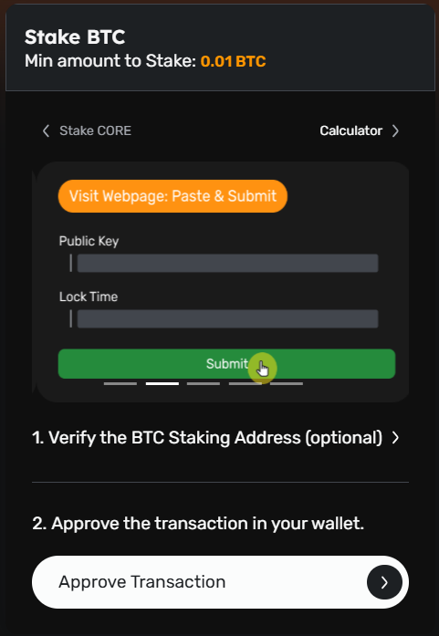

* Click on "**Approve Transaction**" on the website to proceed with the transaction.

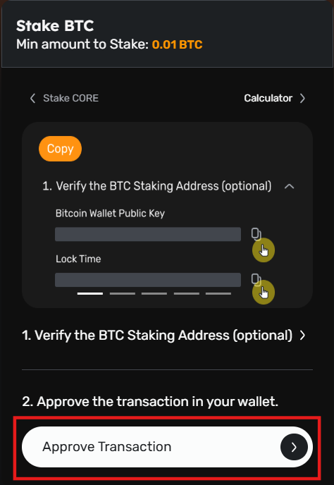

### Review and Approve Transaction

#### Using XVerse Wallet
1. If using an Xverse wallet, review the transaction on your Xverse wallet. 

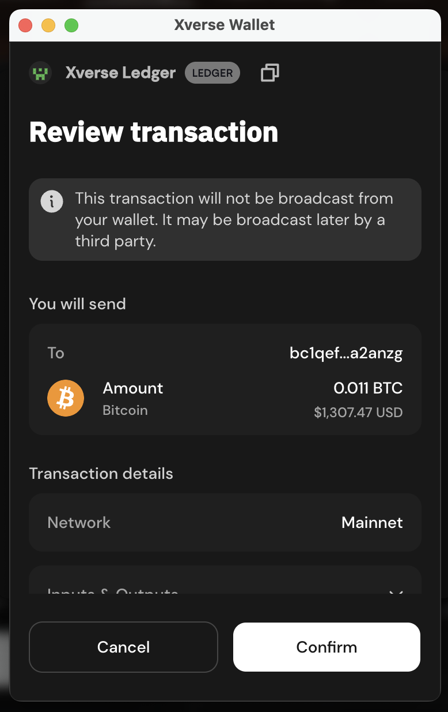

2. Click "**Connect**" on the "**Connect Your Ledger**".

3. Confirm and approve the transaction on your Ledger device. 

#### Approving Staking Transaction on the Ledger Device
1. Ensure your device is unlocked and the CoreDAO app is open. Review and approve the BTC staking transaction on your Ledger device. Verify the staking details, including the amount of BTC and/or CORE being staked, the validator and delegator addresses, and the transaction fees. Approve by signing the transaction.

2. Once approved on your Ledger device, you can see the "**Transaction Submitted**" notification on the staking website. 

3. Click on "**View on BTC Explorer**" to view details of your staking transaction on the BTC Explorer.

## Conclusion
Staking your BTC on the Core Mainnet using a Ledger hardware wallet is a secure and transparent way to participate in the Core ecosystem. With the CoreDAO app and support for Clear Signing, you can confidently stake while keeping full control over your assets.
By following this guide, you're now ready to start earning with Core’s Bitcoin Staking mechanism, all while benefiting from the security of your Ledger device.

