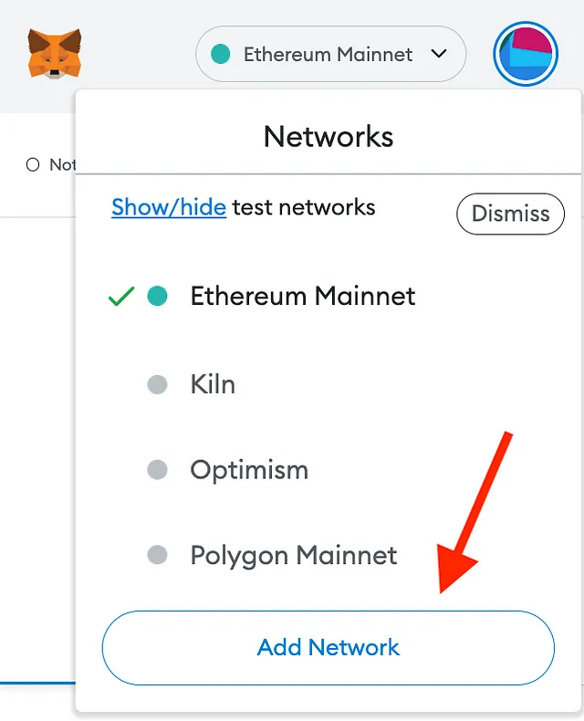
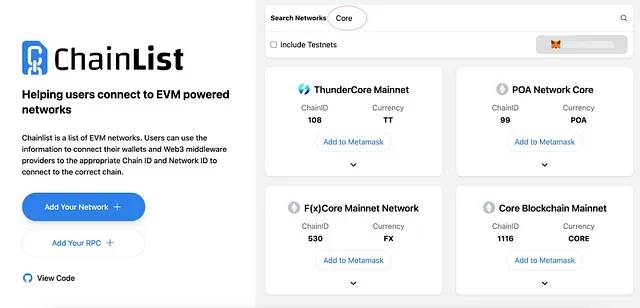
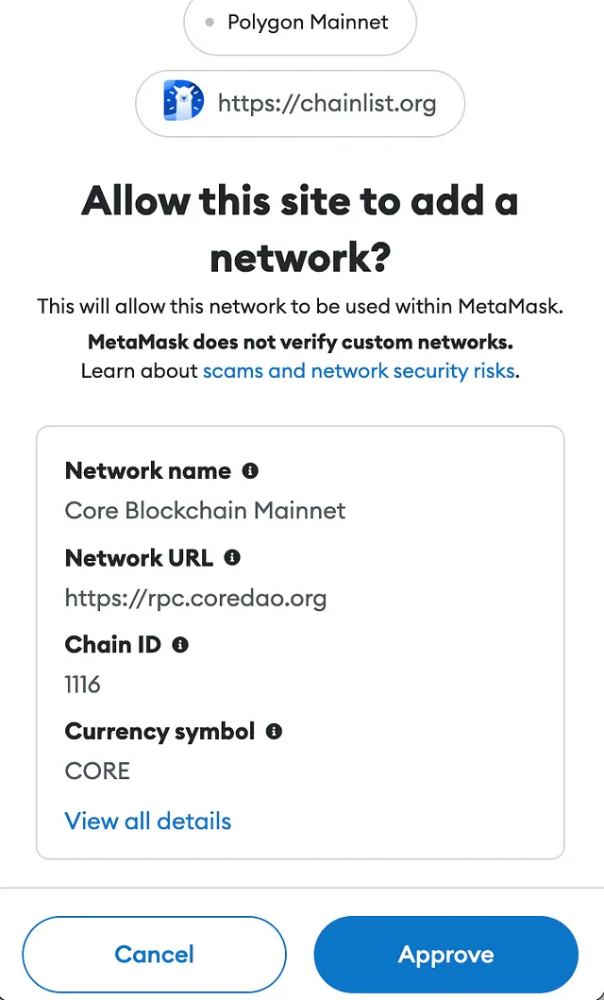
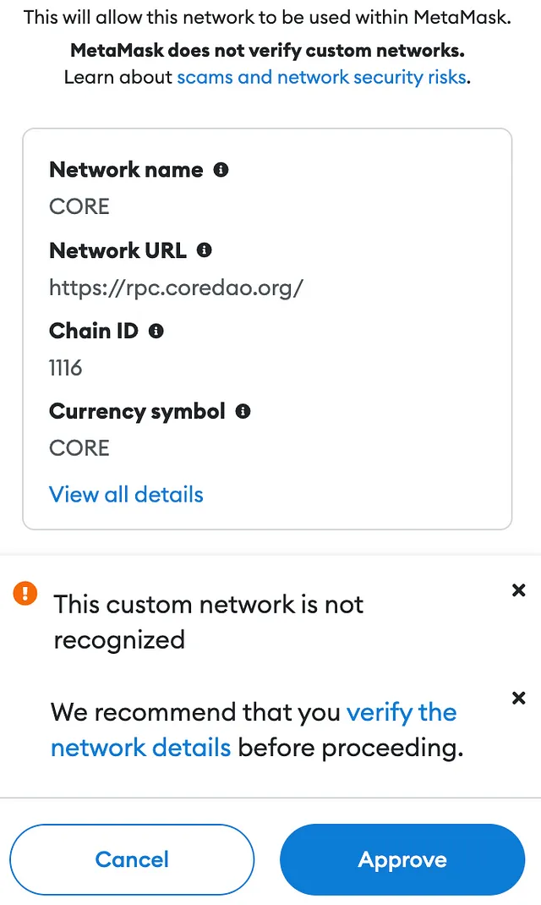
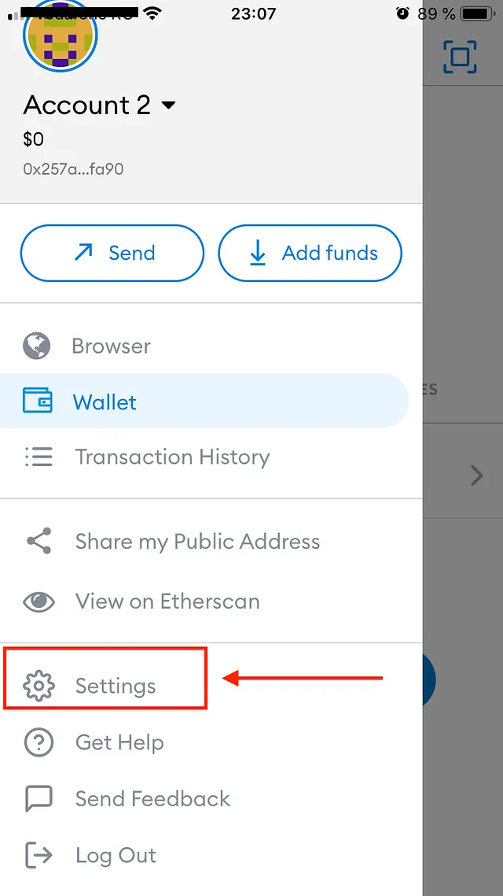
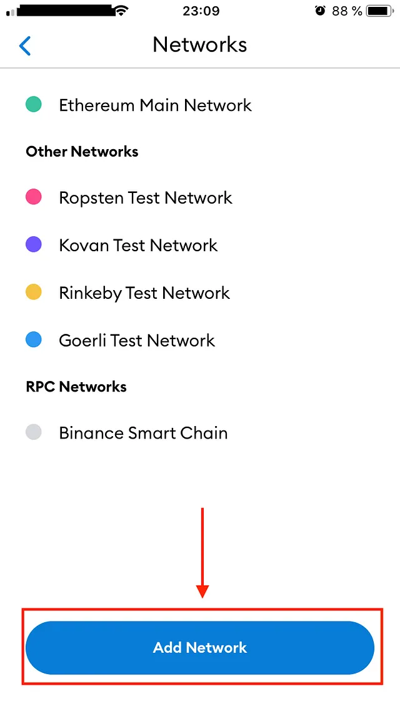

# Conectarse a Core Chain Mainnet

---

:::note
Esta es una guía detallada para conectarse a Core Mainnet utilizando la billetera MetaMask.
:::

## Requisitos previos del software

1. [Extensión del navegador MetaMask Wallet](https://metamask.io/)

## Configuración de la billetera MetaMask

Recomendamos utilizar la [billetera web MetaMask](https://metamask.io/) para conectarse a Core Mainnet. Deberá instalar MetaMask y configurar su cuenta antes de poder usarla para conectarse a Core Mainnet. Puede encontrar las instrucciones de configuración de MetaMask aquí.

## Agregar Core Mainnet a MetaMask

Hay varias formas de agregar configuraciones de Core Mainnet a su MetaMask Wallet; a continuación, enumeramos las formas más confiables y probadas.

### Agregar red manualmente

1. Haga clic en el botón selector de red (la flecha hacia abajo al lado de la red actual). Esto mostrará una lista de redes a las que ya estás conectado.

2. Haga clic en "Agregar red" en la parte inferior de la lista de redes

3. Luego se abrirá una nueva pestaña del navegador, mostrando varios campos para completar:

Complete la siguiente información de la red y haga clic en "guardar" para agregar la red.

- **Nombre de la red:** Core Blockchain
- **Nueva URL de RPC:** https://rpc.ankr.com/core
- **ID de cadena:** 1116 (**Nota**: 0x45c es lo mismo que 1116. La nueva versión de MetaMask convierte el ID de cadena al formato hexadecimal).
- **Símbolo de moneda:** CORE
- **URL del Explorador de bloques:** https://scan.coredao.org

4. Después de realizar los pasos anteriores, podrás ver la red Core la próxima vez que accedas al selector de redes.

### Agregar la red central a través de Chainlist.org

1. Vaya a chainlist.org y busque '_Core_'

2. Verifique dos veces para asegurarse de elegir la red correcta. Verifique los detalles en las siguientes instantáneas: ID de cadena, moneda, etc. para asegurarse de agregar la correcta.

3. Click the ‘_Add to MetaMask_’ button.

4. Approve the action in your MetaMask by clicking the _‘Approve’_ button.

The Core network is now added to your MetaMask.

### Adding the Core network via the Core Explorer

1. Go to https://scan.coredao.org/ and scroll all the way down on the page

2. Click the ‘_Add Core Network_’ button

3. Approve in your MetaMask

4. After performing the above steps, you will be able to see Core network the next time you access the network selector.

### Adding the Core network to MetaMask mobile wallet:

1. Tap on the three lines in the top-left corner:

2. Select _‘Settings’_:

3. Select Networks:

4. Tap on ‘_Add Network_’:

5. Fill in the Custom RPC Network details and click _save_ to add the network.

- **Network Name:** Core Blockchain
- **New RPC URL:** https://rpc.ankr.com/core
- **Chain ID:** 1116 (**Note**: 0x45c is the same as 1116. The new version of MetaMask converts chain ID to hexadecimal format).
- **Currency Symbol:** CORE
- **Block Explorer URL:** https://scan.coredao.org

4. After performing the above steps, you will be able to see the Core network the next time you access the network selector.

:::info
If you happen to have an error, or are struggling with adding the network please ask for help in the ‘support’ channel in the [Core Discord](https://discord.gg/coredao), we are always available to help.
:::
