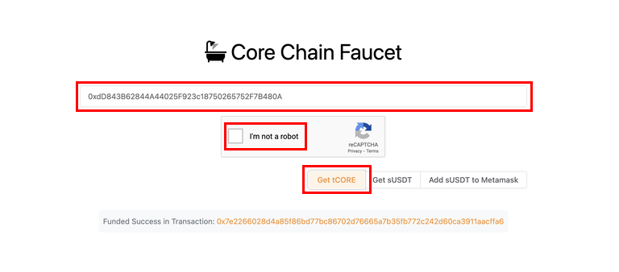

# Faucet Testnet Core

---

Pour aider les utilisateurs à démarrer et permettre aux développeurs de rapidement mettre en place leurs dApps, Core a mis en place le [Faucet public Core Testnet](https://scan.test.btcs.network/faucet) pour distribuer des tokens de testnet Core, **tCORE**.

## Étapes pour obtenir des tCORE depuis le Faucet Testnet Core

1. Rendez-vous sur le site du [faucet](https://scan.test.btcs.network/faucet).
2. Collez votre adresse dans la zone de texte fournie. Assurez-vous d'utiliser l'adresse de votre portefeuille Testnet Core que vous souhaitez alimenter en tCORE.
3. Complétez le CAPTCHA
4. Cliquez sur le bouton `Get tCORE`. Après avoir demandé des tCORE au faucet, vous verrez le solde de votre MetaMask augmenter.

:::Attention
Chaque adresse peut demander **un seul tCORE par jour**. Si vous avez épuisé vos tCORE et que le faucet ne vous en envoie pas plus à cause de la limite quotidienne d'un tCORE, revenez demain et essayez à nouveau !
:::

:::note
tCORE est uniquement utilisé pour les tests et n'a aucune valeur réelle. Ne l'utilisez pas pour des transactions financières réelles.
:::
