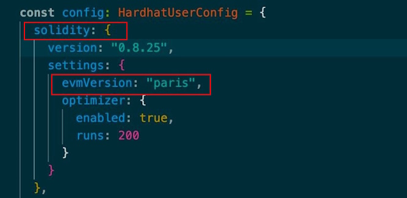

# Directives de développement des contrats intelligents sur la Core Chain

---

La Core Chain évolue constamment pour améliorer l'expérience des utilisateurs et des développeurs. Ce document a pour but de fournir des instructions claires aux développeurs sur les versions de Solidity prises en charge et les paramètres nécessaires pour s'assurer que vos contrats intelligents sont correctement déployés et vérifiables sur le réseau Core Chain. Pour maintenir la cohérence et la compatibilité, Core Chain prend en charge les versions de Solidity supérieures à 0.8.19 en utilisant l'EVM de **Paris**. Le respect des directives de version et de configuration spécifiées est crucial pour garantir le bon fonctionnement de vos contrats. Les sections suivantes détaillent les paramètres Solidity recommandés, y compris les options du compilateur et les procédures de vérification, afin de vous aider à déployer vos contrats de manière fluide et sécurisée sur la Core Chain.

## Contexte

Actuellement, l'EVM de Core correspond à la version **Paris** et _ne prend pas en charge_ le déploiement et la vérification des contrats intelligents de la version **0.8.20^** avec les paramètres EVM par défaut. Core est en train de se mettre à jour vers la dernière version de l'EVM, avec une finalisation prévue pour le _début du troisième trimestre 2024_.

## Configurations pour déployer correctement des contrats intelligents sur Core

Afin que le retard dans la prise en charge du déploiement et de la vérification des contrats intelligents de la version **0.8.20^** ne freine pas le développement des dApps sur la Core Chain, voici les directives à suivre pour s'assurer que les développeurs peuvent déployer et vérifier avec succès les contrats intelligents de la version 0.8.20^ sur Core avant la mise à niveau de l'EVM de Core.

### Paramètres EVM

Pour exécuter des contrats intelligents avec la version 0.8.20^ de Solidity, les développeurs _ne doivent pas utiliser les paramètres EVM par défaut_ pour compiler les contrats intelligents. Au lieu de cela, ils doivent _choisir la version la plus récente avant Shanghai_, à savoir **Paris**.

#### Hardhat

- Veuillez ajouter `evmVersion`: "paris" dans les configurations du compilateur Solidity.

#### Remix

- Veuillez sélectionner `paris` dans les configurations du compilateur.

### Vérification des contrats

- Afin de simplifier le processus de vérification, Core Scan a modifié la version EVM par défaut de la plateforme pour **Paris** pour les contrats Solidity version **0.8.20^**.
- Les développeurs peuvent suivre les mêmes étapes exactes pour vérifier leurs contrats intelligents avec la version 0.8.20^ comme pour les versions antérieures. Pour plus de détails sur la vérification des contrats sur Core Chain, veuillez consulter [ici](./contract-verify.md).

### Contrats intelligents basés sur des versions de Solidity < 0.8.20

- Notez que les contrats intelligents avec des versions de Solidity **\< 0.8.20** ne sont pas affectés par cela et peuvent fonctionner comme d'habitude.
