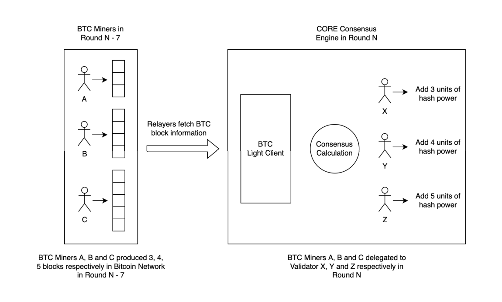

# Délégation de Hashage

---

En utilisant leurs clés publiques et privées, les mineurs de BTC peuvent déléguer leur puissance de hachage à un validateur Core ou se la déléguer eux-mêmes s'ils choisissent de gérer un validateur, en vérifiant et synchronisant leur identité (adresses) sur les blockchains BTC et Core. Lorsque les relayeurs soumettent des transactions, ils synchronisent les blocs minés par le mineur BTC avec le réseau Core. À chaque cycle, le réseau Core calcule la puissance de hachage BTC associée à chaque validateur en comptant le nombre de blocs produits par chaque mineur sur le réseau BTC pendant la même journée de la semaine précédente. L'architecture de la communication de la chaîne de mappage est illustrée dans le schéma ci-dessous. En déléguant leur puissance de hachage BTC aux validateurs, les mineurs de BTC peuvent aider à sécuriser le réseau et à partager les récompenses du système.

## Processus d'installation pour les mineurs

Voyons comment les mineurs de BTC ou les pools de minage peuvent déléguer leur puissance de hachage à la blockchain Core en ajoutant une sortie `OP_RETURN` dans la transaction coinbase de BTC.

:::info
Pour plus d'informations sur la blockchain Core et le consensus Satoshi Plus, veuillez consulter le [Livre Blanc Technique](https://whitepaper.coredao.org/).
:::

### Implémentation

Les mineurs et pools de minage de Bitcoin doivent composer les informations suivantes dans ce format et les placer dans le bloc Bitcoin :

`OP_RETURN + LENGTH + CORE + VERSION + Delegate Information`

Voici une brève description de chaque élément :

- OP\_RETURN: `0x6a`
- LENGTH: `0x2d`, représentant la longueur totale en octets après l'opcode `OP_RETURN`
- CORE: `0x434f5245`
- VERSION: `0x01`
- Les `Informations de Délégation` contiennent deux adresses Core, chacunes de 20 octets. La première adresse est celle du Validateur qui recevra la délégation de PoW. La seconde adresse est l'adresse Core à laquelle vous souhaitez recevoir vos distributions de récompenses.

Pour illustrer, supposons que l'adresse du Validateur soit :

- &#x20`0x0a53b7e0ffd97357e444b85f4d683c1d8e22879a`&#x20

Et l'adresse de récompense soit :

- &#x20`0xBD13F9435f8B327C222d1D1930C17ea6719e8a33` &#x20

En combinant le préfixe constant `OP_RETURN + LENGTH + CORE + VERSION`, le préfixe pour cette chaîne d'octets (et n'importe quel autre) serait `0x6a2d434f5245010`.

Rappelez-vous que les `informations complètes de délégation` proviennent de la combinaison des adresses du Validateur et de récompense, qui doit donc être :

- `0x0a53b7e0ffd97357e444b85f4d683c1d8e22879aBD13F9435f8B327C222d1D1930C17ea6719e8a33`

En ajoutant le préfixe constant à ces informations a notre exemple d'Information de Délégation, nous obtenons une chaîne d'octets valide complète :

- `0x6a2d434f5245010a53b7e0ffd97357e444b85f4d683c1d8e22879aBD13F9435f8B327C222d1D1930C17ea6719e8a33`

Il suffit d'inclure cette chaîne d'octets en tant que nouvelle sortie de la transaction coinbase Bitcoin pour déléguer votre puissance de hachage et recevoir des récompenses.

:::note
Veuillez noter que votre adresse de validateur et votre adresse de récompense seront différentes et doivent être substituées dans la portion des informations de délégation de la chaîne d'octets afin de correctement déléguer la puissance de hachage et recevoir des récompenses.
:::

### Informations supplémentaires

- La blockchain Core utilise les enregistrements de blocs du réseau Bitcoin datant de sept jours pour calculer les scores hybrides. De plus, après qu'un validateur est élu, les récompenses de staking sont distribuées le deuxième jour après le changement de cycle. Ainsi, après avoir délégué leur puissance de hachage, les mineurs/pools de minage verront leur puissance de hachage utilisée dans le calcul de l'élection des Validateurs N+7 jours plus tard, et les récompenses seront réclamables N+8 jours plus tard.
- Afin d'améliorer les récompenses obtenues de la blockchain Core, il est recommandé aux mineurs/pools de déléguer à plus d'un validateur et de répartir leur puissance de hachage de manière équilibrée. La solution optimale est de déléguer **\~5%** de votre puissance de hachage globale à chaque validateur.
- Les informations sur les validateurs pour le mainnet Core se trouvent [ici](https://stake.coredao.org/). Les informations pour le testnet Core se trouvent [ici](https://stake.test.btcs.network/). Utilisez l'adresse de l'opérateur du validateur pour remplir la partie correspondante de la chaîne d'octets décrite ci-dessus.
- Votre adresse de récompense doit être compatible EVM. Après avoir créé une adresse au format Ethereum à utiliser comme adresse de récompense, ajoutez-la après l'adresse du Validateur dans la chaîne d'octets décrite ci-dessus. Plus tard, vous utiliserez cette adresse de récompense pour réclamer vos récompenses depuis la blockchain Core en utilisant MetaMask ou votre portefeuille web préféré. Pour plus d'information sur comment ajouter Core à MetaMask, veuillez-vous référer à notre guide sur [Ajouter core à MetaMask](https://medium.com/@core\_dao/add-core-to-metamask-7b1dd90041ce).
