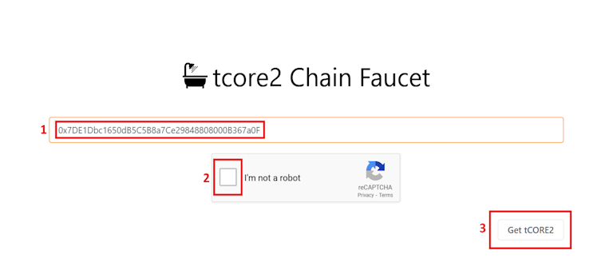

# Grifo de Core Testnet

---

Para ayudar a los usuarios a comenzar y permitir a los desarrolladores prototipar rápidamente sus dApps, Core ha lanzado el Faucet público de Core Testnet para distribuir tokens de Core Testnet, **tCORE2**.

## Pasos para obtener tCORE2 del Faucet de Core Testnet

1. Navega al sitio web del faucet para [Core Testnet2 (1114)](https://scan.test2.btcs.network/faucet).
2. Pega la dirección de tu wallet en el campo de entrada proporcionado. Asegúrate de ingresar la dirección de Core Testnet2 de la wallet que deseas fondear con tCORE2.
3. Completa la verificación CAPTCHA.
4. Haz clic en el botón `Get tCORE2`. Después de solicitar exitosamente tCORE2 del faucet, el saldo de tu wallet aumentará.

:::caution
Cada dirección puede solicitar tCORE2 **solo una vez al día** desde el faucet, dentro de un período de 24 horas. Si te has quedado sin tCORE2 y el faucet no te envía más debido al límite diario de un tCORE2, regresa después de 24 horas e intenta de nuevo. Alternativamente, puedes solicitarlo en el [servidor de Discord](https://discord.com/invite/coredaoofficial) de Core.
:::

:::note
tCORE2 son solo tokens de prueba y se usan únicamente para testing, no tienen ningún valor. No lo use para transacciones financieras reales.
:::