# Conectarse a Core Mainnet

---

:::note
Esta es una guía detallada para conectarse a Core Mainnet utilizando la billetera MetaMask.
:::

## Requisitos previos del software

1. [Extensión del navegador MetaMask Wallet](https://metamask.io/)

## Configuración de la billetera MetaMask

Recomendamos utilizar la [billetera web MetaMask](https://metamask.io/) para conectarse a Core Mainnet. Deberá instalar MetaMask y configurar su cuenta antes de poder usarla para conectarse a Core Mainnet. Puede encontrar las instrucciones de configuración de MetaMask aquí.

## Agregar Core Mainnet a MetaMask

Hay varias formas de agregar configuraciones de Core Mainnet a su MetaMask Wallet; a continuación, enumeramos las formas más confiables y probadas.

### Agregar red manualmente

1. Haga clic en el botón selector de red (la flecha hacia abajo al lado de la red actual). Esto mostrará una lista de redes a las que ya estás conectado.

2. Haga clic en "Agregar red" en la parte inferior de la lista de redes

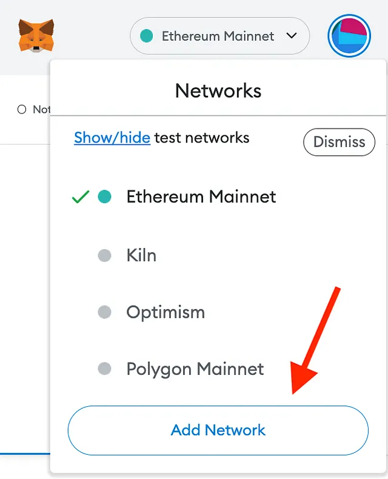

3. Luego se abrirá una nueva pestaña del navegador, mostrando varios campos para completar:

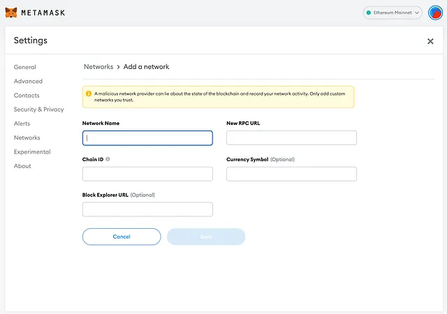

Complete la siguiente información de la red y haga clic en "guardar" para agregar la red.

- **Nombre de la red:** Core Blockchain
- **Nueva URL de RPC:** https://rpc.ankr.com/core
- **ID de cadena:** 1116 (**Nota**: 0x45c es lo mismo que 1116. La nueva versión de MetaMask convierte el ID de cadena al formato hexadecimal).
- **Símbolo de moneda:** CORE
- **URL del Explorador de bloques:** https://scan.coredao.org

4. Después de realizar los pasos anteriores, podrás ver la red principal la próxima vez que accedas al selector de red.

### Agregar la red central a través de Chainlist.org

1. Vaya a chainlist.org y busque '_Core_'

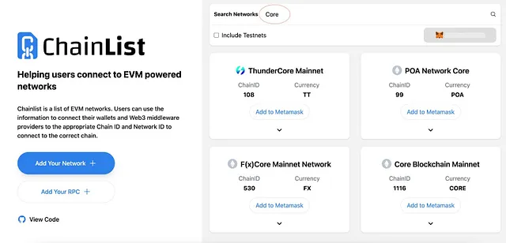

2. Verifique dos veces para asegurarse de elegir la red correcta. Verifique los detalles en las siguientes instantáneas: ID de cadena, moneda, etc. para asegurarse de agregar la correcta.

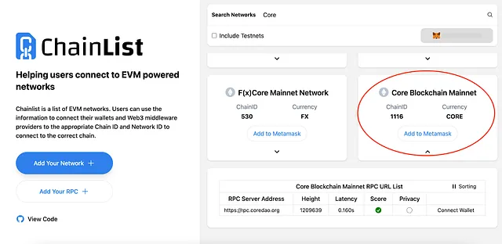

3. Apruebe la acción en su MetaMask haciendo clic en el botón _'Aprobar'_.

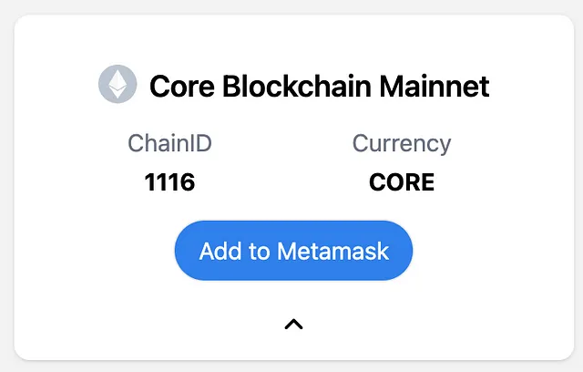

4. Haga clic en el botón '_Agregar a MetaMask_'.

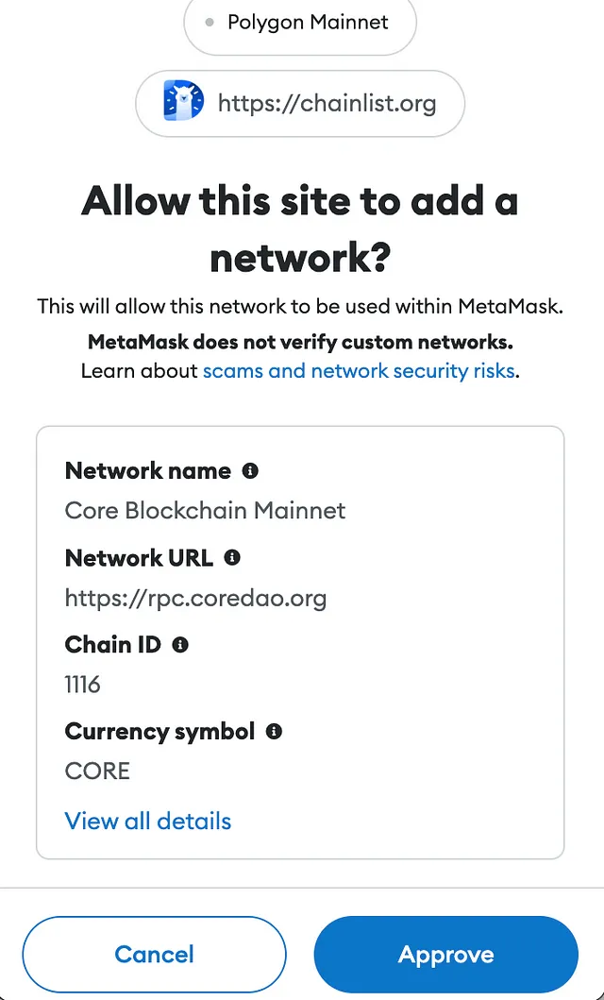

La red Core ahora está agregada a su MetaMask.

### Agregar la red Core a través de Core Explorer

1. Vaya a https://scan.coredao.org/ y desplácese hacia abajo en la página

2. Haga clic en el botón '_Agregar red principal_'

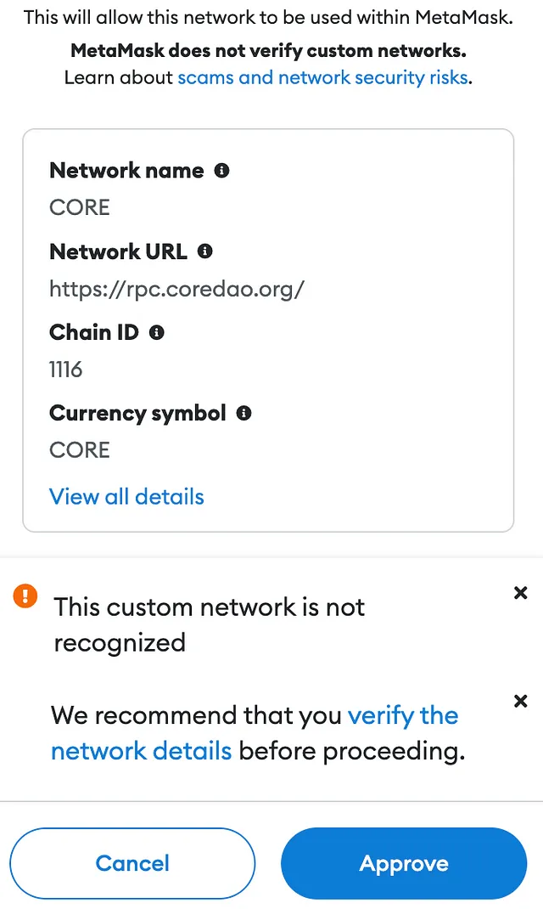

3. Aprobar en tu MetaMask

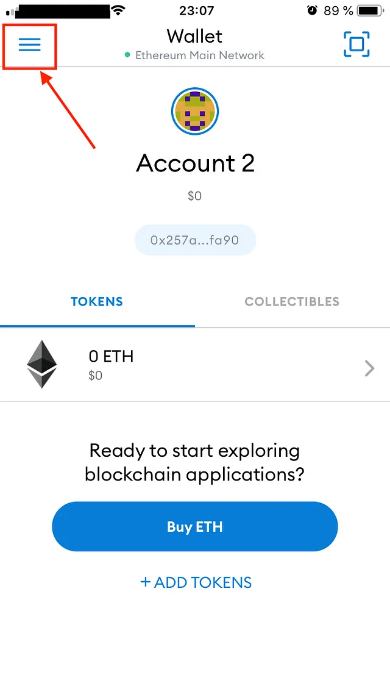

4. Después de realizar los pasos anteriores, podrás ver la red Core la próxima vez que accedas al selector de redes.

### Agregar la red Core a la billetera móvil MetaMask:

1. Toca las tres líneas en la esquina superior izquierda:

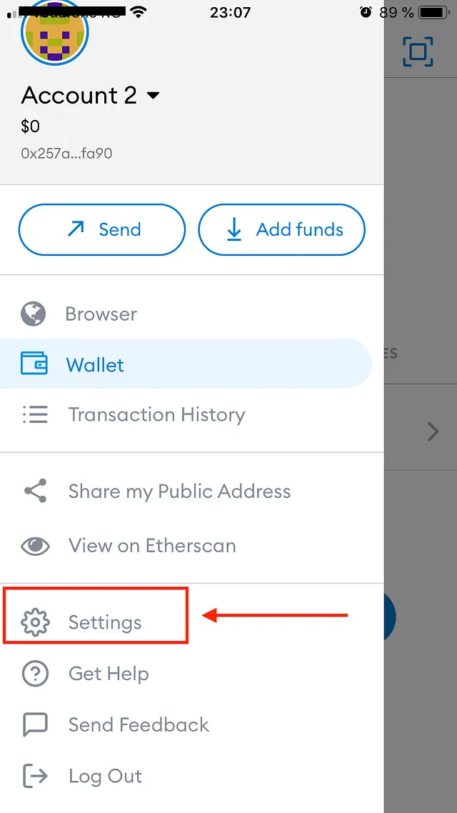

2. Seleccione _'Configuración'_:

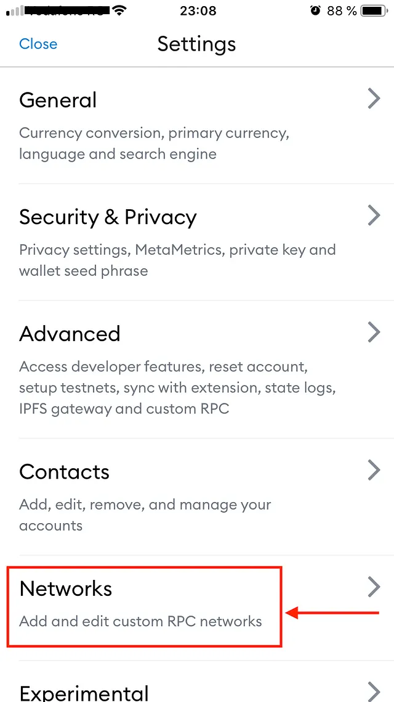

3. Seleccionar redes:

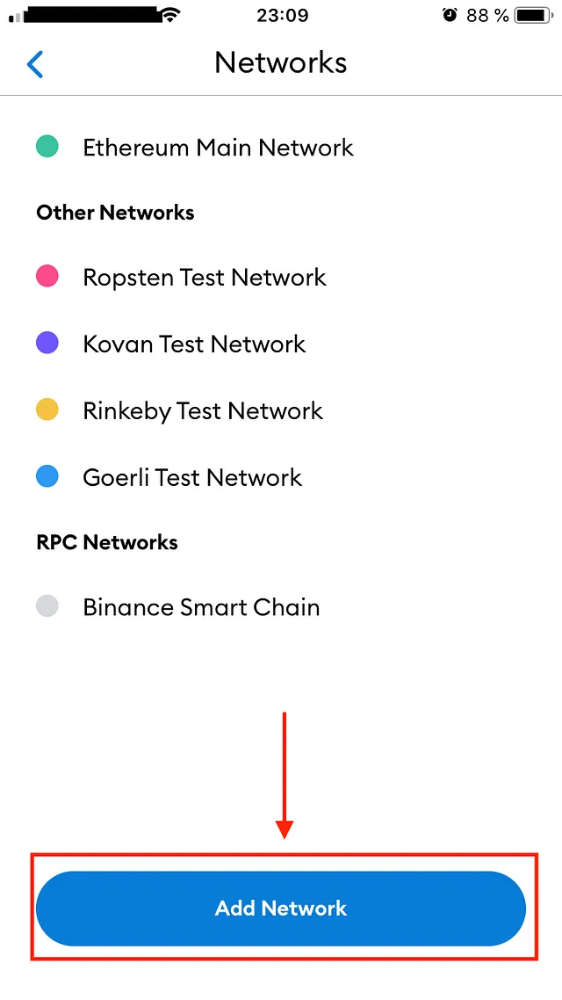

4. Toque '_Agregar red_':

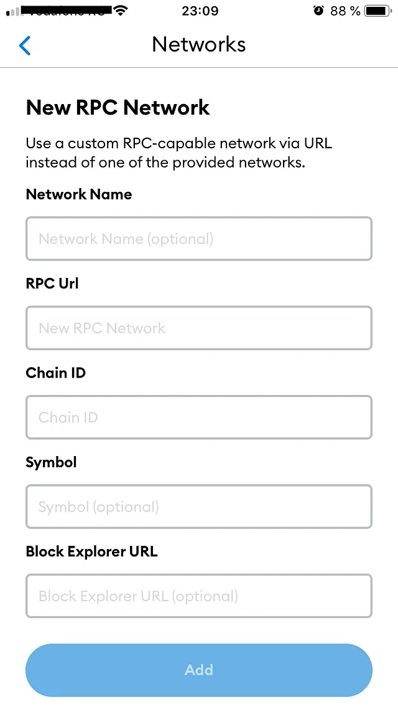

5. Complete los detalles de la red RPC personalizada y haga clic en _guardar_ para agregar la red.

- **Nombre de la red:** Core Blockchain
- **Nueva URL de RPC:** https://rpc.ankr.com/core
- **ID de cadena:** 1116 (**Nota**: 0x45c es lo mismo que 1116. La nueva versión de MetaMask convierte el ID de cadena al formato hexadecimal).
- **Símbolo de moneda:** CORE
- **URL del Explorador de bloques:** https://scan.coredao.org

4. Después de realizar los pasos anteriores, podrás ver la red Core la próxima vez que accedas al selector de redes.

:::info
Si tiene un error o tiene dificultades para agregar la red, solicite ayuda en el canal de "soporte" en [Core Discord] (https://discord.gg/coredao), siempre estamos disponibles para ayudarlo.
:::
