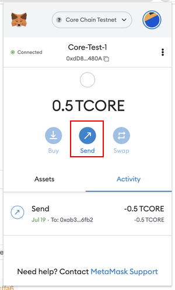
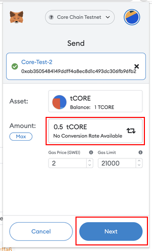

# Conectarse a Core Testnet

---

:::note
Esta es una guía detallada para conectarse a Core Testnet (1114) utilizando la billetera MetaMask.
:::

### Requisitos previos de software

1. [La extensión para el navegador de MetaMask Wallet](https://metamask.io/)

### Configuración de la billetera MetaMask

Recomendamos utilizar la [billetera web MetaMask](https://metamask.io/) para conectarse a Core Testnet. Deberá instalar MetaMask y configurar su cuenta antes de poder usarla para conectarse a Core Testnet. Puede encontrar las instrucciones de configuración de MetaMask aquí.

### Agregar Core Testnet a MetaMask

Hay varias formas de agregar la configuración de Core Testnet a su MetaMask Wallet; a continuación, enumeramos las formas más confiables y de prueba.

#### Agregar red manualmente

Una vez que haya configurado su billetera MetaMask, puede usarla para conectarse a Core Testnet agregando los detalles de la cadena de Core Testnet en la configuración de red de MetaMask. Navegue hasta `Configuración->Redes` (`Settings->Networks`) en MetaMask y haga clic en el botón `Agregar red` (`Add Network`). Introduzca la siguiente información:

- **Nombre de la red:** Core Blockchain TestNet
- **Nueva URL de RPC:** https://rpc.test2.btcs.network
- **ID de cadena:** 1114
- **Símbolo de moneda:** tCORE2
- **URL del Explorador de bloques:** https://scan.test2.btcs.network
- **Faucet:** https://scan.test2.btcs.network/faucet
- **Web de Staking:** https://stake.test2.btcs.network/

#### Agregar la red Core a través de Chainlist.org

1. Vaya a chainlist.org y busque '_core blockchain_', asegúrese de marcar la opción _Include Testnets_.

2. Verifique dos veces para asegurarse de elegir la red correcta. Verifique los detalles en las siguientes capturas: ID de cadena, moneda, etc. para asegurarse de agregar la correcta.

3. Haga clic en _Connect Wallet_ y luego elija MetaMask. Permita conectarse a la billetera MetaMask confirmando las notificaciones de MetaMask.

4. Cambie a Core testnet haciendo clic en el botón _'Cambiar red'_.

El Core Testnet ahora está agregado a su MetaMask.

#### Agregar red a través de Core Testnet Explorer

Si usa la extensión de MetaMask en Chrome, puede usar un atajo rápido para agregar Core Testnet a MetaMask. Visite [Core Testnet Explorer](https://scan.test.btcs.network/), desplácese hacia abajo y seleccione el botón `Add Core Network`. Esto abrirá una ventana emergente con toda la información de red necesaria cargada; solo necesita confirmar y aprobar.

:::info

#### Nueva Testnet

La nueva red de prueba de Core con `ID de cadena1114` ya está disponible y se recomienda su uso. A diferencia de la versión anterior (`ID de cadena: 1115`), esta soporta BTC Testnet4 para el staking. La antigua testnet pronto quedará obsoleta y eventualmente se retirará, así que cambie a la nueva testnet para acceder a las funciones más recientes.

#### Actualizaciones de cambio de marca

`Satoshi Chain/BTCs` ha sido rebautizada como `Core/CORE`, respectivamente. Si agregó la Testnet antes del cambio de marca, deberá actualizar manualmente el nombre de la red y el símbolo de moneda en la configuración de MetaMask; de lo contrario, no podrá utilizar la versión actual de Core Testnet. Vaya a `Configuración->Red` y seleccione `Core Testnet` para abrir la configuración de red. Actualice el nombre de la red y el símbolo de moneda a los valores indicados en la sección anterior y haga clic en el botón Guardar. ¡Listo!
:::

### Fondeando la billetera con tokens tCORE

Para ayudar a los usuarios a comenzar y permitir a los desarrolladores prototipar rápidamente sus dApps, Core ha lanzado él [Core Testnet Faucet](https://scan.test.btcs.network/faucet) público para distribuir tokens de prueba de Core, **tCORE**. Siga la [guía](./core-faucet.md) detallada para financiar su cuenta de metamask con tokens tCORE.

### Envío de tokens tCORE

Puede utilizar MetaMask para enviar tCORE a otras direcciones.

1. Navegue a la billetera metamask, asegúrese de estar conectado a Core Testnet
2. Haga clic en el botón `Enviar`

3. Ingrese la cantidad de tokens tCORE que desea enviar y la dirección a la que los desea enviar; asegúrese de que sea una dirección Core Testnet. Luego haga clic en siguiente y confirme la transacción.

