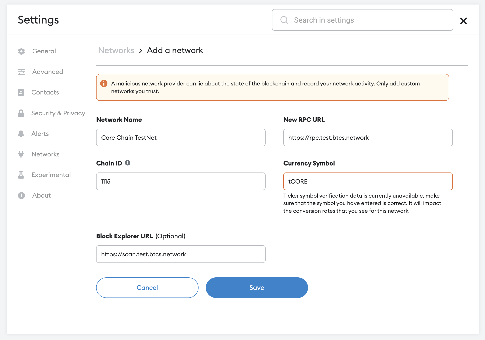
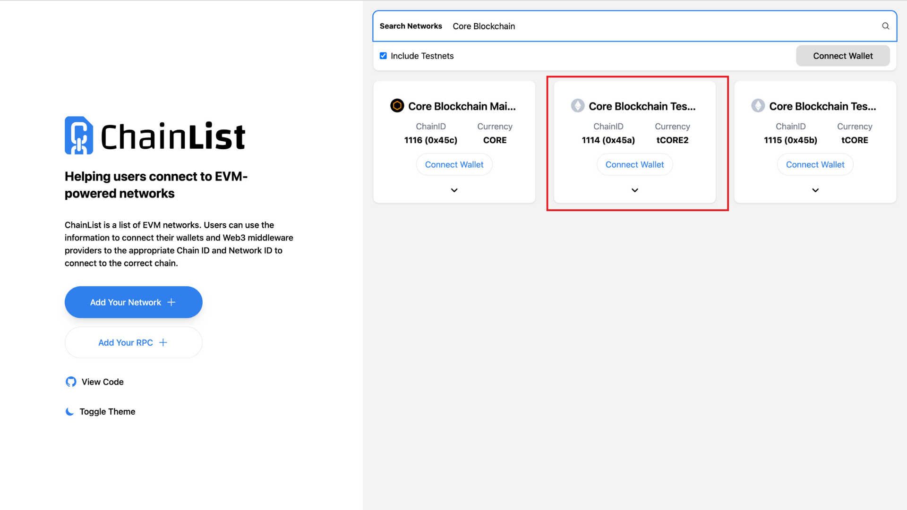
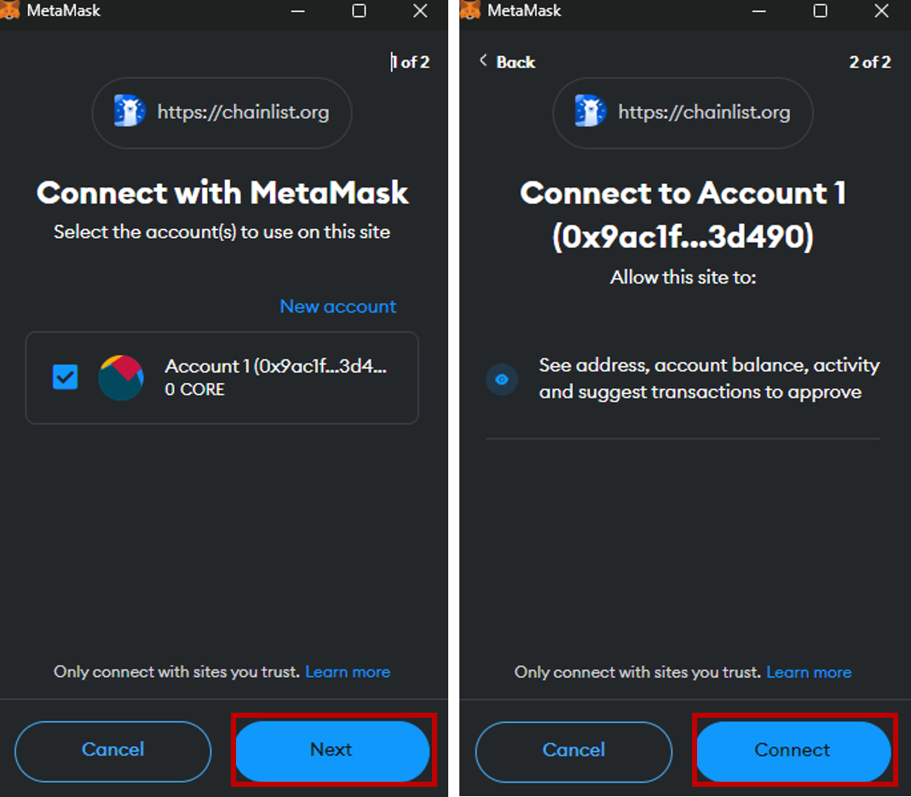
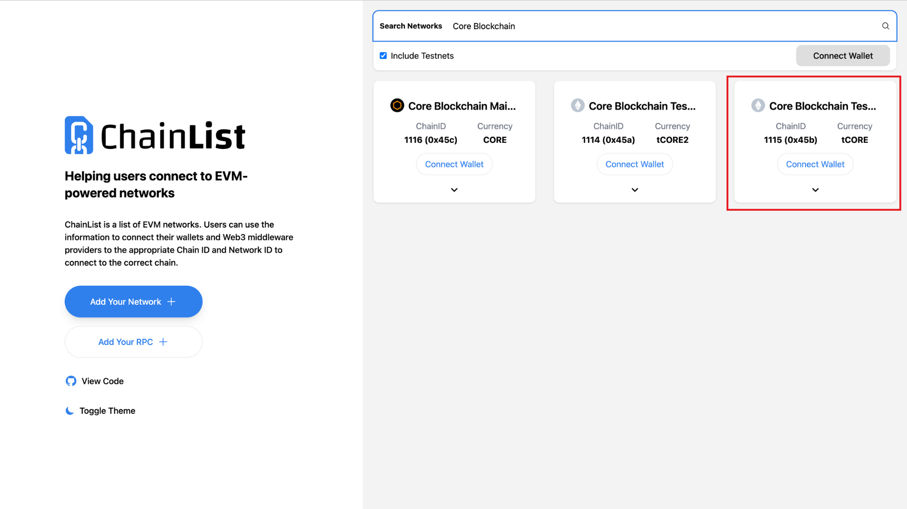
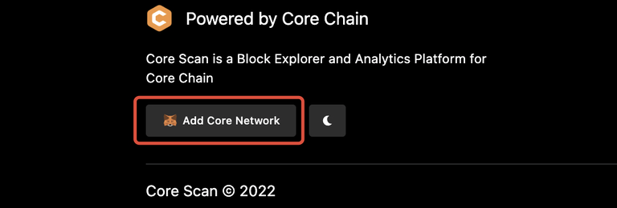
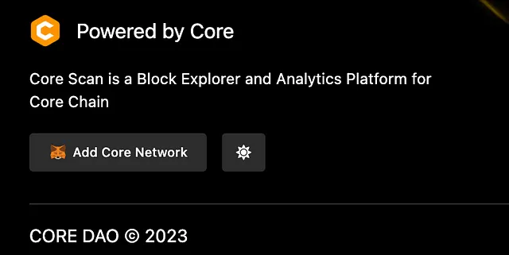

# Conéctese a la red de prueba Core

---

import Tabs from '@theme/Tabs';
import TabItem from '@theme/TabItem';

:::note
Esta es una guía detallada para conectarse a Core (Testnet y Mainnet) utilizando la billetera MetaMask.
:::

### Requisitos previos del software

1. [Extensión del navegador MetaMask Wallet](https://metamask.io/)

### Configuración de la billetera MetaMask

Recomendamos utilizar la [billetera web MetaMask](https://metamask.io/) para conectarse a Core Testnet. Debes tener instalada MetaMask y configurar una cuenta antes de que puedas conectarte a Core Testnet/Mainnet. Puede encontrar las instrucciones de configuración de MetaMask aquí.

### Agregando Core a MetaMask

Existen múltiples formas de añadir las redes de Core (Testnet y Mainnet) a MetaMask. A continuación hemos listado los métodos más confiables y verificados.

#### Agregar red manualmente

Una vez que haya configurado su billetera MetaMask, puede usarla para conectarse a Core agregando los detalles de la cadena a la configuración de red en MetaMask. Navegue hasta `Configuración->Redes` en MetaMask y haga clic en el botón `Agregar red`. Introduzca la siguiente información:

<Tabs defaultValue="testnet2" values={[
{label: 'Testnet2', value: 'testnet2'},
{label: 'Testnet1', value: 'testnet1'},
{label: 'Mainnet', value: 'mainnet'},
]}>

<TabItem value="testnet2">

- **Nombre de la red:** Core Blockchain TestNet
- **Nueva URL de RPC:** https://rpc.test2.btcs.network
- **ID de cadena:** 1114
- **Símbolo de moneda:** tCORE2
- **URL del Explorador de bloques:** https://scan.test2.btcs.network
- **Grifo:** https://scan.test2.btcs.network/faucet
- **Sitio web de apuestas:** https://stake.test2.btcs.network/

</TabItem>
<TabItem value="testnet1">

- **Nombre de la Red:** Core Blockchain TestNet
- **Nueva URL RPC:** https://rpc.test.btcs.network
- **ID de cadena:** 1115
- **Símbolo de Moneda:** tCORE
- **URL del Explorador de Bloques:** https://scan.test.btcs.network
- **Faucet:** https://scan.test.btcs.network/faucet
- **Web de Staking:** https://stake.test.btcs.network/

</TabItem>

<TabItem value="mainnet">

- **Nombre de la Red:** Core Blockchain
- **Nueva URL RPC:** https://rpc.ankr.com/core
- **ID de cadena:** 1116
- **Símbolo de Moneda:** CORE
- **URL del Explorador de Bloques:** https://scan.coredao.org
- **Web de Staking:** https://stake.coredao.org/

</TabItem>

</Tabs>

### Agregar la red Core a través de Chainlist.org

<Tabs defaultValue="testnet2" values={[
{label: 'Testnet2', value: 'testnet2'},
{label: 'Testnet1', value: 'testnet1'},
{label: 'Mainnet', value: 'mainnet'},
]}>

<TabItem value="testnet2">
1. Vaya a chainlist.org y busque '_core blockchain_', asegúrese de marcar la opción _Incluir Testnets_.

2. Verifique dos veces para asegurarse de elegir la red correcta. Por favor, confirme los siguientes detalles en las capturas de pantalla adjuntas: ID de cadena, moneda, etc. Para garantizar la configuración correcta.

3. Haga clic en _Connect Wallet_ y luego elija MetaMask. Permita conectarse a la billetera MetaMask confirmando las notificaciones de MetaMask.

4. Agrega Core Testnet2 al hacer clic en el botón de `Approve`.

El Core Testnet ahora está agregado a su MetaMask.

</TabItem>

<TabItem value="testnet1">
1. Visita chainlist.org y busca ‘_core blockchain_’, asegúrate de marcar la opción _Include Testnets_.

2. Verifique dos veces para asegurarse de elegir la red correcta. Verifique los detalles en las siguientes instantáneas: ID de cadena, moneda, etc. para asegurarse de agregar la correcta.

3. Haga clic en _Connect Wallet_ y luego elija MetaMask. Permita conectarse a la billetera MetaMask al confirmar la notificación respectiva.

4. Agrega Core Testnet2 al hacer clic en el botón de `Approve`.

Core Testnet está ahora agregada a su MetaMask.

</TabItem>

<TabItem value="mainnet">

1. Vaya a chainlist.org y busque ‘_core blockchain_’.

2. Verifique dos veces para asegurarse de elegir la red correcta. Por favor, confirme los siguientes detalles en las capturas de pantalla adjuntas: ID de cadena, moneda, etc. Para garantizar la configuración correcta.

3. Haga clic en _Connect Wallet_ y luego elija MetaMask. Permita conectarse a la billetera MetaMask al confirmar la notificación respectiva.

4. Agrega Core Mainnet al hacer clic en el botón de `Approve`.

Core Mainnet está ahora agregada a su MetaMask.

</TabItem>

</Tabs>

### Agregar la red Core a través de Core Explorer

<Tabs defaultValue="testnet2" values={[
{label: 'Testnet2', value: 'testnet2'},
{label: 'Testnet1', value: 'testnet1'},
{label: 'Mainnet', value: 'mainnet'},
]}>

<TabItem value="testnet2">
1. Vaya a https://scan.test2.btcs.network/ y desplácese hacia abajo en la página

2. Haga clic en el botón ‘_Add Core Network_’

3. Aprueba en tu MetaMask

4. Después de realizar los pasos anteriores, podrás ver la red Core la próxima vez que accedas al selector de redes.

</TabItem>

<TabItem value="testnet1">
1. Vaya a https://scan.test.btcs.network/ y desplácese hacia abajo en la página

2. Haga clic en el botón ‘_Add Core Network_’

3. Aprueba en tu MetaMask

4. Después de realizar los pasos anteriores, podrás ver la red Core la próxima vez que accedas al selector de redes.

</TabItem>

<TabItem value="mainnet">

1. Vaya a https://scan.coredao.org/ y desplácese hacia abajo en la página

2. Haga clic en el botón ‘_Add Core Network_’

3. Aprueba en tu MetaMask

4. Después de realizar los pasos anteriores, podrás ver la red Core la próxima vez que accedas al selector de redes.

</TabItem>

</Tabs>

:::info

#### Última Testnet de Core (1114)

La nueva red de prueba de Core con `chainID 1114` ya está disponible y se recomienda su uso. A diferencia de la versión anterior (`ID de cadena: 1115`), esta soporta BTC Testnet4 para el staking. La antigua testnet pronto quedará obsoleta y eventualmente se retirará, así que cambie a la nueva testnet para acceder a las funciones más recientes.
:::
