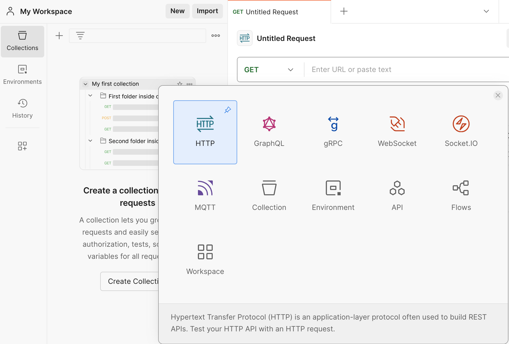

# Conéctate a los endpoints de RPC de Core desde Postman

---

## Ques es postman

[Postman](https://www.postman.com/) es una oferta de software popular que facilita la creación y el uso de API.

En este documento, cubriremos los conceptos básicos para acceder a un punto final RPC con Postman. ¿No pretende ser (o reemplazar) un tutorial completo de principio a fin, sino más bien ofrecer una introducción al tema.

## Trabajar con los RPCs de Core a través de Postman

1. Primero, deberá registrarse con una cuenta. Postman hace que esto sea muy fácil ingresando manualmente los detalles de su cuenta o con una dirección de Gmail.

<p align="center" style={{zoom:"40%"}}>

</p>

2. Los proyectos en Postman están organizados en "espacios de trabajo", por lo que necesitarás crear uno para probar este proceso. Haga clic en el botón _Nuevo_ en el panel de navegación izquierdo.

<p align="center" style={{zoom:"40%"}}>

</p>

3. Puede elegir entre varios espacios de trabajo diferentes. Para este ejemplo, usaremos "HTTP".

<p align="center" style={{zoom:"40%"}}>

</p>

4. Esto lo llevará a una estación de trabajo básica, donde podrá estructurar su consulta RPC y obtener una respuesta.

<p align="center" style={{zoom:"40%"}}>

</p>

5. Primero, cambie la solicitud `GET` por una solicitud `POST`, ya que así es como se estructurará nuestra consulta. Luego, agregue la URL de RPC que desea utilizar para obtener datos relacionados con una transacción específica de Core blockchain. Recuerde que puede utilizar cualquiera de las [URL Core RPC válidas] (./rpc-list.md).

<p align="center" style={{zoom:"40%"}}>

</p>

6. Luego, diríjase a la pestaña Cuerpo y agregue los datos de la siguiente solicitud CURL (tenga en cuenta que en este ejemplo estamos enviando la solicitud como json sin formato).

```bash
curl -H "Content-Type: application/json" \
     -X POST \
     --data '{"jsonrpc":"2.0","method":"eth_getTransactionByHash","params":["0xc9c4a5d14857ace0db197c7393806868824763377f802645aacf6f38d9c309b7"],"id":1}' \
     --url 'https://rpc.ankr.com/core'
```

<p align="center" style={{zoom:"70%"}}>

</p>

7. Una vez que presione el botón "Enviar", recibirá una respuesta en JSON con toda la información que queríamos sobre la transacción cuyo hash pasamos en la solicitud.

<p align="center" style={{zoom:"40%"}}>

</p>
