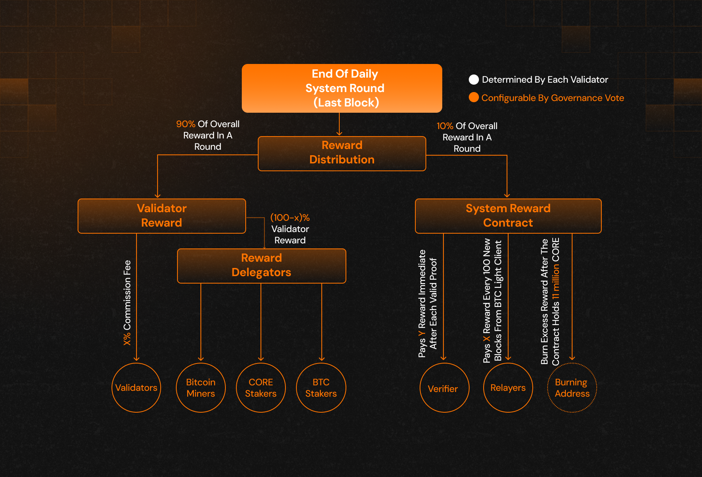

# Recompensas de Consenso

---

## Descripción general

El sistema de recompensas de la red Core es un componente fundamental del **consenso Satoshi Plus**, alineando incentivos entre mineros, stakers, validadores, relayers y verificadores. A través de este sistema, los participantes son compensados por contribuir a la seguridad, descentralización y gobernanza de la red.

Las recompensas se distribuyen en cuatro categorías principales:

1. Minería (DPoW)
2. Staking (CORE y Bitcoin)
3. Operaciones de Validadores
4. Roles a Nivel del Sistema (Relayers y Verificadores)

## 1. Recompensas por Minería (Delegated Proof of Work)

**Quién gana**: Mineros de Bitcoin y pools de minería

**Mecanismo**:

- Los mineros incluyen metadatos de delegación de validadores en los bloques de Bitcoin que minan.
- Esto les permite extender su apoyo a Core sin desviar recursos de la minería de Bitcoin.
- A cambio, los mineros ganan **tokens CORE** como recompensas complementarias, además de las recompensas habituales por bloque de Bitcoin.

## 2. Recompensas por Staking (CORE y Bitcoin)

**Quién gana**: Poseedores de CORE o Bitcoin

**Mecanismo**:

- Los participantes delegan CORE o Bitcoin timelocked a validadores.
- El poder de voto es proporcional a la cantidad delegada.
- Las recompensas se distribuyen en función del rendimiento del validador y de la proporción de delegación total que representa el participante.

Las recompensas por staking fomentan la participación a largo plazo y otorgan a los delegadores influencia sobre la selección de validadores.

## 3. Recompensas del validador

**Quién gana:** Validadores y sus delegadores (mineros, stakers de CORE, stakers de Bitcoin)

**Mecanismo**:

- Los validadores ganan desde dos fuentes:
  - **Recompensas por Bloque**: Tokens CORE recién emitidos
  - **Comisiones por Transacción**: Recaudadas de cada bloque procesado
- Las recompensas se calculan y distribuyen **al final de cada ronda** (200 bloques / ~1 día)

**Distribución de Recompensas**:

- **90%** va a los validadores (y sus delegadores/votantes)
- **10%** se asigna al **System Reward Contract**
- Los validadores aplican una comisión antes de distribuir las recompensas restantes a sus delegadores

Esto incentiva a los validadores a ofrecer una participación competitiva en las recompensas para atraer delegadores.

## 4. Fórmula de Distribución de Recompensas

Después de aplicar la comisión del validador, el protocolo calcula las recompensas de los delegadores en función del tipo de contribución:

#### Delegadores de poder hash (mineros y grupos de minería)

$$
    rH = \frac{\frac{rHp}{tHp} * m} {S} * R
$$

#### CORE Stakers

$$
    rS = \frac{\frac{rSp}{tSp} * k} {S} * R
$$

#### Bitcoin Stakers

$$
    rB = \frac{\frac{rBp}{tBp} * l} {S} * R
$$

donde:

- $$rH$$: Recompensas atribuidas al poder de hash delegado (DPoW).
- $$rS$$: Recompensas atribuidas a la participación CORE (DPoS).
- $$rB$$: Recompensas atribuidas a la apuesta de BTC.
- $$R$$: Recompensas totales asignadas a todos los delegados.
- $$m$$: Proporción de recompensas asignadas al poder hash.
- $$m$$: Proporción de recompensas asignadas al poder hash.
- $$l$$: Proporción de recompensas asignadas a la apuesta de BTC.
- $$S$$: Puntuación híbrida del validador.

## Cálculos de Recompensa por Unidad

Los cálculos de recompensa por unidad determinan las recompensas distribuidas por cada unidad apostada de poder hash, CORE o BTC:

- **Recompensa por unidad de hash power:** $$rHu$$ = $$\frac{rH}{rHp}$$
- **Recompensa por unidad de CORE:** $$rSu$$ = $$\frac{rS}{rSp}$$
- **Recompensa por unidad de BTC:** $$rBu$$ of **Pn** = $$\frac{rB}{rBp}$$ x Yield Multiplier for Leveln

Donde:

- $$rHu$$ son las recompensas del poder hash del validador por unidad;
- $$rSu$$ son las recompensas de apuesta de tokens CORE por unidad;
- $$rBu$$ de **Pn** son las recompensas de apuesta de BTC por unidad para el delegado con nivel de rendimiento de PN BTC
- **Multiplicadores de Rendimiento:** Cada nivel de rendimiento mejorado tiene un multiplicador específico (e, f, g, h,..., etc) que se determina con base en los datos de staking del usuario y la configuración del sistema de Dual Staking. Estos parámetros son establecidos dinámicamente por gobernanza y recompensan a los usuarios por combinar staking de CORE y Bitcoin.

## Impacto del Dual Staking en las Recompensas de Bitcoin

Las recompensas por staking de Bitcoin están organizadas por niveles, basados en cuánto CORE ha delegado un usuario en relación con su delegación de Bitcoin.

- Los niveles superiores (por ejemplo, el Satoshi Tier) reciben multiplicadores de recompensa mayores
- Esto crea un i**ncentivo impulsado por el mercado** para combinar CORE con Bitcoin y aumentar los rendimientos

Conoce más sobre [Dual Staking](../dual-staking/overview.md).

## Estrategias de Optimización de Recompensas

Los delegadores están incentivados a:

- Elegir validadores con **menores pools de delegación**, donde su participación represente un porcentaje más alto
- Buscar validadores con **bajas comisiones**
- Balancear el staking entre validadores con poca suscripción para maximizar el rendimiento marginal

Esta dinámica fomenta decisiones activas de delegación y competencia entre validadores.

## Recompensas para Relayers y Verifiers

### Relayers

- Transmiten bloques y datos de transacciones de Bitcoin hacia Core
- Son pagados desde el **System Reward Contract**
- Las recompensas se agrupan cada **100 bloques de Bitcoin**
- Se reclaman periódicamente por los relayers

### Verifiers

- Monitorean a los validadores por comportamientos maliciosos (por ejemplo, double signing)
- Al presentar reportes válidos, reciben recompensas **inmediatamente** del System Reward Contract

**Nota:** El System Reward Contract está limitado a **10 millones de tokens CORE**. Cualquier exceso **se quema**, haciendo que la participación adicional sea deflacionaria.

## Conclusión

El sistema de recompensas de Core incentiva y alinea adecuadamente a los **mineros, stakers, validadores y roles de infraestructura**. A través de un sistema transparente y configurable, las recompensas impulsan la seguridad, la descentralización y la participación sostenida de la comunidad en el consenso Satoshi Plus.
