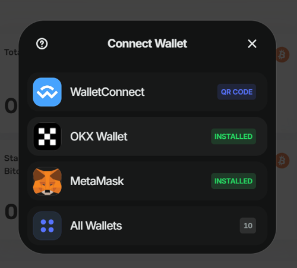
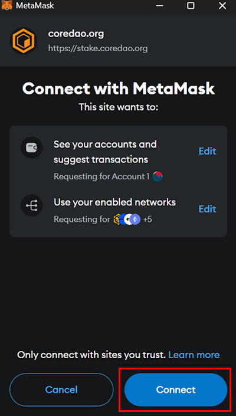
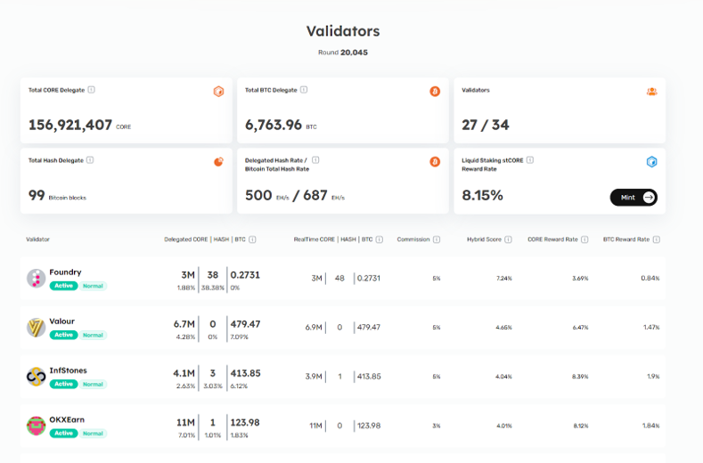
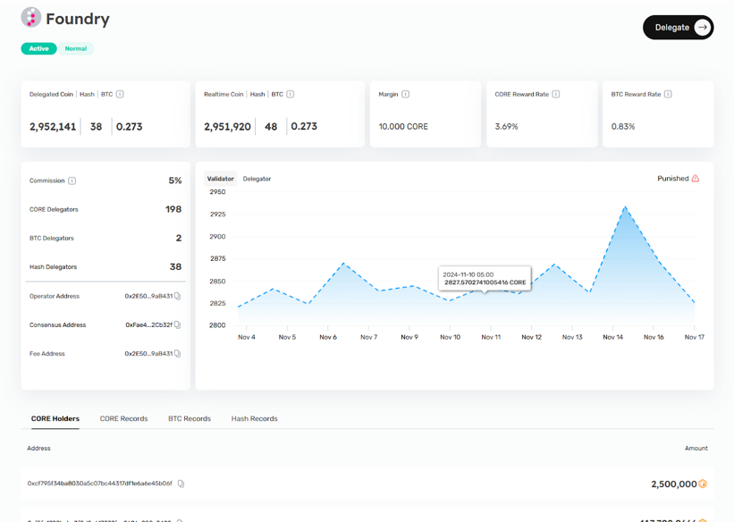
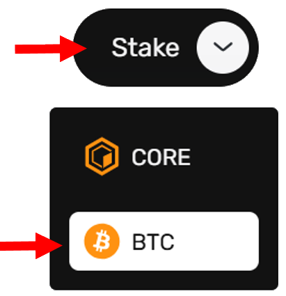
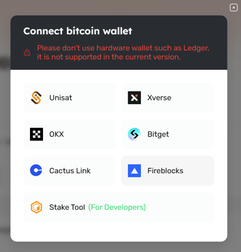
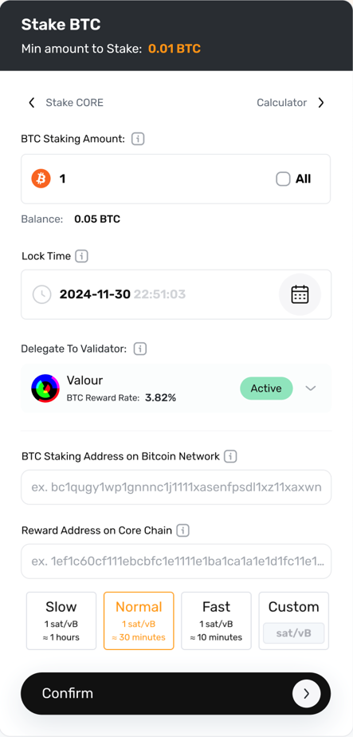
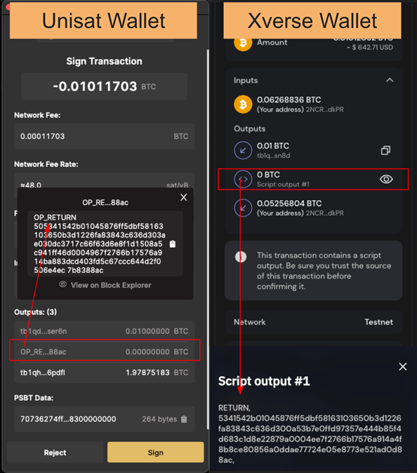
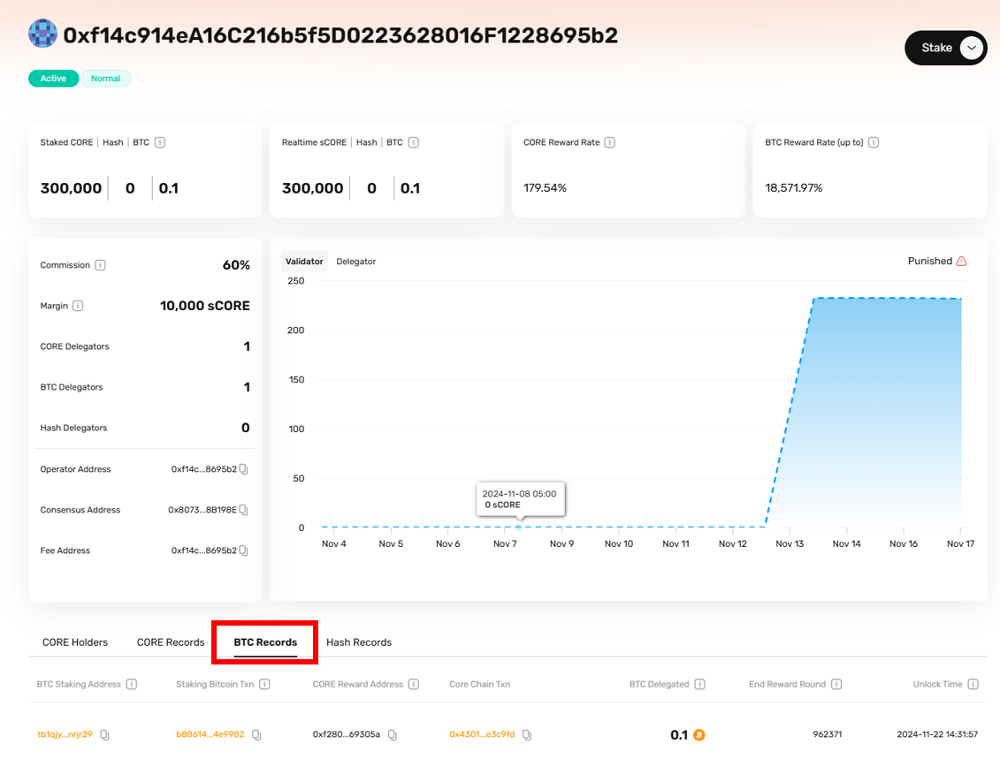

# Staking de Bitcoin No Custodial

Esta guía del usuario está diseñada para guiarlo en el proceso de staking de Bitcoin en la cadena de bloques Core para ganar recompensas en tokens CORE. Con el staking de Bitcoin sin custodia, puede obtener un rendimiento pasivo en CORE mientras conserva la propiedad completa de sus activos de Bitcoin. Vamos a profundizar en cómo funciona y cómo puedes comenzar a hacer staking hoy.

## Requisitos Previos

Para poder realizar stake, debes tener los siguientes requisitos previos:

1. **Supported Bitcoin Wallet Browser Extension:** To participate in the BTC staking process, you must install browser extensions of any supported Bitcoin wallets, like [Xverse](https://chromewebstore.google.com/detail/xverse-wallet/idnnbdplmphpflfnlkomgpfbpcgelopg?hl=en-GB\\&authuser=1), [Unisat](https://chromewebstore.google.com/detail/unisat-wallet/ppbibelpcjmhbdihakflkdcoccbgbkpo), and/or [OKX Wallet](https://chromewebstore.google.com/detail/okx-wallet/mcohilncbfahbmgdjkbpemcciiolgcge) (visit stake.coredao.org for the latest supported wallets). Debes utilizar una versión de escritorio, ya que actualmente no se admiten billeteras móviles ni de hardware. You can also stake directly using the [Element Wallet](https://www.elementwallet.com/) mobile application as well.
2. **Dirección de billetera Core para recompensas:** Prepare su dirección de billetera Core para recibir recompensas en tokens CORE por hacer staking de Bitcoin. Si no tiene una dirección de billetera Core, puede crear una rápidamente conectándose a MetaMask. Para obtener más información sobre cómo configurar MetaMask para que funcione con la red Core, siga la guía detallada [aquí](https://docs.coredao.org/docs/Dev-Guide/core-mainnet-wallet-config).

## **Consideraciones clave para el staking de BTC**

Los siguientes son algunos puntos clave que los usuarios deben tener en cuenta al apostar sus Bitcoin en Core.

1. **Mínimo de 0,01 Bitcoin + tarifa de gas:** Para apostar con éxito su Bitcoin en Core, necesita un mínimo de 0,01 Bitcoin. Además del monto de participación, los usuarios deben considerar las tarifas de gas necesarias en Bitcoin para ejecutar transacciones en la red Bitcoin. Si planeas hacer staking durante menos de un mes, es aconsejable tener al menos 0,05 Bitcoin. Esta cantidad adicional ayuda a cubrir una posible congestión de la red, lo que puede generar precios de gas más altos que las recompensas obtenidas por el staking.
2. **Entendiendo las diferencias en las direcciones de staking de Bitcoin:**
   - La dirección de participación en el mensaje de transacción de su billetera Bitcoin puede diferir de su dirección Bitcoin original. Esto se debe a que la dirección de staking de Bitcoin se deriva de la clave privada maestra de su billetera de Bitcoin, lo que garantiza el control y la seguridad de sus activos. Su Bitcoin permanece seguro en la dirección de staking de Bitcoin, sin verse afectado por el staking.
3. **Retrasos en la aparición de los activos bloqueados en su billetera Bitcoin:**
   - Es posible que experimente algunos retrasos antes de que su Bitcoin bloqueado se muestre en sus billeteras Bitcoin. Este retraso se debe principalmente a retrasos en la confirmación de transacciones en la red Bitcoin, que pueden tardar varias horas debido al tiempo de bloque, la cantidad de confirmaciones de bloque requeridas y la congestión de la red.
   - Mientras trabajamos activamente con socios de billeteras para respaldar la visualización oportuna de sus activos en sus billeteras, puede verificar sus activos bloqueados en la página "MyStaking" en el sitio web de staking de Core.
   - También puedes ver tus fondos apostados buscando la dirección de staking en un explorador de Bitcoin, [Mempool.space](https://mempool.space/).
4. **Consideraciones para los Períodos de Bloqueo**
   - Una vez que bloqueas tu Bitcoin para staking, será inaccesible hasta que concluya el período de staking. Teniendo en cuenta sus objetivos de inversión y su tolerancia al riesgo, le recomendamos seleccionar cuidadosamente su período de bloqueo. Comenzar con períodos de bloqueo más cortos puede ayudarte a familiarizarte con el proceso antes de comprometerte a períodos más largos.

## Flujo de trabajo de staking de BTC sin custodia

El staking de Bitcoin sin custodia introduce un método seguro y descentralizado para que los poseedores de Bitcoin obtengan recompensas por staking. El staking de Bitcoin sin custodia introduce un método seguro y descentralizado para que los poseedores de Bitcoin obtengan recompensas por staking. Aquí están los pasos involucrados en este proceso.

1. **Iniciar staking:** Comience accediendo a la [Herramienta de staking de BTC basada en CLI](https://github.com/coredao-org/btc-staking-tool) (para usuarios técnicos) o a la [plataforma de staking basada en la web](https://stake.coredao.org/) (para usuarios generales).
2. **Apuesta Bitcoin con bloqueo de tiempo:** Usted apuesta su Bitcoin enviando una transacción en la red Bitcoin con un parámetro de bloqueo de tiempo, y su Bitcoin permanece bloqueado hasta que finalice el período especificado. Asegúrese de cumplir con los requisitos para que una transacción sea válida y elegible; consulte [aquí](https://docs.google.com/document/d/1DfhLwMfANGYhcJe4UiyRJxpw1FvFX6k-QQK4cMYYOls/edit?tab=t.0#heading=h.mwjq55dgslw5) para obtener más detalles.
   1. There is no minimum staking period requirements, however, make sure to thoughtfully select your lockup periods.
   2. Incluya la dirección del validador principal para delegar sus activos.
   3. Incluya la dirección de la billetera Core para obtener recompensas.
3. **Vote por los Validadores:** Al incluir la dirección de los Validadores Centrales en su transacción, puede delegar su Bitcoin en stake al validador elegido en la cadena de bloques Central.
4. **Conecta una billetera Core para obtener recompensas:** En el campo de devolución, verifica la dirección de tu billetera Core; recibirás recompensas de tokens CORE en esta dirección.
5. **Conecta una billetera Core para obtener recompensas:** En el campo de devolución, verifica la dirección de tu billetera Core; recibirás recompensas de tokens CORE en esta dirección. **Conecta una billetera Core para obtener recompensas:** En el campo de devolución, verifica la dirección de tu billetera Core; recibirás recompensas de tokens CORE en esta dirección.
6. **Redimir Bitcoin:** Una vez que expire el tiempo de bloqueo del staking, el Bitcoin bloqueado permanecerá inactivo en la dirección de staking hasta que sea redimido por el usuario.

## Guía Paso a Paso para el Staking de Bitcoin No Custodial

Para comenzar a hacer staking de tu Bitcoin en la blockchain de Core y ganar recompensas de staking en tokens CORE, sigue los pasos detallados a continuación para hacer staking de Bitcoin a través del [sitio web oficial de staking](http://stake.coredao.org/) de Core.

### Conectar la Cartera de Core

1. Visita [https://stake.coredao.org](https://stake.coredao.org/) y haz clic en **Validators** en el encabezado superior.

2. Haz clic en **Connect Wallet** en la esquina superior derecha del encabezado para conectar tu cartera de Core. De la lista de carteras soportadas, elige la cartera de Core que desees. Para esta guía, hemos usado Metamask.

3. Confirma la notificación de la cartera para permitir la conexión con el sitio web de staking.

### Seleccionar un Validador de Core para Delegar Bitcoin

4. Una vez en la página de **Validators**, desplázate hacia abajo para ver la lista de Validadores de Core y elige el Validador al que deseas delegar tus Bitcoins. Asegúrate de elegir validadores activos.

5. Al hacer clic en el nombre del validador deseado, serás dirigido a la página de **Detalles del Validador**. Esta página muestra detalles sobre los registros de staking/delegación para el validador seleccionado.

6. Haz clic en el botón **Stake**, luego selecciona **BTC**.

7. Para conectar tu cartera de Bitcoin, haz clic en la cartera soportada de tu elección. Para esta guía, seleccionamos Unisat.

8. Una vez que tu cartera de Bitcoin esté conectada, es importante entender y especificar varios parámetros clave:

- Especifica la cantidad de Bitcoin que deseas delegar. La cantidad mínima para delegar es **0.01 Bitcoin**.
- Configurar el tiempo de bloqueo determina cuándo tu Bitcoin apostado será desbloqueado y estará disponible nuevamente para su redención o redelegación.
  - Puedes ingresar valores seleccionando dentro del cuadro de tiempo de bloqueo o haciendo clic en el ícono del calendario para seleccionar la fecha y luego hacer clic en "OK" para continuar.
  - The default lock time is set to a month in advance.
- Especifica la velocidad de prioridad de la red para tu transacción.

9. Note that the **Reward Address on Core** is pulled from the connected Core wallet. Debes conectar la cartera de Core con la misma dirección en la que deseas recibir las recompensas de staking en tokens CORE.
10. Haz clic en **Confirmar** para completar la transacción.

### Confirmar Salida OP\_Return

11. Antes de firmar la transacción en tu cartera, verifica las salidas de la transacción para asegurarte de que incluyan una salida OP\_Return. La salida OP\_Return es donde se guarda tu redeem\_script y se usa esencialmente para redimir tu Bitcoin apostado. Puede haber dos o tres salidas, pero al menos una debe ser siempre OP\_Return. Aborta la transacción si no incluye la salida OP\_Return.

12. Una vez que confirmes la transición, recibirás una notificación de **Transacción Enviada**. Puedes verificar tu transacción haciendo clic en **Ver en BTC Explore**.

### Ver Registros de Staking

13. En la esquina superior derecha del sitio web de staking, pasa el cursor sobre tu cartera conectada y haz clic en **My Staking**.

14. La página **My Staking** muestra los registros de todos tus stakings (CORE, BTC y hash). Haz clic en la pestaña **BTC Records** para ver detalles de tus delegaciones de BTC.

**¡Felicidades!** Has apostado con éxito tu Bitcoin en la blockchain de Core y ahora ganarás activamente tokens CORE por tu Bitcoin delegado. Al hacer staking de Bitcoin y votar por validadores en Core, contribuyes activamente a la gobernanza y seguridad de la red Core, apoyando su descentralización y estabilidad.
