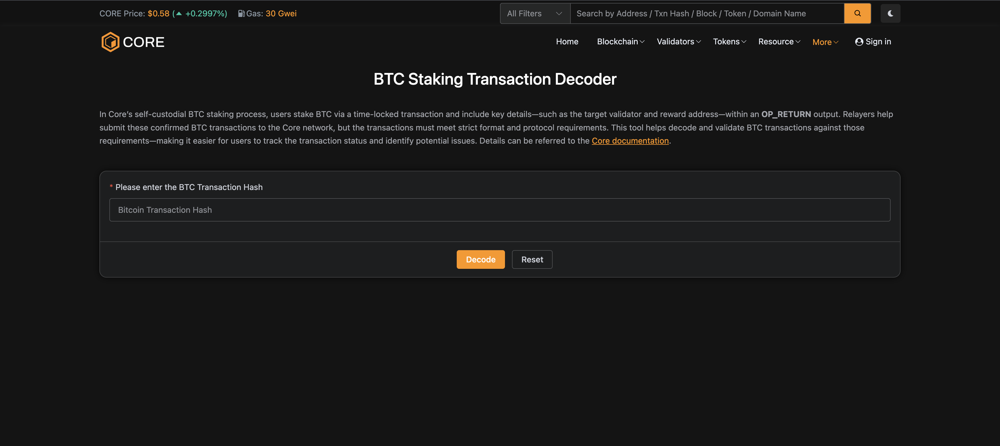
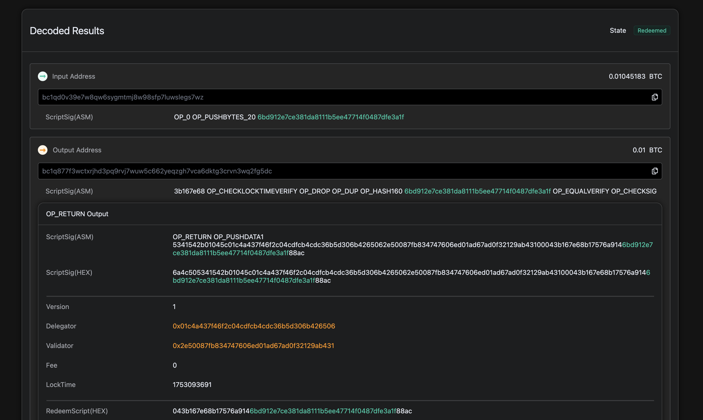

# BTC Staking Transaction Decoder

El BTC Staking Transaction Decoder es una herramienta potente disponible en [Core Scan](https://scan.coredao.org/btc-stake-txn-decoder) que permite a los usuarios verificar y validar sus transacciones de BTC staking. Esta herramienta ayuda a diagnosticar posibles problemas de formato en tus transacciones de staking después de que han sido enviadas a la red Core

## Visión general

La herramienta de decodificación realiza una validación completa de las transacciones de BTC staking mediante:

- **Transaction Confirmation Status**: Verifica que la transacción haya sido confirmada en la red Bitcoin
- **OP_RETURN Output Validation**: Verifica que la transacción contenga el formato de salida OP_RETURN correcto requerido por el protocolo de Core
- **Validator Address Verification**: Confirma que la dirección del validator objetivo es válida y está activa en la red Core
- **Protocol Compliance**: Valida que la transacción cumpla con todos los requisitos del protocolo de staking de Core

Este proceso de validación analiza tu transacción de BTC staking y ayuda a identificar problemas si la transacción no tuvo éxito.

## Funcionalidad de la Herramienta

Esta herramienta ayuda a decodificar y validar las transacciones de BTC Staking según los requisitos del protocolo, analizando la salida OP_RETURN de la transacción, lo que facilita a los usuarios rastrear el estado de la transacción e identificar posibles problemas.

La herramienta rastrea los siguientes estados de transacción:

- **Pending**: La transacción aún no ha sido incluida en un bloque.
- **Confirming**: La transacción está incluida en un bloque pero tiene menos de 6 confirmaciones.
- **Staked**: El staking está activo.
- **Failed**: El intento de staking falló.
- **Expired**: El período de staking ha terminado, pero las recompensas aún no han sido reclamadas.
- **Redeemed**: El período de staking ha terminado y las recompensas han sido reclamadas exitosamente.
- **Missed**: La transacción fue confirmada después de que el período de staking había terminado, resultando en ninguna recompensa de staking.

## Cómo Usar el Transaction Decoder

### Step 1: Acceder a la Herramienta Decoder

Navega al [BTC Staking Transaction Decoder](https://scan.coredao.org/btc-stake-txn-decoder) en Core Scan.

### Step 2: Ingresar el Transaction Hash

1. Ubica el campo de transaction hash en la página del decoder
2. Copia el hash de tu transacción de BTC staking desde tu wallet o explorador de blockchain
3. Pega el transaction hash en el campo de entrada
4. Haz clic en `Decode` para iniciar el análisis

### Step 3: Analizar la Información Decodificada

El decoder proporcionará información detallada sobre tu transacción:

- **Transaction State**: Muestra el estado actual de tu transacción de staking (Pending, Confirming, Staked, Failed, Expired, Redeemed o Missed)
- **Input/Output Addresses**: Muestra el flujo de BTC en tu transacción de staking
- **OP_RETURN Data**: Contiene la información codificada del staking, incluyendo direcciones de delegator y validator
  - **Delegator address**: La dirección de recompensas CORE del staker en la cadena Core.
  - **Validator address**: La dirección del validator a quien el staker delegó sus BTC.
- **LockTime**: [Unix timestamp](https://www.unixtimestamp.com/) que representa la fecha y hora de finalización de tu staking
- **PublicKeyHash**: El hash de tu clave pública para propósitos de verificación

## Problemas Comunes y Soluciones

### Transaction Not Confirmed

- **Problema**: La transacción aún está pendiente en el mempool
- **Solución**: Espera la confirmación de la red Bitcoin (típicamente 1-6 bloques)

### Invalid OP_RETURN Format

- **Problema**: La salida OP_RETURN no cumple con los requisitos del protocolo Core
- **Solución**: Asegúrate de que el formato OP_RETURN sea correcto. Para orientación detallada, consulta el [formato especificado aquí](https://docs.coredao.org/docs/stake-and-delegate/btc-staking/design#op_return-output)

### Invalid Validator Address

- **Problema**: La dirección del validator no está activa o no existe
- **Solución**: Verifica la dirección del validator y asegúrate de que sea un validator activo en Core

## Beneficios de Usar el Decoder

- **Verifica el Cumplimiento del Protocolo**: Comprueba si la transacción cumple con todos los requisitos y decodifica los detalles de la transacción de staking.
- **Proporciona Transparencia**: Permite una visibilidad clara de los detalles de tu transacción de staking

El BTC Staking Transaction Decoder ayuda a los usuarios a verificar los detalles de sus transacciones de BTC staking auto-custodiadas y facilita la resolución de problemas cuando una transacción de BTC staking no se registra correctamente en la red Core.
