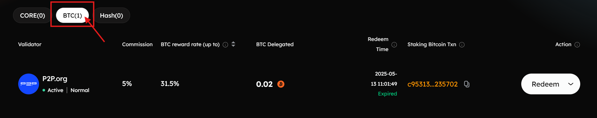
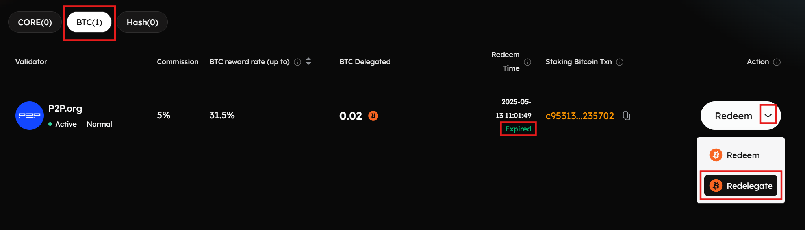
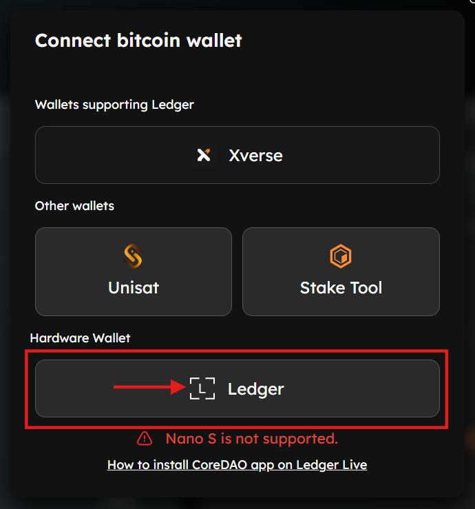
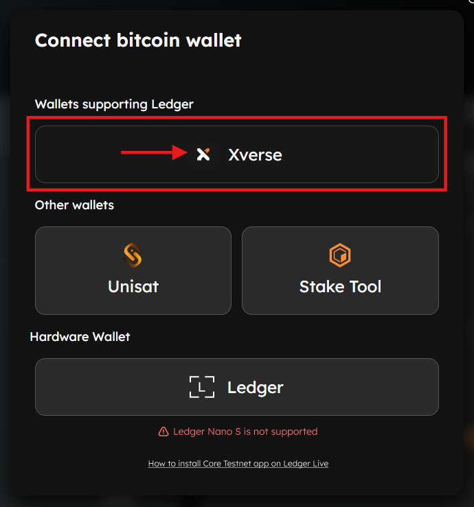
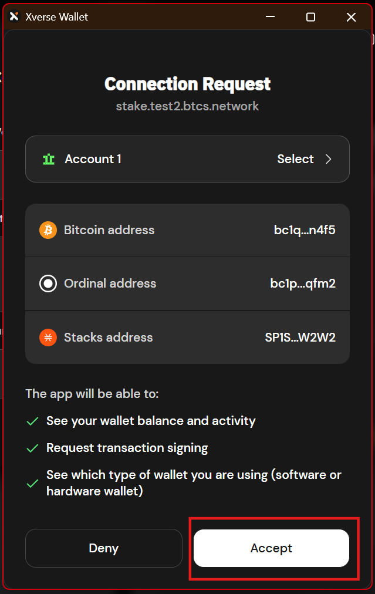
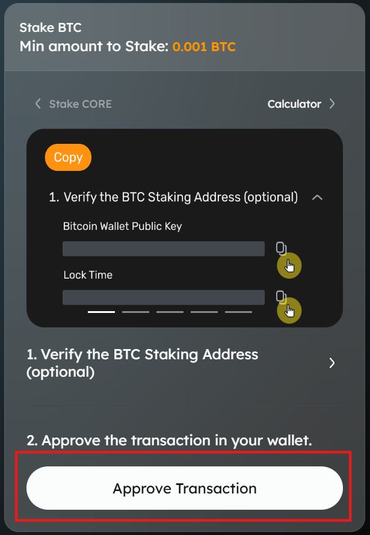
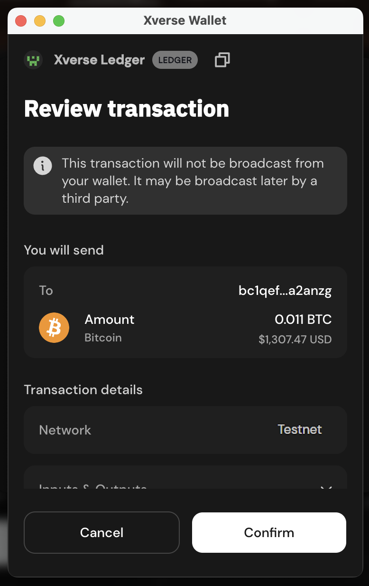
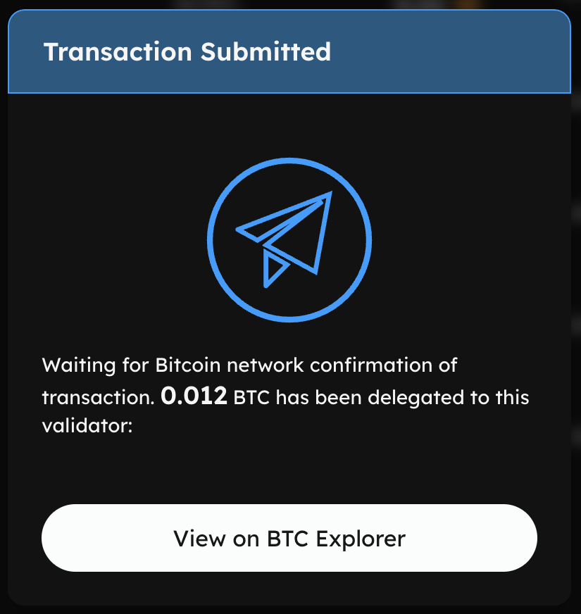

# Using Ledger Hardware Wallets to Redelegate Staked BTC on Core

This user guide will walk you through the step-by-step process of redelegating staked expired timelocked Bitcoin (BTC) to a new Core validator on Core Testnet using a Ledger hardware wallet, reinitiating a new BTC staking transaction.

:::note
Before you begin, ensure your Ledger device is updated and the Ledger Core Testnet app is installed. You must use the same primary BTC wallet address originally used for BTC staking. To learn how to stake BTC using Ledger on Core Testnet, refer to the detailed guide [here](./btc-staking.md).
:::

## Before You Begin: Important Reminders

To ensure a secure and seamless experience, please note the following key requirements:

1.  **Use Only Supported Ledger Devices:** BTC staking, redemption, and redelegation on Core Testnet are supported only on specific supported Ledger hardware wallets with the latest firmware. Always update your device via Ledger Live before use.
    
2.  **Always Use the Ledger’s Core Testnet App:** You must use the Ledger Core Testnet app (not the Ledger Bitcoin app) for staking, redeeming, or redelegating BTC on Core Testnet. The Bitcoin app does not support redemption or redelegation operations of staked BTC and may prevent successful redemption or redelegation.
    
3.  **Redelegate BTC Only from the Primary BTC Wallet Address:** Currently, BTC staking, redemption, and redelegation on Core Testnet through Ledger are supported only from the primary BTC address of the Ledger device. Secondary or derived addresses are not compatible.
    
## Supported Ledger Hardware Wallets

The following Ledger hardware devices currently support staking, redemption, and redelegation of BTC to earn rewards on the Core Testnet. For the best experience and compatibility, ensure your device is running the latest available firmware.

| Ledger Device | Firmware Version (*at the time of writing*) |
| ----- | ----- |
| **Ledger Nano S+** | 1.4.0 |
| **Ledger Nano X** | 2.5.0 |
| **Ledger Stax** | 1.8.0 |
| **Ledger Flex** | 1.4.0 |

:::note
The firmware versions listed above reflect the latest available version at the time of writing and are subject to change. Before staking, redeeming, or redelegating BTC on Core Testnet using your Ledger device, update to the latest version to ensure compatibility and security. Always check **Ledger Live** for the most current updates. Refer [here](https://support.ledger.com/article/8458939792669-zd) for more details on updating the Ledger drive firmware.
:::

## Prerequisites

Before you begin, make sure you have:

-   A supported Ledger device with the latest firmware.
-   Ledger Live is installed and correctly set up on your computer.
-   You have previously staked BTC on the Core Testnet using your Ledger device.
-   If you're using Xverse Wallet, your Ledger device is already connected and added to it.
-   The timelock period for your locked BTC has expired, making it eligible for redelegation.

> ⚠️ **Note:** You will not be able to redeem or redelegate staked BTC until the designated timelock has expired.

## Steps to Redelegate Timelock Expired BTC

After the timelock period for staked BTC has expired, users are eligible to redeem or redelegate their delegated Bitcoin assets. You must use the same Ledger wallet address used for staking BTC to redelegate your BTC after the timelock expiry.

### Step #1: Connect Core Wallet to the Staking Website

1.  Navigate to the [Core Testnet Staking Website](https://stake.test2.btcs.network/staking).
    
2.  Connect your Core Testnet wallet to the Core Testnet Staking website. Remember to use the same wallet that you had used at the time of staking BTC.
    
3.  Click on the "Connect" button in the top right corner of the website.

4.  From the displayed wallet modal, select the wallet of your choice configured for use with Core.

### Step #2: Navigate to Testnet Staking Dashboard

1.  Ensure your Ledger device is installed with the latest firmware and connected to your computer with Ledger’s primary Bitcoin (BTC) address.
    
2.  On the Core Testnet Staking website, hover over your connected wallet in the top right corner, and click "**My Staking**".

### Step #3: Navigate to BTC Staking Records

1.  On the "**My Staking Dashboard**" page, select "**BTC**" records from the displayed tabs.

2.  This tab lists all the BTC staking records and the validators that you have previously delegated your BTC to. Look for any ‘**Expired**’ records under ‘**Redeem Time**’, and proceed to click ‘**Redelegate**’ under ‘**Action**’.

### Step #4: Connect Ledger Device for Redelegation

#### Option #1: Connecting the Ledger Device Directly to the Staking Website

1.  To connect your Ledger device directly to the Core Testnet Staking website, click on "**Ledger**" under the "**Hardware Wallets**" section from the displayed wallet model. Ensure your Ledger device is connected, unlocked, and the Ledger Core Testnet app is open on your device.
    

#### Option #2: Connecting Ledger Device Using Xverse Wallet

Alternatively, you can use Xverse Wallet to redelegate BTC directly from your Ledger device. To achieve this, users must first add their Ledger device to their Xverse wallet as a prerequisite. Refer to the [official guide by Xverse](https://support.xverse.app/hc/en-us/articles/17819233917965-How-to-Connect-Your-Ledger-Device-to-Xverse) to connect your Ledger device with Xverse.

1.  To connect your Ledger device using the Xverse wallet, click on "Xverse" under the "Wallets Supporting Ledger" section from the displayed wallet model. Ensure your Ledger is connected, unlocked, and the Ledger Core Testnet app is open on your device.
    

2. Unlock your Ledger device and confirm the connection via the Xverse wallet extension.

### Step #5: Specify BTC Redelegation Details

1.  On the displayed "**Restake BTC**" modal, cross-check the **BTC amount to redelegate**, the **Bitcoin Staking Address**, and the **Reward Address on Core Testnet**. To redelegate expired timelocked BTC, users **_must_** connect to the same Bitcoin address as the one initiating the BTC staking transaction.
    
2. **Set the BTC timelock period:** Setting the lock time determines when your Bitcoin will be unlocked and available again for redemption or redelegation. Note that the lock time on the Staking Website UI is based on the user’s local timezone, which may not align with the Ledger device’s UTC timezone.
    
3. **Setting Transaction Network Priority Speed:** Select the network priority speed for your transaction.
   
4. **Confirm Delegation:** Proceed by clicking "**Confirm Delegation**".

5.  **Verify BTC Staking Address (Optional):** Use the BTC Staking Address verification tool to confirm that the displayed BTC staking address matches your expected address before proceeding.

6. **Proceed to Approve Transaction:** Click on "Approve Transaction" on the website to proceed with the transaction.
    

### Step #6: Review & Approve BTC Redelegation Transaction

The user will be prompted to review and approve the transaction from their Ledger device.

#### Using Xverse Wallet to Approve Transaction

1.  If using an Xverse wallet, review the transaction. Verify details and click "**Confirm**" on the wallet notification on your browser.
    

2.  Click "**Connect**" on the "**Connect Your Ledger**" modal.
    

3.  Proceed to confirm and approve the transaction on your Ledger device.
    

#### Approve BTC Staking Transaction on the Ledger Device

1.  Sign the transaction with your Ledger device wallet after reviewing the transaction details.
    
2.  Always use the Ledger Core Tesnet app, not the Ledger Bitcoin app, for redelegation of expired timelocked BTC on the Core Testnet. The Bitcoin app lacks support for redemption and redelegation operations. Further, the Ledger Core Testnet app supports Clear Signing, which displays all transaction details (such as amount, addresses, and fees) directly on your Ledger device screen. This ensures full transparency and allows you to verify and approve the transaction, thereby safeguarding your assets from unintended or malicious actions. For more details on Clear Signing, refer [here](https://www.ledger.com/academy/topics/ledgersolutions/what-is-clear-signing).
    

2.  Once the transaction is approved on your Ledger device, the staking website will display a "Transaction Submitted" notification, confirming that your BTC redelegation request has been successfully initiated.
    

3.  After transaction approval, users can also view the transaction details on the BTC Explorer.

## Conclusion

By following this guide, you’ve successfully redelegated timelock-expired staked BTC on the Core Testnet using your Ledger hardware wallet. The combination of Core’s Self-Custodial BTC Timelocking model and Ledger’s industry-leading security, enhanced by Clear Signing via the Ledger Core Testnet app, provides maximum transparency, confidence, and safety. Your successful redelegation for staking BTC means your BTC continues to participate in Core’s decentralized ecosystem without ever leaving your custody.
