# Using Ledger Hardware Wallets for BTC Staking on Core

This user guide walks you through the process of staking BTC to earn CORE rewards on the Core blockchain using a Ledger hardware wallet. By following the steps below, you can participate in Core’s Self-Custodial Bitcoin Staking while maintaining complete control of your assets.

## Before You Begin: Important Reminders

To ensure a secure and seamless experience, please note the following key requirements:

1.  **Use Only Supported Ledger Devices:** Bitcoin staking, redemption, and redelegation on Core is only supported on specific Ledger hardware wallets with the latest firmware. Always update your device through Ledger Live before proceeding.
    
2.  **Always Use the Ledger’s Core App:** You must use Ledger’s Core Testnet app, not the standard Bitcoin app, when staking or redeeming BTC on Core Testnet. Staking BTC with the Bitcoin app may result in the inability to redeem your BTC, resulting in permanent loss of assets.
    
3.  **Stake BTC Only from the Primary BTC Wallet Address:** BTC staking is currently supported from your Ledger’s primary BTC wallet address only. Secondary or derived addresses are currently not compatible.

4. **Only Native Segwit Bitcoin Address Type Supported:** Currently, only Native SegWit Bitcoin addresses are supported for BTC staking via Ledger hardware. 
  
## Supported Ledger Hardware Wallets

The following Ledger hardware devices currently support staking, redemption, and redelegation of BTC on the Core Testnet. For the best experience and compatibility, ensure your device is running the latest available firmware.

| Ledger Device | Firmware Version (*at the time of writing*) |
| ----- | ----- |
| **Ledger Nano S+** | 1.4.0 |
| **Ledger Nano X** | 2.5.0 |
| **Ledger Stax** | 1.8.0 |
| **Ledger Flex** | 1.4.0 |

 

:::important
The firmware versions listed above reflect the latest available at the time of writing and are subject to change. Before staking, redeeming, or redelegating Bitcoin on Core Testnet using your Ledger device, as a best practice, update to the latest compatible version to ensure compatibility and security. Always check Ledger Live for the most current updates. Refer [here](https://support.ledger.com/article/8458939792669-zd) for more details on updating the Ledger drive firmware.
:::

## Prerequisites

Before you begin, make sure you have:

-   A supported Ledger device with the latest firmware.
-   Ledger Live is installed and set up on your computer.
-   You need to have a BTC address on your Ledger device, which can be acquired through either Ledger Live or the Xverse wallet. 
    - BTC addresses created via wallets other than Xverse and Ledger Live have not been tested - use at your own risk.
    - For Xverse Wallet, add your Ledger device to the Xverse Wallet.
-   Sufficient Bitcoin Testnet4 BTC (minimum 0.01 BTC) available on your Ledger device for staking and covering transaction fees. 

## Setting up Ledger Device

Before staking BTC on Core Testnet, as a best practice, make sure your Ledger hardware wallet is updated with the latest or supporting firmware, and configured and ready to use with the Core Testnet.

### Update Your Ledger Device

Ensure your Ledger device is updated and ready for use.

1.  Open **Ledger Live** on your computer.
2.  Connect and unlock your Ledger device.
3.  Navigate to **My Ledger** in the sidebar.
4.  If prompted, allow **Ledger Manager** access on your device.
5.  Install any available firmware updates for your device.

#### Setting up the Ledger Live for Testnet

The Core Testnet app is not installed by default on Ledger Live Manager. To install and view the Core Testnet app, you must enable "**Developer Mode**" and enable and change "**My Ledger Provider**" on your Ledger device.

##### Enable Developer Mode on your Ledger Device

1.  Connect your Ledger hardware device and unlock it.
    
2.  Open the Ledger Live application and navigate to "**Settings**" (located in the upper right corner).
    
3.  Navigate to the "**Experimental Features**" menu, enable "**Developer Mode**," and set "**My Ledger Provider**" to **4**. This will show the developer and testnet apps in the manager.  

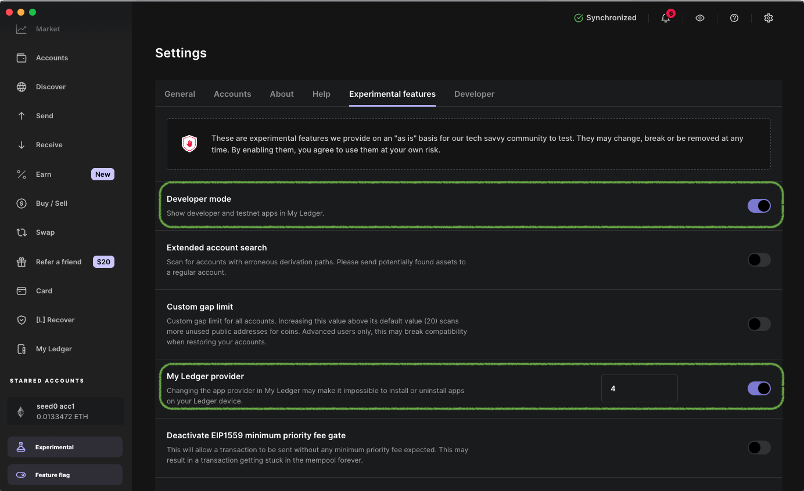

##### Installing Ledger Core Testnet app

1.  With your device connected, open Ledger Live and navigate to "**My Ledger**".
    
2.  Under the "**App Catalog**", search for "**Core**".
    
3.  Install the "**Core Testnet**" app. Use _only_ the Core Testnet app for staking Bitcoin on Core Testnet.

    
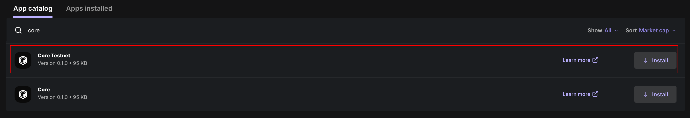

:::note
For staking BTC on Core Testnet with a Ledger device, users must use only the Core Testnet app. Unlike the Bitcoin app, which relies on blind signing, the Core app supports Clear Signing, allowing users to fully view and verify transaction details before signing and approving them. For more information about Clear Signing, refer [here](https://www.ledger.com/academy/topics/ledgersolutions/what-is-clear-signing).
:::  

#### Setup Bitcoin Testnet Account

Currently, staking from a Ledger device is only supported via the primary Bitcoin account on the Ledger device. 
If you have a new Ledger device, the first Bitcoin account you set up is the primary account. Refer here for detailed steps on stepping up the Bitcoin Address on the Ledger device using Ledger Live. 
If you have multiple Bitcoin accounts already set up on your ledger device, refer here for instructions on how to identify the primary account.

⚠️ Disclaimer: Currently, only Bitcoin addresses generated through Ledger Live and Xverse Wallet have been thoroughly tested and verified for compatibility. Addresses created using other wallets have not yet been tested, and functionality cannot be guaranteed. Users choosing to proceed with untested wallets should do so at their own risk.

##### Setting up Bitcoin Address using Ledger Live 
To set up a Bitcoin account address that contains the Bitcoin Testnet4 BTC tokens for staking, follow the steps below:

1. Install Bitcoin Testnet and the Bitcoin app on your Ledger device.  
2. With your device connected to the computer, in the Ledger Live app, navigate to the "**Accounts**" tab and click "**Add Account**".
  

    

3. Search testnet and select Bitcoin Testnet (BTC). Click on Continue  

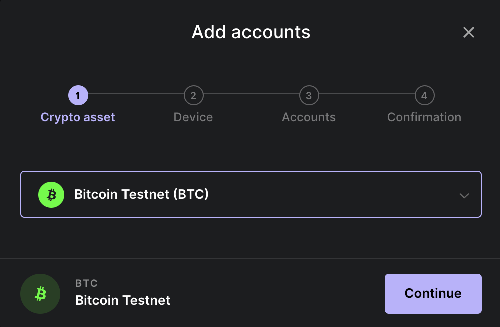

4. Approve the Bitcoin Test app on your hardware wallet device.
5. On the next screen, choose the address format (Native SegWit). Note that only the Bitcoin Native Segwit Address type is supported for staking BTC on Core using Ledger hardware wallets.
6. Click on the **Add Account** button.

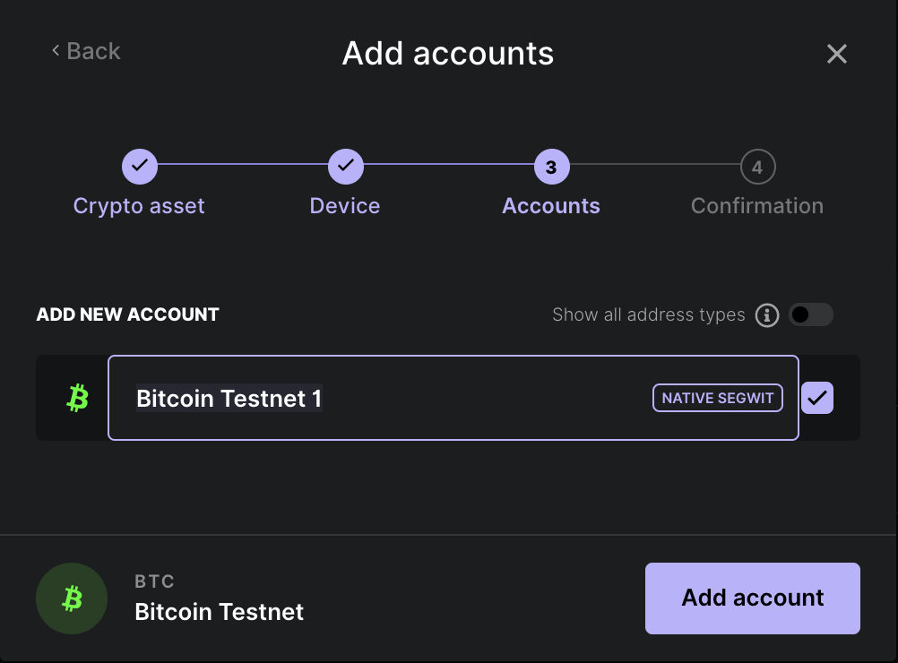

7. You have successfully added a Bitcoin account on the Bitcoin testnet app.

For more details on setting up your first Bitcoin Account on a Ledger device, refer [here](https://support.ledger.com/article/115005195945-zd).

#### Get Bitcoin Testnet4 BTC Tokens

1. Go to the Receive tab on Ledger Live.  

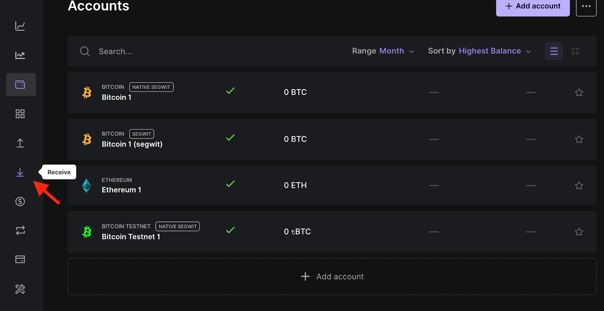

2. Select Bitcoin testnet account you want to use and click on "Continue".

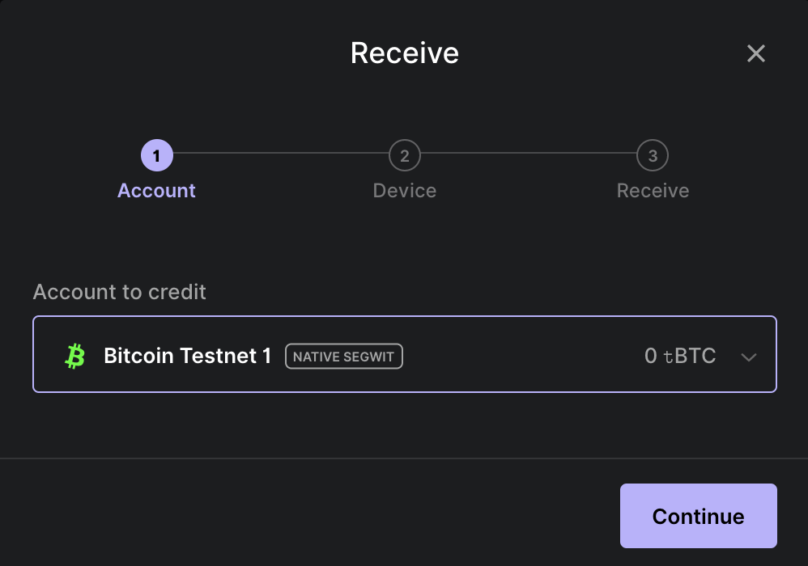

3. Copy the Bitcoin Testnet account address.

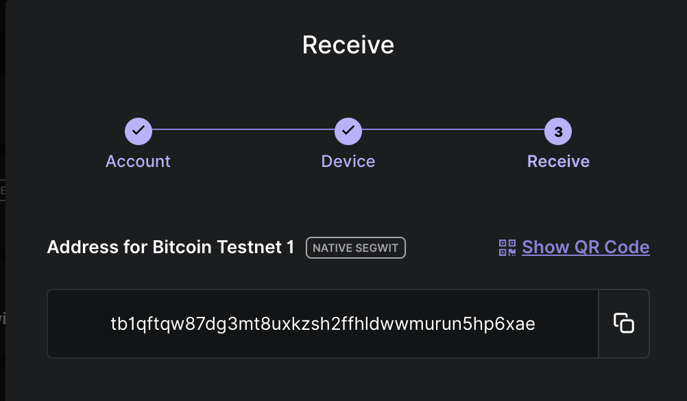

4. Use the Bitcoin Testnet4 faucets to receive testnet Bitcoin tokens.

 

:::note
Always use the Core Testnet app for staking, redeeming, or redelegating Bitcoin on Core Testnet. The standard Bitcoin app does not support redemption operations on Core and may result in permanent loss of access to your staked BTC. Unlike the Ledger Bitcoin app, which uses blind signing where transaction details are obscured from the user, the Ledger Core Testnet app enables Clear Signing. Clear Signing displays all transaction information (e.g., amount, validator, fees, addresses) directly on your Ledger device screen, giving you complete visibility. This enables you to verify what you’re signing confidently and protects you from unintended or malicious transactions. For more details on Clear Signing, refer [here](https://www.ledger.com/academy/topics/ledgersolutions/what-is-clear-signing).
:::

## Staking BTC on Core with Ledger

With your Ledger device connected and the Core Testnet app installed, you can securely stake BTC directly from your hardware wallet.

> ⚠️ **Note:** A minimum of 0.01 BTC is required to participate in Bitcoin staking on Core Testnet, along with sufficient testnet BTC to cover transaction fees.

1.  On your Ledger device, open the CoreDAO app before proceeding.

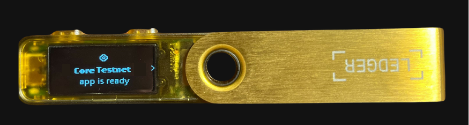

2.  Navigate to the [Core Testnet Staking Website](https://stake.test2.btcs.network/staking).
    
### Connect Core Wallet to the Staking Website

1.  Connect your Core Testnet wallet to the Core Staking website. This will be used as the CORE reward address.
    
2.  Click on the "**Connect**" button in the top right corner of the website.

3.  From the displayed wallet modal, select the wallet of your choice configured for use with Core Testnet.
    
### Connect Ledger Hardware Wallet to Website

Before connecting your Ledger device to the website, it's important to ensure you are using your primary Bitcoin (BTC) account for staking BTC on Core Testnet. Refer to the [official guide from Ledger](https://support.ledger.com/article/115005195945-zd) to set up a Bitcoin (BTC) account on your device, if you haven't already.

#### Staking Option One: Connect Ledger Wallet Directly

1. On the [Core Testnet Bitcoin Staking website](https://stake.test2.btcs.network/staking), click on "**Connect**" next to BTC Staking Amount. Remember, only the primary account is supported for staking BTC; ensure it is the same account connected to your Ledger Live.

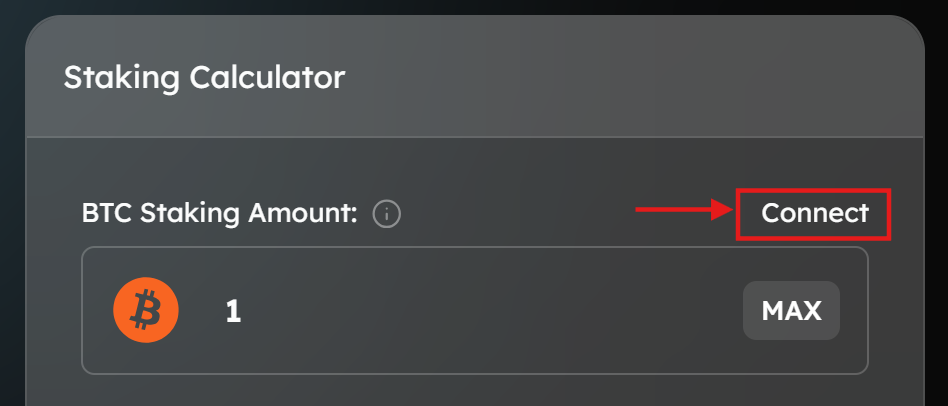

2. From the displayed wallet modal, under "**Hardware Wallet**," click on "**Ledger**". Ensure your Ledger is connected, unlocked, and the Core Testnet app is open.

#### Staking Option Two: Connecting Ledger Device Using Xverse Wallet

Alternatively, users can also use Xverse to stake Bitcoin from their Ledger device. To achieve this, users must first add their Ledger device to their Xverse wallet as a prerequisite. Refer to the [official guide by Xverse](https://support.xverse.app/hc/en-us/articles/17819233917965-How-to-Connect-Your-Ledger-Device-to-Xverse) to connect your Ledger device with Xverse.

1.  On the Core Bitcoin Staking page, click on "**Connect**" next to BTC Stake Amount. Remember, only the primary account is supported for staking BTC; ensure it is the same account connected to your Ledger Live.

    

2.  From the displayed wallet modal, click on "**Xverse**" under "**Wallets Supporting Ledger**". Make sure your Ledger device is unlocked.

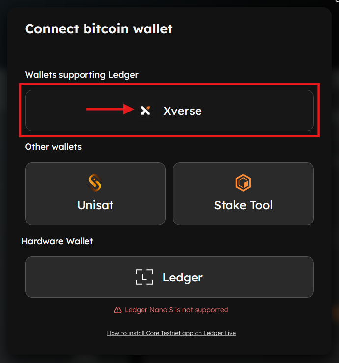

3.  Unlock your Ledger device and confirm the connection via the Xverse wallet extension.

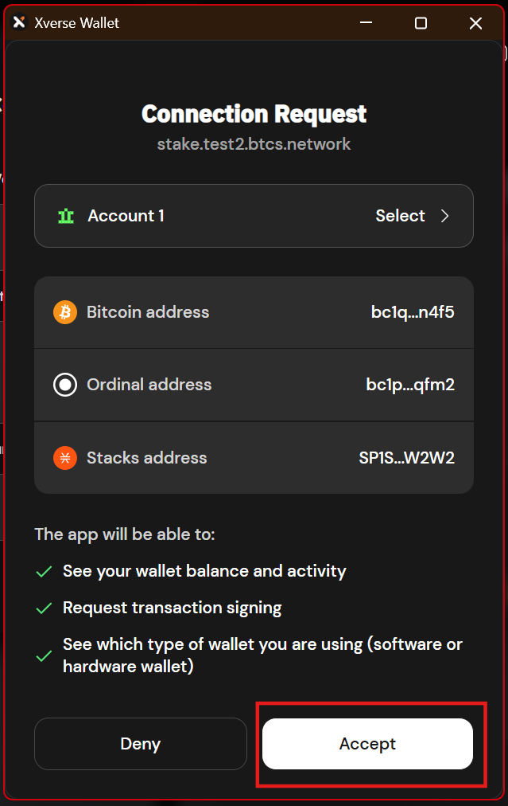

4.  If requested to switch to "**Bitcoin Testnet4**" accept the notification.

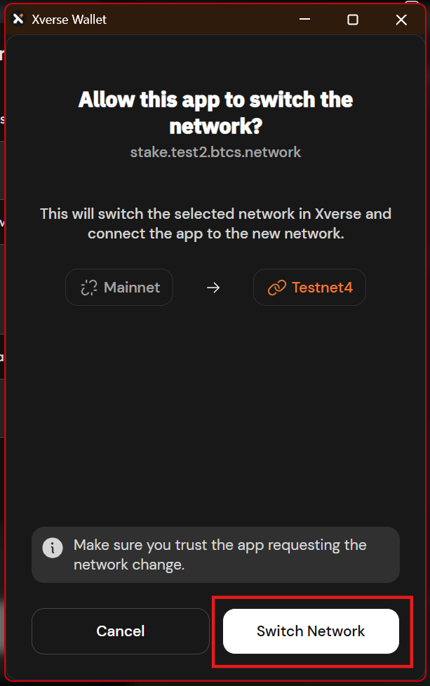

> ⚠️ **Note:** Only the primary Bitcoin account on the Ledger device is supported to stake BTC; ensure it is the same account connected to the Xverse wallet and used for staking purposes.

### Specify & Confirm BTC Staking Details

1. **Specify BTC Staking & Delegation Details:** Once both Core and Bitcoin wallets are connected, specify the amount of BTC to stake. Select the desired Core validator to delegate your Bitcoin to. To proceed with BTC staking, set the tCORE2 Staking Amount as zero. Click the "Proceed to Stake" button.

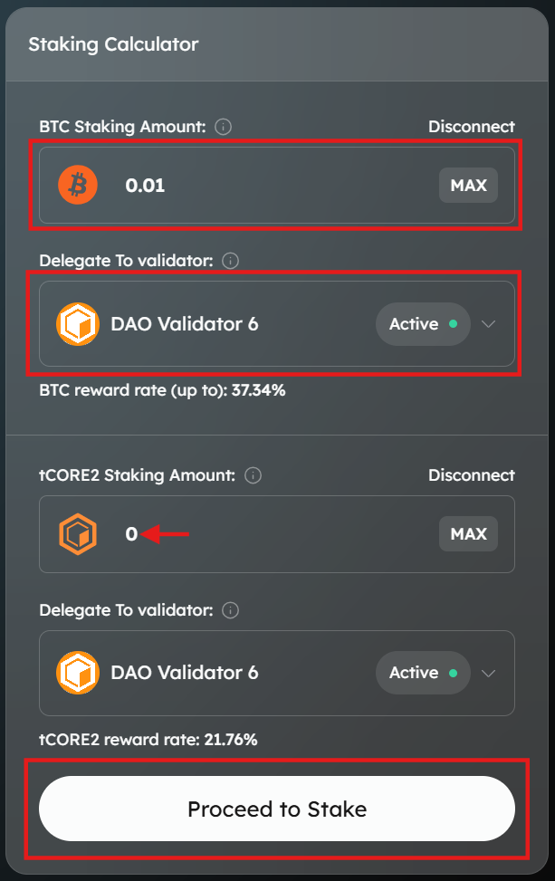

2. **Skip tCORE2 Staking Details:** Users can skip this step and click directly on "Stake BTC" to proceed with staking only Bitcoin by verifying Bitcoin staking details.

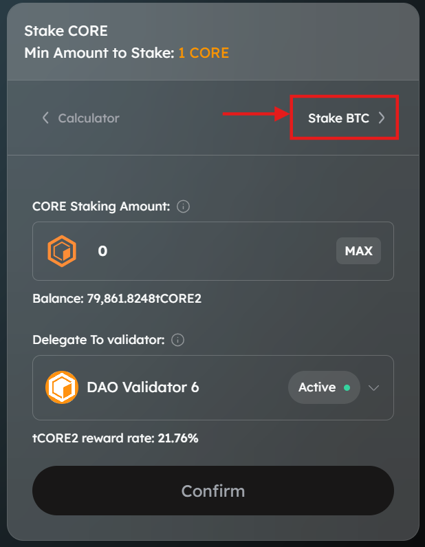

3. **Confirm BTC Staking Details:** Confirm the amount to stake BTC. Before finalizing the Bitcoin staking transaction, it's essential to understand and specify several key parameters:
    - Confirm the amount of BTC you’d like to timelock. The minimum amount to stake is 0.01 BTC.
    - Setting the lock time determines when your Bitcoin will be unlocked and available again for redemption or re-delegation.
    - The lock time on the website UI is based on the user’s local timezone, which may not align with the Ledger device’s UTC timezone.
    - Specify the network priority speed for your transaction.

  
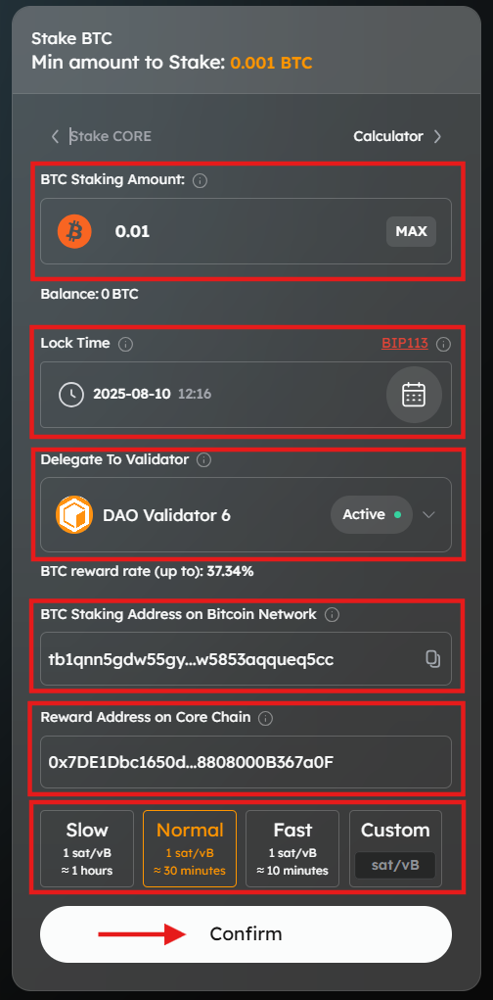

4. **Verify Bitcoin Staking Address (Optional)**: Use the Bitcoin Staking Address verification tool to confirm that the displayed BTC staking address matches your expected address before proceeding.

5. **Proceed to Approve Transaction:** Click on "**Approve Transaction**" on the website to proceed with the transaction.  

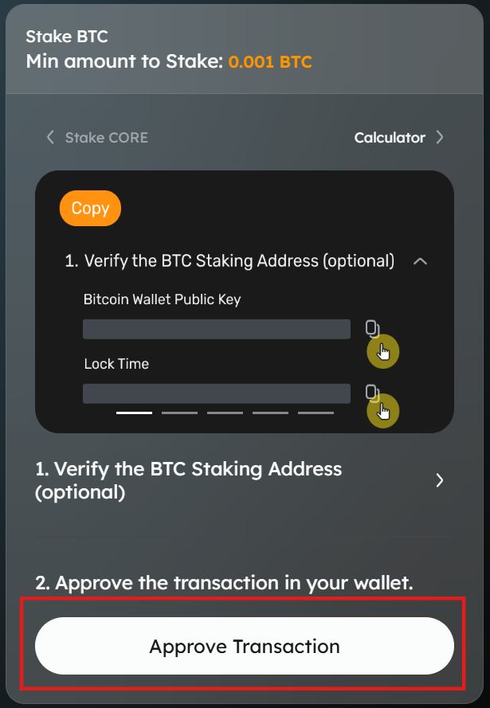

6.  The approval will be directed to the connected wallet.

### Review and Approve Transaction on Ledger Device

#### Using Xverse Wallet

1.  If using an Xverse wallet, review the transaction. Verify details and click "**Confirm**" on the wallet notification on your browser.

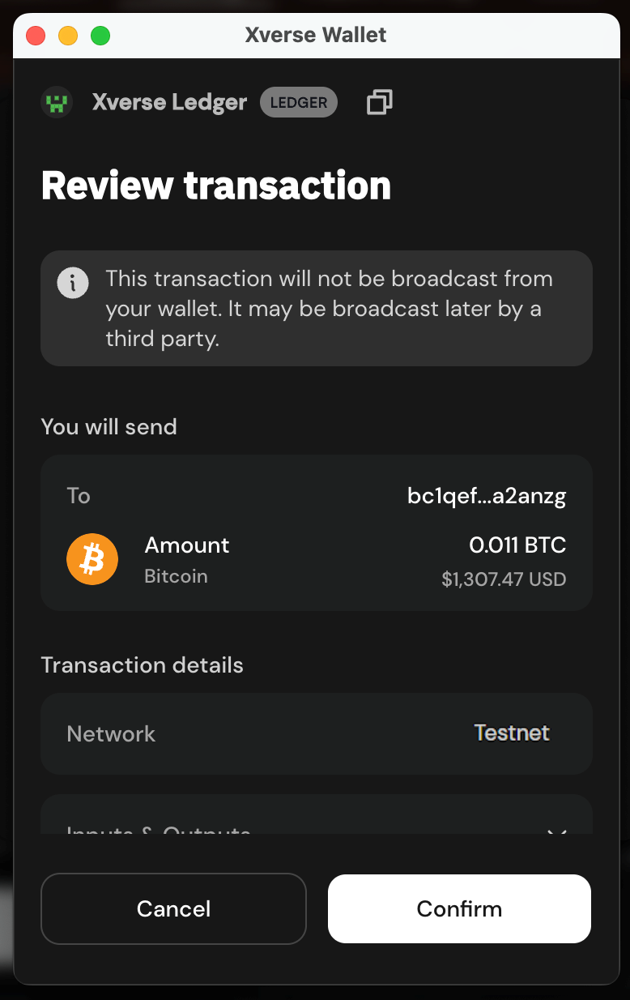

2.  Click "**Connect**" on the "**Connect Your Ledger**" modal.

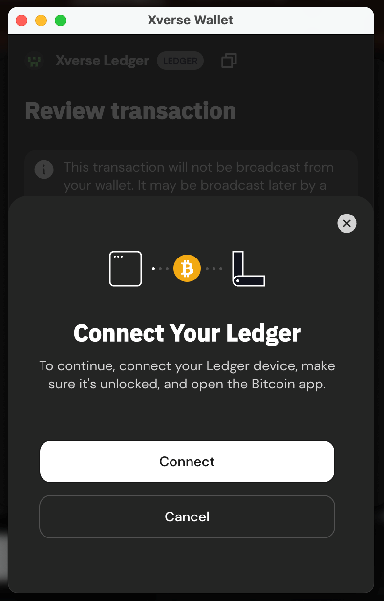

3.  Proceed to confirm and approve the transaction on your Ledger device.
    
#### Approve BTC Staking Transaction on the Ledger Device

1.  Ensure your device is unlocked and the Core Testnet app is open. Review and approve the BTC staking transaction on your Ledger device. Verify the staking details, including the amount of BTC, the validator and delegator addresses, and the transaction fees. Approve by signing the transaction.

 

2.  Once approved on your Ledger device, the "**Transaction Submitted**" notification will appear on the Core BTC Staking website.

3.  Click on "**View on BTC Explorer**" to view details of your BTC staking transaction on the BTC Explorer.

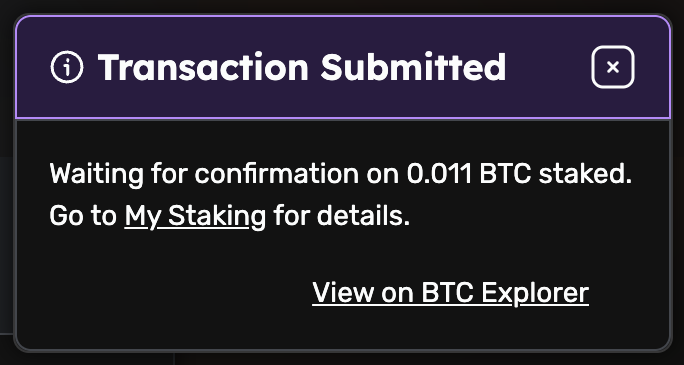

> ⚠️ **Note:** To be eligible to earn rewards, you must complete a full staking round on (00:00:00 - 23:59:29 UTC).

## Conclusion

Congratulations! You’ve successfully staked Bitcoin using your Ledger hardware wallet on the Core Testnet through Core’s Self-Custodial Bitcoin Staking. By following this guide, you securely connected your Ledger device, installed and used the Ledger Core Testnet app, and completed your BTC staking transactions with confidence. You’re now part of the Core ecosystem where security, control, and yield go hand in hand!
