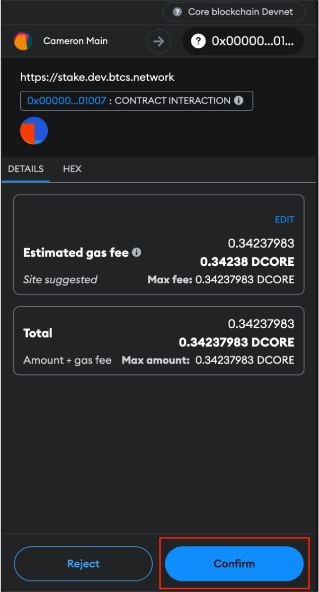

# Redeem Staked Bitcoin or Claim CORE Rewards

Core enables Bitcoin holders to earn CORE token rewards by timelocking their Bitcoin on the Bitcoin blockchain. For instructions on how to participate in Bitcoin timelocking and earn rewards, follow our detailed [guide](./stake-btc-guide.md).
After you've successfully created a Bitcoin timelock transaction, you'll want to know how to claim your earned CORE rewards and manage your timelocked Bitcoin. This guide explains the process when you see either the 'Redeem' option under 'Action' for your chosen validator, or the 'Claim' button next to 'Delegated Hash & Core Rewards' or 'Bitcoin Staking Rewards' in the interface.

## Reward Distribution Information

- **Distribution of Rewards:** CORE token rewards are distributed to stakers as incentives for their contribution to network security and governance.
- **Reward Source:** Rewards are sourced from the consensus reward pool.

## Redeem an Expired Staked Bitcoin

If your staking period has expired, redeem your staked Bitcoin assets from either Unisat or Xverse wallet(s). You must use the same wallet address during the staking process to redeem your expired staked Bitcoin.

1. From any Core screen, hover over your connected wallet in the top right corner → click **‘My Staking’**.

2. At the delegator screen, look for the column BTC(x) and click.

3. You are now viewing the validators that you have previously delegated your staked Bitcoin to. Look for any validators that say ‘**Expired**’ under ‘**Redeem Time**’ and proceed to clicking ‘**Redeem**’ under ‘**Action**’.

4. You will be met with a popup window to redeem your Bitcoin. In order to redeem the Bitcoin, you must connect to the same Bitcoin wallet address as the one initiating the Bitcoin staking transaction.

- Set your receiving Bitcoin Address to receive the unlocked Bitcoin. This does not need to be the same as the address that initiated the Bitcoin staking transaction.
- Set your transaction speed priority
- Click ‘**Create Transaction**’

5. Sign the transaction with your Bitcoin wallet that you connected previously, and verify the Bitcoin has returned to your receiving address. (_This may take a few minutes_).

## Claim CORE token rewards earned from Bitcoin Staking delegation

:::note
To be eligible to earn rewards, it is required to complete a full staking round (00:00:00 - 23:59:29 UTC).
:::

1\. From any CORE screen, hover over your connected wallet in the top right corner, click ‘**My Staking**’.

2. Click the ‘**Claim**’ button next to ‘**BTC Staking Rewards**’

3. Sign the transaction via MetaMask wallet.

3. Wait for transaction to submit

3. Verify Transaction succeed

#### Conclusion

By following this guide, you have successfully learned how to redeem your staked Bitcoin, as well as, how to redeem your rewards earned as CORE token from delegating your staked Bitcoin. We’re happy you’ve chosen to journey into BTCfi with Self-Custodial Bitcoin Staking on Core!
