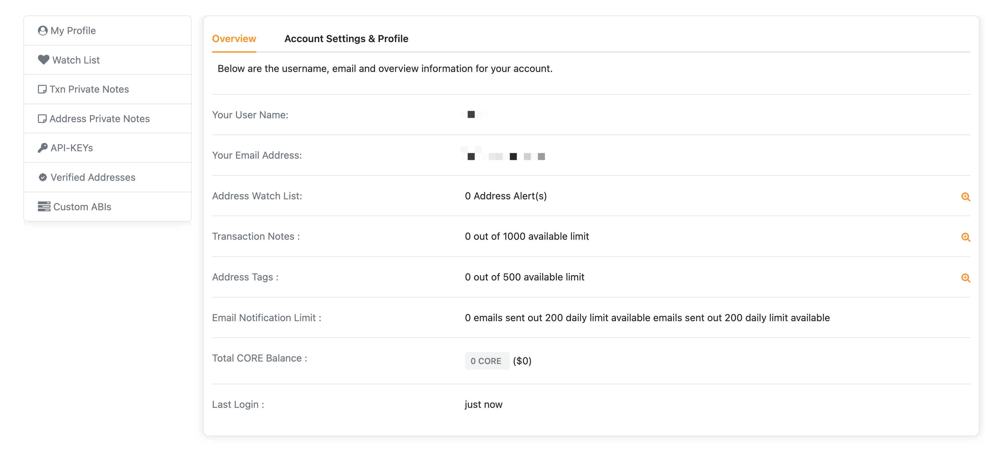

# Création d'un compte

Posséder un compte Core Scan vous permet d'utiliser des fonctionnalités et des outils réservés aux utilisateurs connectés, tels que la liste de surveillance d'adresses, les notes privées sur les transactions, la liste d'ignorance des tokens, ainsi que vos propres clés API 🗝.

> Notez que la création d'un compte Core Scan est uniquement liée aux services de l'explorateur de blocs de Core Scan, cela ne correspond pas à la création d'une [adresse de blockchain CORE](https://info.etherscan.com/what-is-an-ethereum-address/) 💡

***

## Enregistrer un compte

Rendez-vous sur la [page d'inscription](https://scan.coredao.org/register) et fournissez un nom d'utilisateur, une adresse e-mail et un mot de passe pour votre compte.

.png)

## Vérifiez Votre Email

Un lien de confirmation 🔗 vous sera envoyé par e-mail afin de vérifier votre demande d'inscription. Une fois le lien cliqué, la configuration de votre compte est terminée et vous pouvez commencer à utiliser les fonctionnalités spécifiques à votre compte ! 🎉

## Utilisation de Votre Compte

Après vous être connecté, vous aurez accès à votre tableau de bord où vous pourrez pleinement profiter des fonctionnalités de Core Scan, telles que la génération de clés API 🗝, la dissimulation des tokens indésirables et l'ajout de notes privées.

## URL des Points de Terminaison

Tous les points de terminaison et le formatage des paramètres sont identiques sur TestNet et MainNet, vous devez simplement modifier l'URL du point de terminaison API correspondant comme suit.

<table><thead><tr><th width="155.33333333333331" align="center">Réseau</th><th align="center">URL de point de terminaison</th><th align="center">Documentation</th></tr></thead><tbody><tr><td align="center">Mainnet de Core</td><td align="center">https://openapi.coredao.org/api</td><td align="center">https://docs.coredao.org/docs/api</td></tr><tr><td align="center">Testnet de Core</td><td align="center">https://api.test.btcs.network/api</td><td align="center">https://docs.coredao.org/docs/api</td></tr><tr><td align="center">Testnet2 de Core</td><td align="center">https://api.test2.btcs.network/api</td><td align="center">https://docs.coredao.org/docs/api</td></tr></tbody></table>
