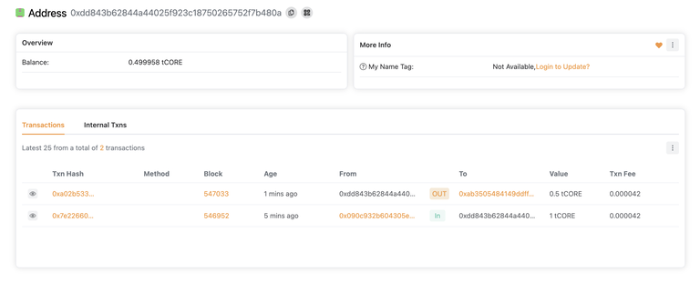

import Tabs from '@theme/Tabs';
import TabItem from '@theme/TabItem';

# Explorateur Blockchain Core Scan

---

Core Explorer est une interface graphique permettant aux utilisateurs d'interagir avec la blockchain CORE. Grâce à cette interface, vous pouvez consulter les informations sur les blocs ajoutés à la blockchain, les transactions effectuées, les soldes de portefeuille, ainsi que les informations sur les jetons tCORE2 et CORE. Core Network propose des explorateurs pour son mainnet et son testnet.

<Tabs defaultValue="mainnet" values={[
{label: 'Testnet', value: 'testnet2'},
{label: 'Mainnet', value: 'mainnet'},
]}>

<TabItem value="testnet2">- **Core Testnet2 Explorer:** https://scan.test2.btcs.network/</TabItem>

<TabItem value="mainnet">- **Core Mainnet Explorer:** https://scan.coredao.org/</TabItem>

</Tabs>

### Utilisation de l'explorateur Core Scan

Vous pouvez utiliser l'explorateur de blockchain Testnet Core pour rechercher et examiner les transactions. Copiez l'adresse de votre compte depuis MetaMask et recherchez-la sur l'explorateur. Vous y verrez les transactions associées à votre compte, telles que :

- Celle où vous avez récupéré des tCORE2 depuis le Faucet;
- Celle où vous avez envoyé des tCORE2 à une autre adresse;

