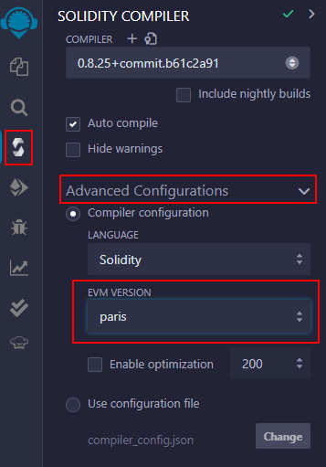

# Utilisation de Remix

---

Remix est un environnement de développement intégré (IDE) en ligne puissant permettant aux développeurs de construire, tester, déployer et gérer des smart contrats. Dans ce tutoriel, nous allons utiliser l'[IDE Remix](https://remix.ethereum.org/) pour déployer un contrat sur le Testnet de Core.

## Connexion de Remix au Testnet de Core

Accédez à l'[IDE Remix](https://remix.ethereum.org/), et vous verrez une interface similaire à celle ci-dessous :

Dans l'image ci-dessous, vous pouvez choisir différentes versions du compilateur Solidity. Nous recommandons d'utiliser les versions plus récentes et stables de Solidity, telles que la v0.8.7. Vous pouvez également choisir d'activer la compilation automatique ou de masquer les avertissements.

Vous pouvez choisir différents environnements sur Remix, comme illustré dans l'image ci-dessous. Un environnement est simplement le réseau blockchain avec lequel vous allez travailler. Il existe des machines virtuelles (VMs) intégrées, ainsi que des fournisseurs qui vous permettent de vous connecter à des VMs externes.

Pour vous connecter au Testnet de Core, choisissez `Injected Provider - MetaMask`. Assurez-vous que votre portefeuille MetaMask est [configuré pour le Testnet de Core](./core-testnet-wallet-config.md) en utilisant les paramètres de la chaîne Testnet, et vérifiez que votre compte est approvisionné via le faucet correspondant au Core Testnet auquel vous êtes connecté. Reportez vous [ici](https://scan.test.btcs.network/faucet) pour le Core Testnet (1115) et [ici](https://scan.test2.btcs.network/faucet) pour le Core Testnet (1114).

Il vous sera demandé de vous connecter à MetaMask. Une fois connecté, Remix affiche l'adresse connectée et le montant de CORE détenu par l'adresse, comme illustré ci-dessous :

## Compilation et déploiement du contrat intelligent

- **Assurez-vous que votre contrat intelligent suit les [directives de support de Solidity pour Core Blockchain](./smart-contract-guidelines.md)**.

- Remix propose plusieurs contrats prédéfinis chargés par défaut dans l'espace de travail, comme illustré ci-dessous. Pour ce tutoriel, utilisons le contrat préchargé `1_Storage.sol`. Ce contrat implémente une simple base de données qui nous permet de stocker un nombre via la fonction `store()` et de le consulter via la fonction `retrieve()`.

- Dans le menu de gauche, accédez à `SOLIDITY COMPILER`, puis aux `Configurations Avancées` et sélectionnez `Paris` dans le menu déroulant de la `Version EVM`.

- Cliquez ensuite sur le bouton bleu **Compile** pour compiler votre contrat intelligent.

- Ensuite, passez à l'onglet `DEPLOY & RUN TRANSACTIONS` dans le même menu de gauche et sélectionnez le bouton **Deploy** (entouré en rouge ci-dessous).

- Après avoir sélectionné le bouton **Deploy**, MetaMask ouvrira une fenêtre contextuelle vous demandant de signer et d'envoyer la transaction de déploiement sur le Testnet de Core, comme illustré ci-dessous.

- Une fois que le contrat est déployé avec succès, un message de confirmation apparaîtra dans la console.

## Interaction avec le contrat intelligent

Une fois votre contrat déployé, vous pouvez utiliser Remix pour interagir rapidement et de manière intuitive avec lui.

Trouvez le nouveau contrat déployé dans la section `Deployed Contracts` située en bas à gauche. Testons notre contrat en entrant `100` dans le champ de saisie de la fonction `store` et en sélectionnant le bouton orange **store**.

MetaMask nous demandera de nouveau de signer et d'envoyer la transaction.

Après avoir réussi à stocker `100` dans notre contrat intelligent, nous pouvons utiliser la fonction `retrieve` pour lire la valeur. Cliquez sur le bouton **retrieve** pour afficher la valeur, et vous devriez voir le nombre `100` retourné, comme indiqué ci-dessous dans la boîte bleue.

Vous aurez peut-être remarqué que MetaMask ne s'est pas affiché pour l'appel à la fonction `retrieve` ; cela s'explique par le fait que les _transactions_ ne sont nécessaires que pour les interactions avec les smart contrats qui nécessitent du gas, et la lecture des données d'un contrat intelligent ne nécessite pas de gas.

## Core Scan

Utilisons [Core Scan](https://scan.test2.btcs.network/) pour vérifier notre contrat déployé. Copiez l'adresse du contrat depuis Remix et utilisez-la comme entrée pour une recherche sur Core Scan. Vous devriez trouver le contrat intelligent ainsi que des informations pertinentes, et une liste de toutes les interactions historiques avec le contrat, y compris notre transaction de déploiement et notre transaction `store`.

