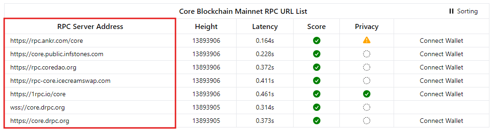

# RPC Core via la ligne de commande

---

Les blockchains génèrent des quantités massives de données, telles que les volumes de transactions et la propriété des actifs, qui sont précieuses pour les dApps dans l'ensemble de l'écosystème. Cependant, l’accès à ces données et leur utilisation nécessitent souvent une expertise technique importante.

## Qu'est-ce qu'un appel de procédure à distance (RPC) ?

Les appels de procédure à distance (RPC) aident à résoudre ce problème en permettant la communication entre les réseaux blockchain et les utilisateurs, les applications ou les entreprises. Au lieu de configurer un nœud personnalisé complet ou un programme complexe pour extraire des données, les RPC permettent aux développeurs de collecter les informations nécessaires en accédant simplement au point de terminaison fourni.

Considérez un RPC comme l’inverse d’un oracle. Alors qu'un oracle apporte des données externes (par exemple, les résultats des élections ou les prévisions météorologiques) dans la blockchain, un RPC extrait des données internes de la blockchain (par exemple, des informations sur les transactions ou les blocs) et les déplace vers l'extérieur.

## Fournisseurs RPC pour la connexion Core Network Mainnet

Core prend en charge différents [fournisseurs de RPC](https://chainlist.org/chain/1116) — à la fois le RPC natif de Core et des fournisseurs de RPC tiers. Consultez la liste complète des points de terminaison RPC [ici](./rpc-list.md) pour vous connecter au mainnet ou au testnet de Core.

## Utilisation des RPCs via la ligne de commande

Pour se connecter aux points de terminaison Core RPC via la ligne de commande, nous pouvons utiliser « cURL » (URL client). Cet outil permet aux développeurs de récupérer des données directement à partir de serveurs distants. La commande « cURL » la plus simple récupère le code HTML d'une page Web en transmettant une URL.

Voici un exemple :

```bash
curl https://coredao.org/
```

Pour récupérer des informations sur une transaction spécifique sur la Core blockchain, utilisez la commande « cURL » suivante, en remplaçant le hachage de transaction par la valeur souhaitée :

```bash
curl -H "Content-Type: application/json" \
     -X POST \
     --data '{"jsonrpc":"2.0","method":"eth_getTransactionByHash","params":["0xc9c4a5d14857ace0db197c7393806868824763377f802645aacf6f38d9c309b7"],"id":1}' \
     --url 'https://rpc.ankr.com/core'
```

Dans cette commande, les composants du relevé de `curl` sont les suivants :

- **curl** : La commande pour exécuter la requête.
- **-H** : spécifie l'en-tête, dans ce cas, en définissant le type de contenu sur JSON.
- **-X POST** : Définit la méthode HTTP à utiliser ('POST\`).
- **--data** : Le corps de la requête, y compris la « méthode », les « paramètres » et l'« ID de la requête ».
- **--url** : Le point de terminaison « URL » auquel la demande est envoyée.

Comme expliqué précédemment, CURL est une méthode pour envoyer des requêtes API, qui contiennent un point de terminaison (c’est-à-dire l’URL à partir de laquelle les informations sont récupérées) et une méthode HTTP. Dans notre cas, l’URL apparaît à la fin après l’option_` --url`_; vous pouvez remplacer cette URL par n’importe quelle URL RPC valide trouvée [ici](https://chainlist.org/chain/1116) pour vous connecter au Core Mainnet, n’oubliez simplement pas de mettre l’URL entre des guillemets simples ("). Dans la figure ci-dessous, n'importe quelle des URL figurant dans l'encadré rouge fonctionnera.

<p align="center">

</p>

### Réponse d’exemple :

```json
{
  "jsonrpc": "2.0",
  "id": 1,
  "result": {
    "blockHash": "0xb1cbf38843207e6133b69b53559c22c61463208cc2a822a92ba18e30da3054ba",
    "blockNumber": "0x972743",
    "from": "0x7ef3a94ad1c443481fb3d86829355ca90477f8b5",
    "gas": "0x7a120",
    "gasPrice": "0x0",
    "hash": "0xc9c4a5d14857ace0db197c7393806868824763377f802645aacf6f38d9c309b7",
    "input": "0xf340fa010000000000000000000000007ef3a94ad1c443481fb3d86829355ca90477f8b5",
    "nonce": "0x74622",
    "to": "0x0000000000000000000000000000000000001000",
    "transactionIndex": "0x4",
    "value": "0x2d01fcfa9da000",
    "type": "0x0",
    "v": "0x8dc",
    "r": "0x15c80da30b54e61f383f38f2033f71ef4201a39ff4e799dadf13937dde88b1a0",
    "s": "0xd63214598ae5cd8da665517e60d8471f1b4c591711247d0f94958ec0add4ba9"
  }
}
```

## Utilisation de cURL dans un workflow Python

Si vous préférez travailler dans un IDE plutôt que sur la ligne de commande, vous pouvez répliquer la commande cURL à l’aide de la bibliothèque « requests » de Python. Voici comment :

```python
import requests

headers = {
    'Content-Type': 'application/x-www-form-urlencoded',
}

data = '{"jsonrpc":"2.0","method":"eth_getTransactionByHash","params":["0xc9c4a5d14857ace0db197c7393806868824763377f802645aacf6f38d9c309b7"],"id":1}'

response = requests.post('https://rpc.ankr.com/core', headers=headers, data=data)
print(response.content)
```

:::note
Vous pouvez remplacer l'URL (`https://rpc.ankr.com/core`) par n'importe quelle URL RPC valide trouvée dans la documentation Core, et n'oubliez pas d'entourer l'URL de guillemets simples.
:::
