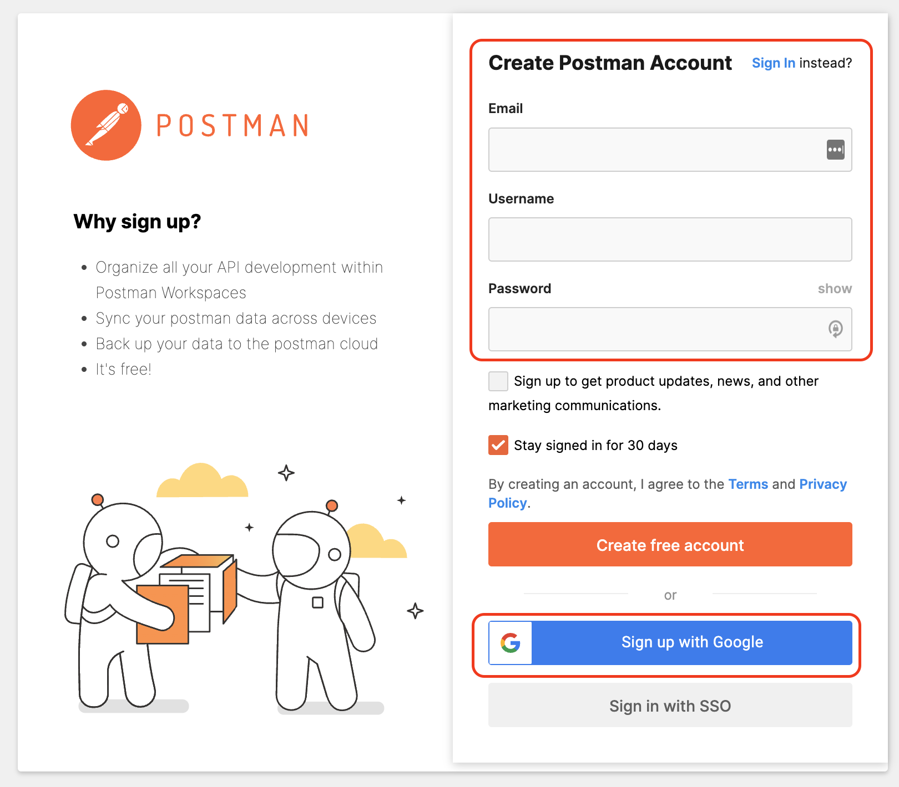
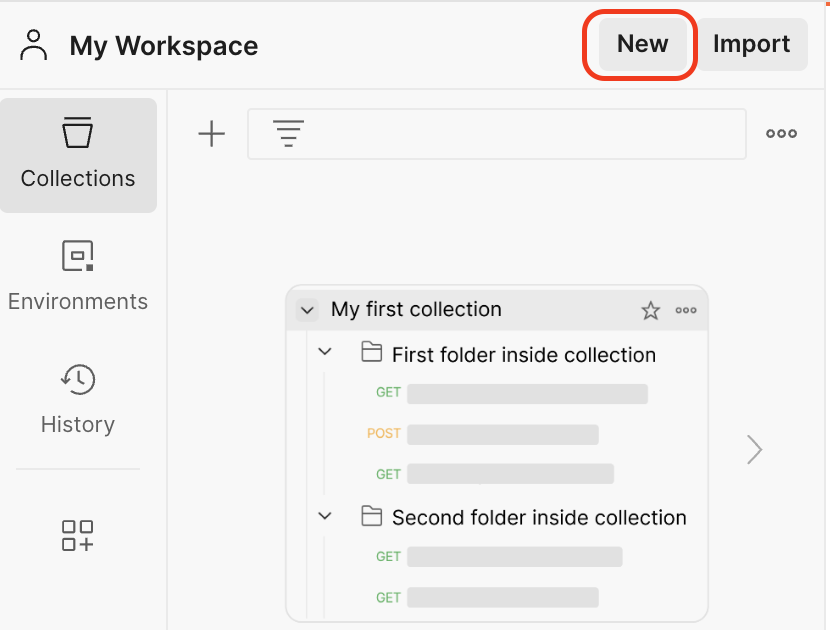
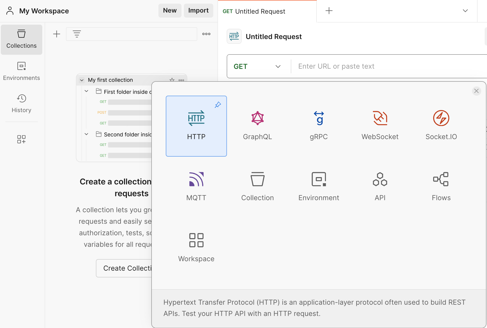
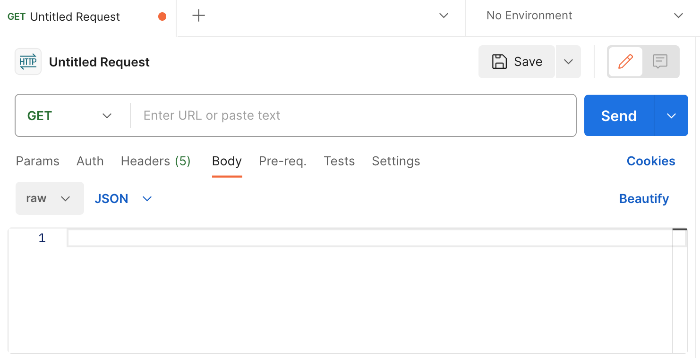
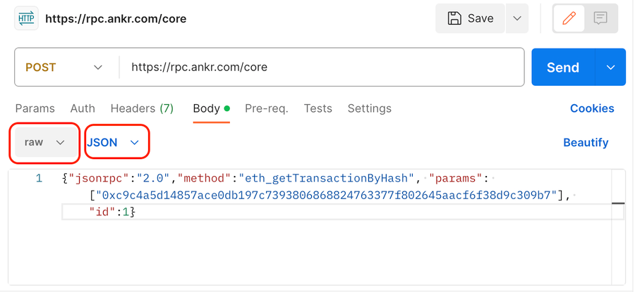
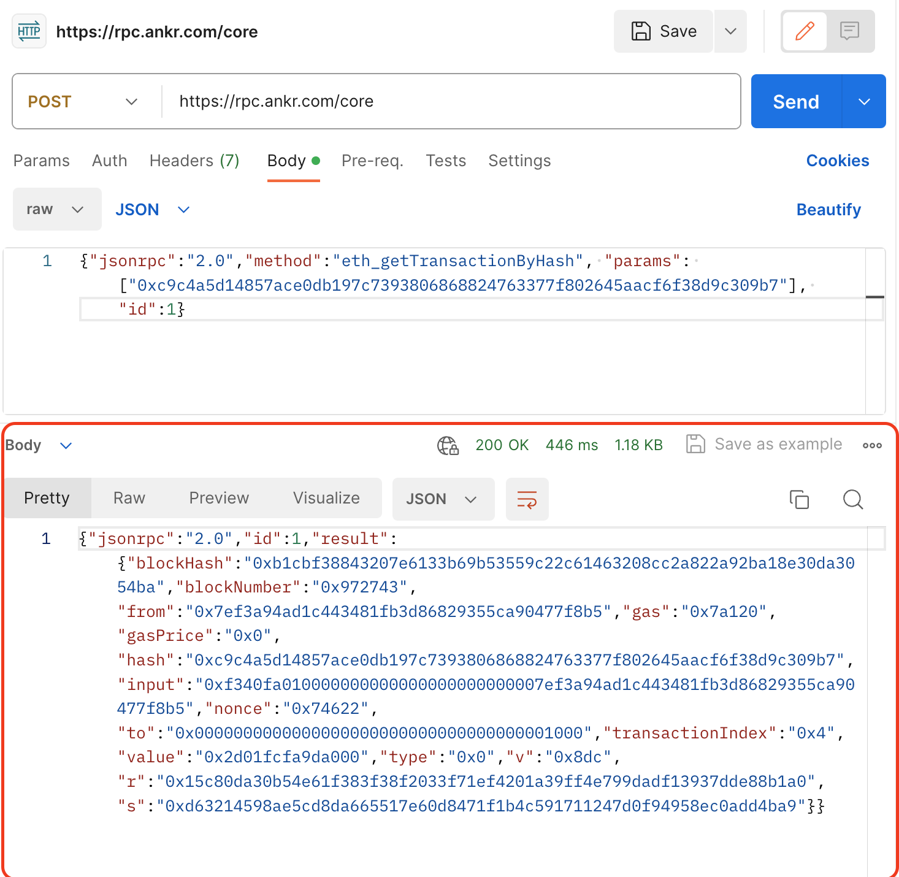

# RPCs Core via Postman

---

## Qu'est-ce que Postman ?

[Postman](https://www.postman.com/) est un logiciel populaire qui facilite la création et l'utilisation des APIs.

Dans ce document, nous allons couvrir les bases de l'utilisation d'un point de terminaison RPC avec Postman. Ce document n'a pas pour objectif d'être un tutoriel complet de bout en bout, mais plutôt de vous offrir une introduction au sujet.

## Utilisation des RPCs Core via Postman

1. Tout d'abord, vous devrez créer un compte. Postman facilite grandement cette étape, soit en entrant manuellement vos informations de compte, soit en utilisant une adresse Gmail.



2. Les projets dans Postman sont organisés en "espaces de travail", vous devrez donc en créer un pour tester ce processus. Cliquez sur le _Nouveau_ bouton dans le volet de navigation à gauche.



3. Vous pouvez choisir parmi plusieurs types d'espaces de travail. Pour cet exemple, nous allons utiliser `HTTP`.



4. Cela vous amènera à un espace de travail de base, où vous pourrez structurer votre requête RPC et obtenir une réponse.



5. Commencez par changer la requête de `GET` à `POST`, car c'est ainsi que notre requête sera structurée. Ensuite, ajoutez l'URL RPC que vous souhaitez utiliser pour obtenir des informations relatives à une transaction spécifique de la Core blockchain. N'oubliez pas que vous pouvez utiliser n'importe quelle [URL RPC valide de Core](./rpc-list.md).


6. Ensuite, accédez à l'onglet Body et ajoutez les données de la requête CURL suivante (notez que dans cet exemple, nous soumettons la requête sous forme de JSON brut).

```bash
curl -H "Content-Type: application/json" \
     -X POST \
     --data '{"jsonrpc":"2.0","method":"eth_getTransactionByHash","params":["0xc9c4a5d14857ace0db197c7393806868824763377f802645aacf6f38d9c309b7"],"id":1}' \
     --url 'https://rpc.ankr.com/core'
```



7. Une fois que vous avez cliqué sur le bouton `Send`, vous recevrez une réponse en JSON avec toutes les informations que nous souhaitions sur la transaction dont nous avons passé le hash dans la requête.


