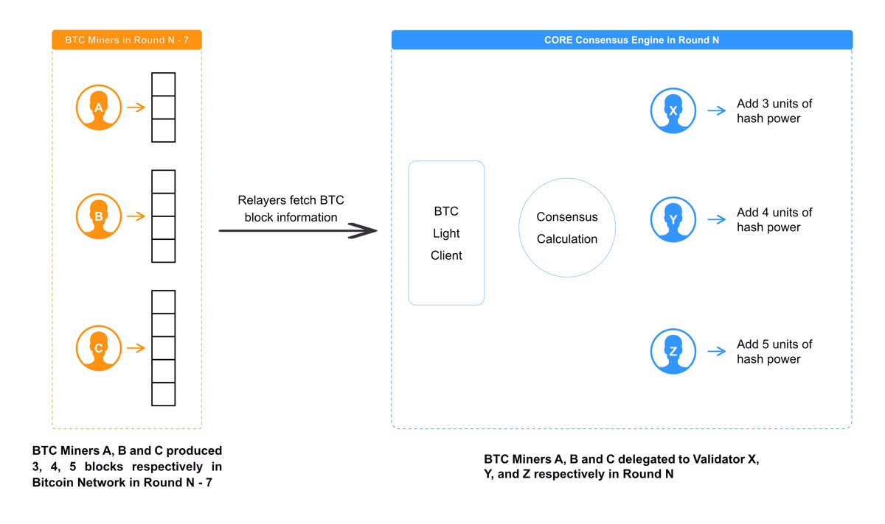

# Preuve de Travail Déléguée (DPoW) dans le mécanisme de consensus Satoshi Plus

---

## Aperçu

La Preuve de Travail Déléguée (DPoW) est un élément crucial du mécanisme de consensus Satoshi Plus de Core. Ce système exploite la sécurité robuste du minage de Bitcoin, en l'intégrant dans la blockchain Core pour améliorer la sécurité et encourager la participation sans coûts supplémentaires. Voici un aperçu détaillé du fonctionnement de la DPoW et de son importance.

La DPoW permet aux mineurs de Bitcoin de gagner une seconde récompense de bloc en plus de leurs récompenses Bitcoin tout en sécurisant la blockchain Core, créant ainsi une relation symbiotique qui profite aux deux réseaux.

## Fonctionnement de la DPoW dans Satoshi Plus

Sur le réseau Bitcoin, les mineurs de Bitcoin génèrent de la puissance de hachage pour sécuriser le réseau Bitcoin, valider les transactions et gagner des récompenses en Bitcoin. Afin de lisser leurs récompenses dans le temps, les mineurs de Bitcoin contribuent souvent leur puissance de hachage à des pools de minage, qui utilisent la puissance de hachage agrégée pour augmenter les chances globales du pool de miner un bloc de Bitcoin et de recevoir des Bitcoin en retour. La DPoW intègre directement le minage de Bitcoin dans le protocole de sécurité de Core via un système de délégation. Voici une répartition étape par étape de son fonctionnement :

1. **Intégration du Minage**: Les mineurs de Bitcoin poursuivent leurs activités de minage standard, mais avec une étape supplémentaire consistant à signaler leur soutien à la blockchain Core. Cela se fait en incluant une transaction spéciale dans les blocs de Bitcoin qu'ils minent, qui spécifie le Validateur Core qu'ils souhaitent soutenir.

2. **Métadonnées dans les Blocs Bitcoin**: Dans le bloc de Bitcoin miné, les mineurs ajoutent des métadonnées dans le champ op_return. Ces métadonnées incluent l'adresse du Validateur Core et l'adresse pour recevoir les récompenses en tokens CORE, déléguant ainsi une partie de leur puissance de hachage au réseau Core.

3. **Soutien aux Validateurs**: En incluant ces informations, les mineurs délèguent leur puissance de calcul aux Validateurs sur Core. Ces Validateurs utilisent la puissance déléguée pour participer à la validation et à la création de blocs sur la blockchain Core.

4. **Relayeurs** : Les relayeurs sont chargés de surveiller le réseau Bitcoin et de transmettre les blocs ainsi que les données de transaction au réseau Core. Au sein du réseau Core, un client léger BTC embarqué on-chain traite les données entrantes des relayeurs et transmet les informations de délégation (y compris la puissance de hachage et le staking non custodial) au "Delegation Hub". Celui-ci sert de composant central responsable de la gestion et de la supervision des délégations dans le réseau Core.  Pendant une ronde de 1 jour, le réseau Core calcule la DPoW pour chaque validateur en comptant le nombre de blocs que les mineurs ont délégués à chaque validateur _une semaine auparavant_. Si la ronde a lieu un jeudi par exemple, Core totalisera la puissance de hachage déléguée à chaque validateur en comptant les blocs du jeudi _précédent_.

5. **Mécanisme de Récompense**: En retour de leur contribution, les mineurs reçoivent des récompenses supplémentaires sous forme de tokens CORE, en plus des récompenses habituelles de minage de Bitcoin. Ce système de double récompense incite les mineurs à participer au processus DPoW sans avoir besoin de détourner des ressources du minage de Bitcoin.

## Processus étape par étape

1. **Minage des Blocs Bitcoin :** Les mineurs de Bitcoin continuent leur rôle principal de minage de blocs sur le réseau Bitcoin en utilisant la Preuve de Travail (PoW).

2. **Inclusion des Informations de Délégation :** Les mineurs ajoutent deux informations supplémentaires dans le champ op_return de la transaction coinbase :

- **Adresse du Validateur Core :** L'adresse du validateur Core à qui déléguer la puissance de hachage.
- **Adresse de Récompense en Tokens CORE :** L'adresse où le mineur souhaite que ses récompenses en tokens CORE soient envoyées.

3. **Délégation de la Puissance de Hachage :** Cette action délègue la puissance de hachage du mineur au validateur Core choisi, réutilisant le travail existant sans encourir de coûts supplémentaires.

4. **Élection des Validateurs :** Les validateurs avec une puissance de hachage déléguée plus élevée ont une plus grande chance d'être élus dans l'ensemble des validateurs.

5. **Récompenses des Validateurs :** Les validateurs gagnent des récompenses pour le traitement des blocs, prennent une petite commission et transfèrent les récompenses à leurs délégateurs, y compris les mineurs de Bitcoin ou les pools de minage qui leur ont délégué de la puissance de hachage.

6. **Obtention des Récompenses :** Les mineurs ou les pools de minage reçoivent des récompenses en tokens CORE en plus de leurs récompenses en Bitcoin, offrant ainsi des incitations supplémentaires.

## Importance de la DPoW dans Satoshi Plus

- **Sécurité Améliorée :** En intégrant la PoW de Bitcoin, Core bénéficie de l'infrastructure de sécurité inégalée de Bitcoin, rendant le réseau Core plus résilient.

- **Incitations Augmentées :** Les mineurs de Bitcoin gagnent une source de revenus supplémentaire grâce aux récompenses en tokens CORE, améliorant leur rentabilité globale sans coûts énergétiques supplémentaires.

- **Relation Symbiotique :** Ce système promeut des avantages mutuels pour les réseaux Bitcoin et Core, encourageant un environnement coopératif qui renforce l'écosystème blockchain.

- **Efficacité des Ressources**: La DPoW permet aux mineurs de maximiser l'utilité de leurs ressources de calcul existantes. En soutenant la sécurité de l’écosystème Core tout en poursuivant leurs opérations de minage de Bitcoin habituelles, les mineurs peuvent contribuer à deux réseaux simultanément, sans dépense d’énergie supplémentaire.

#### **Conclusion**

Le DPoW est une innovation essentielle au sein du mécanisme de consensus Satoshi Plus, il étend les incitations des mineurs du réseau Bitcoin pour s'aligner sur le mécanisme de consensus Satoshi Plus de Core. Core bénéficie de la participation des mineurs de Bitcoin à sa sécurité, et les mineurs de Bitcoin reçoivent une meilleure rémunération. Le résultat est un ensemble de mineurs qui sont fortement incités à sécuriser à la fois Bitcoin et Core.
