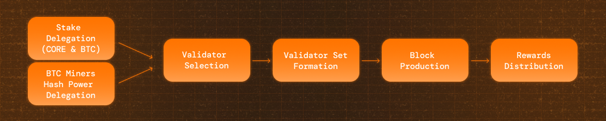

# Élection des Validateurs Core

---

## Aperçu

Le consensus Satoshi Plus de Core tire le soutien des validateurs de trois sources de délégation :

- **Preuve de travail déléguée (DPoW)** des mineurs Bitcoin
- **Staking Bitcoin en auto-garde** par les détenteurs de Bitcoin
- **Preuve de participation déléguée (DPoS)** des détenteurs de jetons CORE

Chaque source contribue au score **hybride** d'un validateur, qui détermine son élection dans l'ensemble actif de validateurs.

## Processus d'élection

### 1. Délégation de soutien

Les validateurs reçoivent un soutien de trois sources:

- **Détenteurs de Bitcoin**: Verrouillent temporairement Bitcoin en utilisant CLTV (Check Lock Time Verify) et intègrent des métadonnées de validation dans le script de remboursement pour voter pour les validateurs.
- **Mineurs Bitcoin**: Délèguent leur puissance de hachage en incluant des votes de validation dans le champ op_return des transactions coinbase Bitcoin.
- **Détenteurs de jetons CORE**: Délèguent directement leurs jetons CORE à leurs validateurs préférés.

Chaque forme de délégation contribue à la sélection des validateurs et à l'éligibilité aux récompenses.

### 2. Calcul du score hybride

Les validateurs sont classés selon un **score hybride** qui combine les trois formes de soutien :

$$
 S = (\frac{rHp}{tHp})* m + (\frac{rSp}{tSp})*k + (\frac{rBp}{tBp})*l
$$

Où, $$m + k + l = 1$$

- $$rHp$$: Puissance de hachage Bitcoin déléguée à un validateur.
- $$tHp$$: Puissance de hachage totale sur Core.
- $$rSp$$: Montant de tokens CORE stakés auprès d’un validateur.
- $$tSp$$: Montant total de tokens CORE stakés sur Core.
- $$rBp$$: Montant de tokens BTC stakés auprès d’un validateur.
- $$tBp$$: Montant total de tokens BTC stakés sur Core.
- $$m$$: Ratio attribué à la puissance de hachage.
- $$k$$: Ratio attribué au staking de CORE.
- $$l$$: Ratio attribué au staking de BTC.

Cette formule favorise une influence proportionnelle et équitable entre toutes les sources de délégation.

### 3. Sélection des validateurs et production de blocs

- Les **29 meilleurs validateurs** avec les scores hybrides les plus élevés sont élus à chaque **tour (1 jour)**
- Les validateurs produisent des blocs de manière **tournante**, chaque créneau durant **3 secondes**
- L'ensemble **de validateurs est mis à jour tous les 200 blocs** pour promouvoir la cohérence et prévenir les perturbations causées par des validateurs sous-performants ou pénalisés
- Core maintient la liveness tant que moins **d'⅓ des validateurs sont malveillants**

## Résumé du flux

1. **Délégation**: Les mineurs, les détenteurs de CORE et les détenteurs de Bitcoin délèguent leur soutien
2. **Calcul du score**: Les scores hybrides sont calculés à l'aide d'une formule définie
3. **Élection**: Les 29 meilleurs validateurs sont sélectionnés en fonction de leurs scores
4. **Production de blocs**: Les validateurs se relaient pour produire des blocs
5. **Récompenses**: Les validateurs gagnent des jetons CORE et les distribuent proportionnellement aux délégateurs
6. **Cycle Répété**: L'ensemble de validateurs est mis à jour tous les 200 blocs
