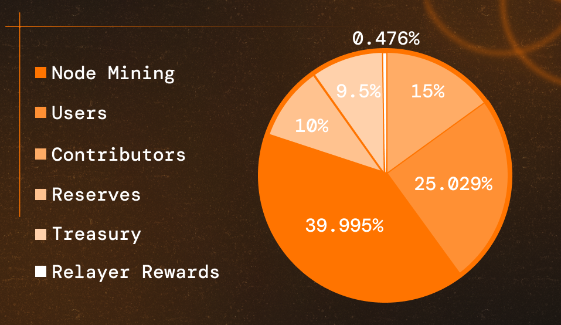
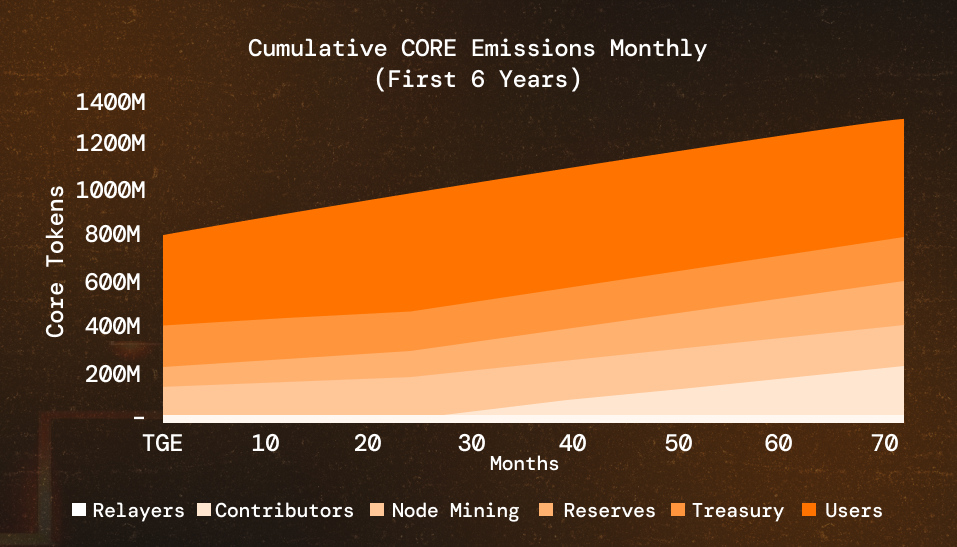
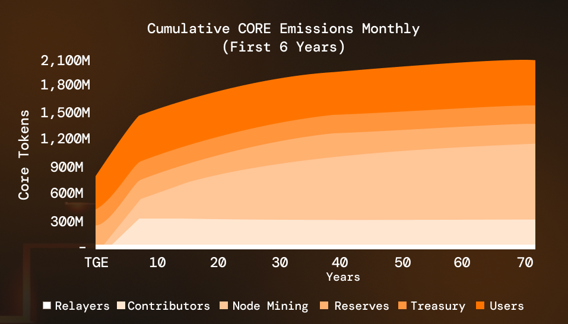
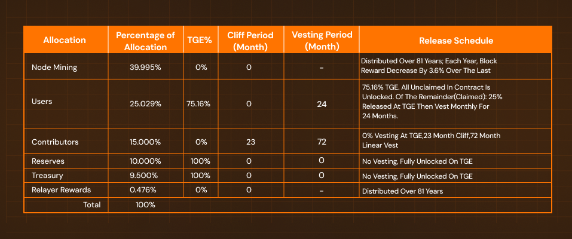

# Tokenomics et Utilité de CORE

---

## Aperçu

CORE est le jeton utilitaire natif et de gouvernance de la blockchain Core. Sa tokenomics suit les principes de décentralisation, de durabilité et d'alignement des incitations à long terme. CORE présente un plafond d'approvisionnement fixe similaire au modèle de Bitcoin et a été lancé en mettant l'accent sur une distribution équitable et décentralisée.

## Distribution des Tokens

La tokenomics de CORE se concentre sur la durabilité à long terme et la gouvernance décentralisée. Le jeton remplit plusieurs fonctions au sein de l'écosystème Core, notamment les récompenses des validateurs, les paiements des frais de transaction et la participation à la gouvernance.

CORE a une offre fixe de 2,1 milliards de jetons répartis sur plusieurs fonctions clés de l'écosystème. L'allocation est structurée pour soutenir la croissance du réseau, la sécurité et le développement, comme indiqué dans le diagramme ci-dessous :

1. Extraction de nœuds (39,995% - 839 900 000 jetons CORE) :
  Récompenses pour les validateurs pour la production de blocs et la sécurité du réseau, distribuées sur une période de 81 ans pour assurer une alignement à long terme avec la croissance du réseau.

2. **Utilisateurs (25,029% - 525 600 000 jetons CORE) :** Allocation pour les airdrops communautaires et les incitations à la participation des utilisateurs, conçue pour promouvoir une large distribution de jetons et l'engagement dans l'écosystème.

3. **Contributeurs (15% - 315 000 000 jetons CORE) :** Fonds destinés aux contributeurs passés et futurs qui développent et maintiennent les protocoles de base, l'infrastructure et les applications au sein de l'écosystème.

4. **Réserves (10% - 210 000 000 jetons CORE) :** Réserve stratégique pour soutenir les opérations de la fondation et les initiatives de développement du réseau à long terme.

5. **Trésorerie (9,5% - 199 500 000 jetons CORE) :** Fonds de développement de l'écosystème géré par la gouvernance pour soutenir les subventions, les partenariats et les investissements stratégiques dans la croissance de Core.

6. **Récompenses des relais (0,476% - 10 000 000 jetons CORE) :** Incitations pour les relais qui transmettent des données entre Bitcoin et Core, soutenant les mécanismes de consensus inter-chaînes.

## Utilité des Tokens

Les tokens CORE remplissent plusieurs fonctions essentielles au sein du réseau Core:

- **Frais de transaction :** Toutes les transactions et exécutions de contrats intelligents sur Core nécessitent des jetons CORE pour les paiements de gaz.
- Staking : Les jetons CORE peuvent être délégués aux validateurs dans le cadre du consensus Satoshi Plus, contribuant à la sécurité du réseau et générant des récompenses de staking.
- **Participation à la gouvernance :** Les détenteurs de jetons peuvent participer à la gouvernance en chaîne, en votant sur les mises à niveau du réseau et les paramètres de protocole.

## Offre et Émissions Strictes

CORE a un plafond d'approvisionnement fixe de 2,1 milliards de jetons, adoptant un modèle de rareté similaire à celui de Bitcoin. Les récompenses des validateurs sont distribuées selon un calendrier d'émission prédéterminé sur 81 ans, conçu pour assurer une durabilité à long terme.

- **Ajustement des récompenses annuelles :** Les récompenses de bloc diminuent de 3,61% chaque année, créant une courbe de réduction progressive plutôt que le modèle de réduction de moitié de Bitcoin, offrant ainsi des conditions économiques plus prévisibles pour les participants du réseau.

### Émissions cumulatives de CORE mensuellement (Les 6 Première années)

### Émissions cumulatives de CORE annuellement (81 ans)

### Répartition des Allocations

## Politique Monétaire Solide

En plus du plafond fixe, Core dispose également d'un mécanisme déflationniste :

- **Brûlage des Frais de Transaction:** Une partie des frais de transaction et des récompenses des blocs sera brûlée, selon les décisions de la DAO, de sorte que l'offre de tokens CORE approche asymptotiquement du plafond fixe sans le dépasser.

## Conclusion

La tokenomique de CORE crée un système économique équilibré qui soutient la sécurité du réseau, la gouvernance et l'utilité. Avec un plafond d'approvisionnement fixe, un calendrier d'émission prévisible et des incitations alignées entre les mineurs de Bitcoin, les détenteurs de Bitcoin et les détenteurs de jetons CORE, le modèle soutient une croissance durable de l'écosystème tout en préservant la nature décentralisée du réseau. Cette conception encourage une participation à long terme des parties prenantes à travers les écosystèmes Bitcoin et Core.