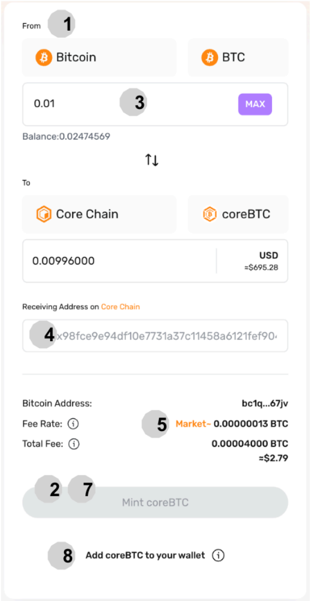
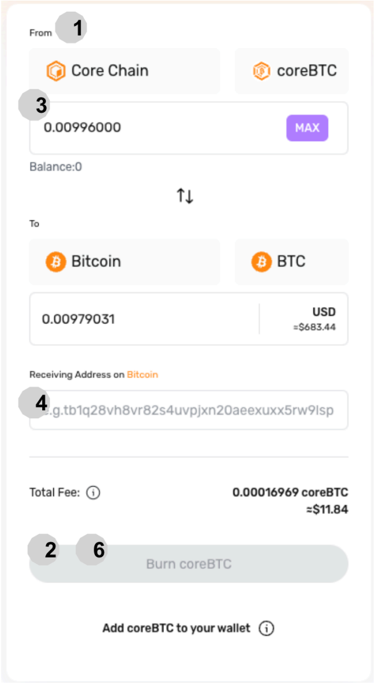

# CoreBTC Wrap & Unwrap

## Introduction

En tant que wrapped Bitcoin natif sur Core, le coreBTC maintient une parité 1:1 avec le Bitcoin grâce à un mécanisme sécurisé, alimenté par un réseau de participants décentralisés et sans permission. Ce guide vous présente les étapes essentielles pour la création (wrapping) et la conversion (unwrapping) du coreBTC, facilitant ainsi l'intégration du Bitcoin dans la finance décentralisée (DeFi).

## Prérequis : Avant de commencer

1. [Extension de Navigateur Portefeuille Unisat](https://unisat.io/): Nécessaire pour gérer vos Bitcoin. Notez que Unisat est actuellement disponible uniquement sur pc et application Android.
2. [MetaMask](https://metamask.io/): Requis pour interagir avec la blockchain Core.

## Obtention du coreBTC

1. **Site Web coreBTC:** Allez sur https://bridge.coredao.org/coreBTC
2. **Spécifiez la Conversion:** Indiquez que vous convertissez du Bitcoin (BTC) vers du coreBTC.
3. **Connectez le Unisat Wallet:** Sélectionnez la connexion au portefeuille Unisat pour lier votre portefeuille Bitcoin.
4. **Entrez le montant de Bitcoin:** Indiquez le montant de Bitcoin que vous souhaitez convertir en coreBTC.
5. **Adresse de réception Core:** Entrez l'adresse de votre portefeuille sur la blockchain Core.
6. **Ajuster le taux de frais:** Les frais par défaut sont basés sur les taux actuels du marché. Pour accélérer le traitement de la transaction, ajustez les frais de gas de manière appropriée. Gardez à l'esprit que des frais plus élevé peuvent grandement accélérer la transaction. En revanche, si les frais sont trop bas, la transaction peut subir de longs retards, prenant potentiellement des jours à être confirmée. Il est crucial de trouver un équilibre qui corresponde à votre urgence et à la demande actuelle du réseau.
7. **Vérification:** Vérifiez soigneusement tous les détails, y compris les montants, les frais et les adresses de portefeuille.
8. **Obtention:** Cliquez sur 'Mint coreBTC' pour initier la conversion.
9. **Ajouter le Token:** Sélectionnez 'Ajouter coreBTC à votre portefeuille' dans MetaMask pour visualiser votre coreBTC.

## Récupérer du Bitcoin à partir de coreBTC

1. **Site web de coreBTC:** Accédez à https://bridge.coredao.org/coreBTC
2. **Spécifier la conversion:** Choisissez la conversion de coreBTC vers Bitcoin (BTC).
3. **Connecter le portefeuille EVM:** Cliquez sur « Connecter le portefeuille EVM » pour lier votre portefeuille.
4. **Saisir le montant de coreBTC:** Indiquez le montant de coreBTC que vous souhaitez échanger contre du Bitcoin.
5. **Adresse de réception de Bitcoin:** Entrez l'adresse Bitcoin du portefeuille de destination.
6. **Vérification:** Vérifiez soigneusement tous les détails, y compris les montants, les frais et les adresses de portefeuille.
7. **Brûler:** Cliquez sur 'Burn coreBTC' pour lancer le processus de récupération.

## Tableau de bord : Suivi de l'état

1. **Transactions en attente:** Consultez et obtenez des détails sur les transactions en cours.
2. **Transactions terminées:** Vérifiez l'historique et les spécificités des transactions finalisées.
3. **États des Lockers:** Explorez les lockers disponibles, y compris leurs frais, collatéral, capacité de création et facteur de santé. Les lockers sont essentiels pour sécuriser les Bitcoin et peuvent être soumis à des pénalités ou à une liquidation en fonction de leur comportement et de leur statut de collatéral.
4. **États des Relayeurs:** Consultez la liste des relayeurs responsables de la transmission et de la vérification des données entre le réseau Bitcoin et la blockchain Core.

:::note
Consultez [la section FAQ de coreBTC](../../../FAQs/coreBTC-faqs.md) pour toute question que vous pourriez avoir.
:::
